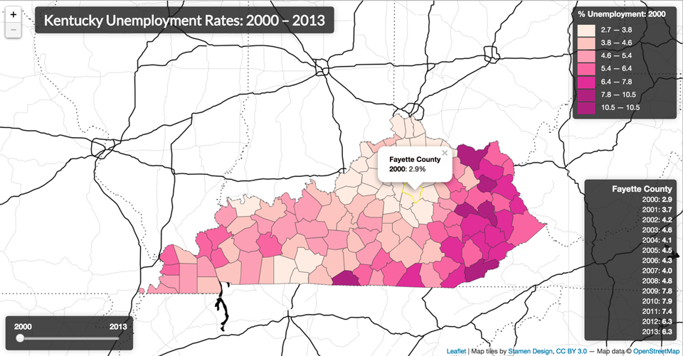

#Map Assignment 4

Create an interactive web map of unemployment rates by county in the state of Kentucky. Use the maps created within Modules 14 and 15 as a guide, as well as the two data files included with this assignment to complete the map (*ky-counties.json* and *ky-unemployment.csv*). You will need to create the *index.html* file yourself.

Your map should fulfill the following requirements, covered explicitly within Modules 14 and 15:

* load two external files (provided) at runtime
* process these data, binding attribute data to geometries
* draw a classed choropleth map of unemployment rates for Kentucky counties (you may choose the appropriate classification method, e.g., Jenks or Quantile) using a sequential color scheme (hint: use [http://colorbrewer2.org/](http://colorbrewer2.org/))
* draw an accompanying legend with an appropriate legend title and class break labels
* display the map at 100% width and height of the browser window's viewport
* provide a meaningful title for the map, placed upon the map

In addition to these requirements, your map should also provide the following UI enhancements for the user:

* a visual affordance when the user hovers over specific counties (e.g., making the stroke of the county yellow)
* an information panel made visible when the user hovers over specific counties. the informal panel should include information for that county including the county name and data for all the available years (2000 - 2013)
* a popup triggered when the user clicks on a specific county, which provides the name of the county and the specific unemployment rate for the currently displayed year

Finally:

* thoroughly comment your code, in accordance with the example solution for Task J.

Your final map should look something like this:

Note: for an additional challenge, consider modifying the info panel:

* draw an info graphic within the info panel capturing the temporal data (e.g., a line graphic), rather than listing the information textually
* position the info panel appear over the county being moused over, rather than in a corner of the map

This assignment is due by **11am on April 9th, 2015**