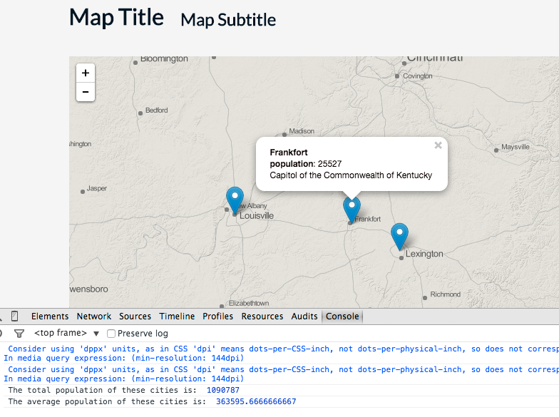

#Task C: Playing with JavaScript Building Blocks

**Instructions:** First, copy over the contents of */geo409/session-04/task/* into the root directory of your *geo409* Git repository. Modify the index.html within this directory to fulfill the requirements listed below. The goal of this task is to create 3 markers on the map for 3 different Kentucky cities, and provide information about those cities on a clickable popup. 

Save your changes to your *index.html* file and **commit changes to your local GitHub repository** as you work. 

To begin editing the code, open the file found at */geo409/task-a/index.html* within Brackets and view the rendered page within Chrome using Live Preview. 

Open your JavaScript Console within your web browser and note that there is an Uncaught ReferenceError. This script is looking for values referenced by variables that do not yet exist. You will need to provide these variables and values. Modify the JavaScript within the section beginning the code comment "begin writing Task C code here" and ending with "end writing Task C code here."

To start, declare a variable named `city1Name` and assign it a string value of "Lexington", like so:

```javascript
var city1Name = "Lexington";
```

Now continue writing JavaScript according to these instructions:

1. Declare a variable named `city1Lat`, determine the latitude of this city (e.g., using a Google search) and assign this number value to it. Do the same for a variable named `city1Lon`.
2. Next declare a variable named `city1Pop`, short for the population of the city, which you should also determine using a web search, and assign this numeric value to the variable.
3. Finally, declare a varaible named `city1Capitol` and assign a Boolean variable of either true or false, depending on whether this city is in fact the capitol of the commonwealth of Kentucky.
4. Save your changes, refresh your browser, and verify a marker has been correctly placed on Lexington and the popup information is correct. Look for errors in the JavaScript Console and return to your code to fix these errors.
5. Repeat this process for two more cities, Frankfurt and another of your choosing. Name the related varaibles `city2` (i.e., `city2Name`, etc) and `city3`. Note that you'll need to uncomment the code toward the bottom of the script for each city.
6. Finally, declare a variable named `totalPop` and assign it the sum total of the three city's populations, using their varaibles and the plus operator. Output this total to the JavaScript Console. Next, declare a variable named `averagePop` and assign it a value of the city's population averages using a division operator.
7. Change the `h1` and `h2` tags to update your web document with an appropriate (even fun!) title and subtitle, and edit the text at the bottom of the page (e.g., author and meta information).
7. Sync your final solutions with your remote repository and provide a link within Canvas by the due date: **Thursday, January 29th 12:00pm**.

Your final solution should look like this (with a title and subtitle!):
