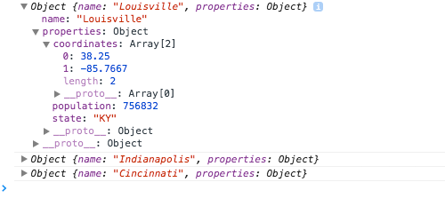

#Task F: JavaScript Objects

**Instructions:** First, copy over the directory [https://github.com/newmapsplus/geo409/tree/master/session-07/task](https://github.com/newmapsplus/geo409/tree/master/session-07/task) into the root directory of your personal *geo409* Git repository and rename it to *task-f/* -- just like you previously did with tasks a to e. Modify the *index.html* within this directory to fulfill the requirements listed below. 

The goal of this task is to build a map with markers on three cities within three different US states. The popup of each marker will display the text in a unique color dependent upon the state in which the city marker is located.

Save your changes to your *index.html* file and **commit changes to your local GitHub repository** as you work. Begin your coding beneath line 93 containing the comment `begin writing/editing Task F code here`. 

So far in Geo409, the modules have used the Array data type to structure and store information about various cities for web mapping using a Leaflet map. This lab will make use of JavaScript objects to achieve this, as well as to bring together the looping and conditional logic practiced within earlier modules.

1. First create three JavaScript objects that each represent a different city within the Array `cities` that is pre-existing in the file. We provided you with an example of the JavaScript object for Louisville. You can pick any other two cities but have one each from Indiana and Ohio. Each city object will be made of two properties. 

  * The the name of the first property will be `name`, and its associated value will be a String value of the name of the city (e.g., `name: "Louisville"`). 
    
  * The name of the second property within each city object will be `properties`. Its value will be another object which itself hold three additional properties: `coordinates` (an Array), `population` (a Numeric value), and `state` (a String value). For example, an object representing the city of Louisville will look like this:
    ```javascript
        {
            name: "Louisville",
            properties: {
                coordinates: [38.25, -85.7667],
                population: 756832,
                state: "KY"
            }
        }
    ```
3. Add your two city objects to your cities Array. Load the map in chrome and check to see if you have any errors.

    **Hint: if you haven't already, get in the habit of writing lots of these *console.log* statements, saving your file, and examining the output in the web browser.**

4. Next, construct a *for* loop that will loop through the three elements (in this case JavaScript objects) contained within the `cities` Array.

4. Within the loop, try writing a couple *console.log()* statements, saving your file and testing the result by refreshing your browser with the JavaScript Console open as you do.  First, try logging to the console each element within the `cities` Array:

    ```javascript
        console.log(cities[i]);
    ```

5. After refreshing your browser's web page, within the JavaScript Console you should see three lines of output that look something like `Object {name: "Louisville", properties: Object}`. You've essentially logged the contents of each of your `cities` Array objects to the console. By clicking on the grey arrows to the left you can drill down into the nested structure of these objects. Take a look through this and see the various values that are in these objects.

    

6. See if you can access just the `properties` of each city object with a *console.log()* statement using either bracket or dot notation, (i.e., `console.log(cities[i].properties);`). For example, try to output the value of the population or the longitude. Note: these two examples require slightly different structures. Examine the output of this second *console.log* statement (you should recognize the properties you encoded within your `cities` Array's objects).

  * Note that you may wish to comment out or delete the previous *console.log()* statement so the output doesn't get cluttered and confusing. 

7. Once you have figured out how to access these properties, create a new variable named `props` (see the example below). 

    ```javascript
        var props = cities[i].properties;
    ```

    This will act as a shorthand for accessing these properties further on in the script, so you don't need to write `cities[i].properties` each time but can simply write `props`. A really quick test is just try the *console.log* statement (i.e., `console.log(props)`). Also try this out by copying your previous `console.log` and replacing `cities[i].properties` with `props`.  

    **Hint: if you haven't already, get in the habit of writing lots of these *console.log* statements, saving your file, and examining the output in the web browser.**

8. After creating the `props` variable within the loop, create a variable for the content of our map marker popups, and assign a simple String for now. Then write the mysterious `L.marker( ...` code we've been using so far within the Tasks. After reading Module 7, you may now recognize the `.marker()` as a method! We're going to pass one argument with this method call: the value of the `coordinates` property currently held within our `props` variable. Your *for* loop should now contain the following code:

    ```javascript
        var props = cities[i].properties;

        var popup = "I am a temporary String value";

        L.marker(props.coordinates).addTo(map)
                .bindPopup(popup);   
    ```
    Save your document and test the map in the browser. Your map should now contain the three markers, each with a popup that says something useless like "I am a temporary String value." Verify that there are no errors in the Console. Also note that you may need to adjust the values for the map's center coordinates and zoom level, found on lines 80 and 81 of the Task F *index.html* file. The zoom level is an integer between 4 and 12 that indicates how far zoomed-in the map will be -- 4 being global scale and 12 the scale of an urban neighborhood. Play around with these settings.

9. Instead of assigning a string to the `popup` variable, we want to instead construct the popup content dynamically using a function and assign its return value to the `popup` variable. Name this function `buildPopup` and call it within the *for* loop, passing it three arguments (the name of the city, the population of the city and the state). Remember how you referenced those when you were outputing them in the console.log?  We'll come back to this call in a few steps after you declare the function. Right now if you load the file you will get an error since the function doesn't exist yet.

10. Surprise, the next step is declaring the *buildPopup* function (make sure it is outside of the *for* loop). It will need to achieve the following: (a) accept the three arguments (name them `name`, `pop`, and `state`); (b) use conditional if/else statements to determine which state a particular city is located; and (c) create and assign a unique String value to a variable named `colorClass` based on which state each of the cities are located. You'll end up with three different colors since your cities are in different states. The value of `colorClass` must correspond with CSS class definitions contained in the CSS style rules at the top of the document (lines 49 to 57). For example, if we want Kentucky to be colored blue:

    ```javascript
        if(state == "KY") {
            var colorClass = "blue";
        }
    ```

    You may wish to create new CSS style rules and use different colors for your map (you can determine the hexidecimal values for various colors from such a website as [http://www.color-hex.com/](http://www.color-hex.com/)). How would you add a value for yellow?         

11. After your conditional statements assigning a value to `colorClass`, the *buildPopup* function must return the following string. Remember to include the return statement and copy this code exactly for the return value:

    ```javascript
        "<div class='"+colorClass+"'><b>"+name+"</b><br>"+
        "<b>Population</b>: "+pop.toLocaleString()+"<div>";
    ```

    If the popups don't render properly or you find error messages in the Console, there likely is an error within your *buildPopup* function's body. Use `console.log` and the error messages in the Console to debug the function step-by-step.

12. Once you have the map working, each popup should be uniquely colored based upon the value contained with the `state` property of each city. To polish, change the `h1` and `h2` tags to update your web document with an appropriate (even fun!) title and subtitle, and edit the text at the bottom of the page (e.g., author and meta information).

13. Sync your final solutions with your remote repository and provide a link within Canvas by the due date: **Tuesday, February 10th, 11:00am**.


