#Module 08: Introduction to Leaflet

##Overview

This lab does the following:

* Introduces you to the Leaflet JavaScript mapping library
* Provides instruction on how to read the Leaflet API Reference
* Walks you through the basics of creating a Leaflet map, including:
    * Providing initial options for how a map is displayed and what features it includes;
    * Modifying these options after a map has been created;
    * Providing a user with basic map interaction capabilities; and
    * Adding and switching between different tile set layers using a Leaflet map.

###Working files

You should use the index.html file located in the session-08/lab/ directory from the course Github repository. Remember to sync your local version of the course repository with the online version.

##What is Leaflet?

Leaflet is a JavaScript library that is quickly growing in popularity within the web mapping community. This is because it is both lightweight (meaning it makes fast maps) and open source (meaning anyone can see and edit the code behind it). This means that there is an entire community of users who are constantly tinkering, improving and expanding the mapping capabilities of Leaflet. 

A JavaScript library is nothing more than a collection of objects, methods and functions designed to help solve a particular challenge. Over the past couple of labs we've been introducing to how these things are structured, pass and receive arguments, etc., because for the rest of the course you will be using the Leaflet library to do amazing mappy things.  You are standing on the shoulders of those who have made Leaflet. Which is great -- but to extend the analogy -- if you aren't careful with where you put your feet, you can come crashing down. So remember the structures and rules you've been working with as you explore Leaflet.

The Leaflet library is designed for creating maps on the web and, using the convenient methods it offers, Leaflet can:

  * load a variety of basemap tile services (the background that makes your map look good); 
  * draw vector features atop these tiles using the SVG (Scalable Vector Graphics) web standard; 
  * be bundled with Mapbox.js (www.mapbox.com/mapbox.js), which extends Leaflet's functionality. 

Leaflet's basic tutorials, examples, and documentation can be found here: [http://leafletjs.com/](http://leafletjs.com/). Bookmark this. It is a really useful source of the hows and whys of Leaflet. In particular, the *Leaflet API reference* [http://leafletjs.com/reference.html](http://leafletjs.com/reference.html) will be really important.

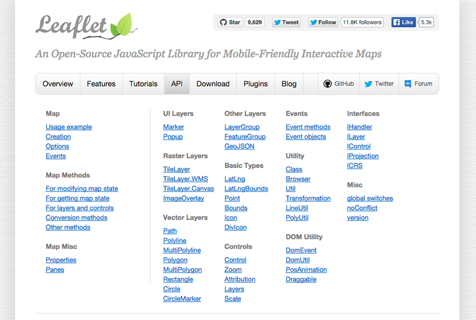

Figure 08-01. The Leaflet API Reference, accessed 2.03.2015 [http://leafletjs.com/reference.html](http://leafletjs.com/reference.html)

For the hardcore coders among you, Leaflet's current codebase is also maintained and accessible through Github: [https://github.com/Leaflet/Leaflet](https://github.com/Leaflet/Leaflet). This means that we could create a function or object and push it up to share with the world. We won't be doing this anytime soon but this is how open source software works.

Leaflet also supports a wide variety of user-contributed plug-ins (which extend Leaflet's functionality), many of which can be found here: [http://leafletjs.com/plugins.html](http://leafletjs.com/plugins.html)

##Let's start playing with Leaflet and the Leaflet API

Wait! What's an API? 

While we would love to say that API stands for **Awesome Programming Iguana** professional ethics force use to admit that it actually stands for Application Programming Interface. Which makes more sense but is decidedly less awesome.

Makes sense? In your dreams!  What does Application Programming Interface actually mean? We can think about two types of interfaces we deal with in web mapping and development. The first one is the interface between the human (a.k.a. the "user" or perhaps map "reader") and the machine, the Human-Computer Interface (HCI). This interface exists in terms of the visual display on a computer and other tactile devices such as a mouse, trackpad, keyboard, or touch-screen (Or in the case of iguanas some kind of tongue flicking interface device, which we sadly suspect doesn't actually exist.) This is the interface that we (or an iguana), as information designers, are most concerned with (e.g., providing a clear point of entry for using a map, giving the user feedback when they click on something so they know they've succeeded in their task, etc). 

There's a second interface at play in all this though, and that one is an interface between different computer software applications (the *application* programming interface). While we often think of computers as a monolithic whole (like SkyNet coming to wipe us out) a computer system is far from a unified system with a single programming running. Instead, various programs are running simultaneously to allow software applications and hardware to all work together. APIs are what allow these various components of a computer system to do this. APIs essentially translate computer routines and software outputs for one another so they can talk to each other. It's sort of a cross between a kindergarten teacher, marriage counselor and traffic cop, although some APIs encompass the features of one of these types more than others.

An "open" API means that this Application Programming Interface has been exposed and documented so we can access it in specific ways. And if you don't follow the rules of access, strange things can happen. Like asking a policeman directing traffic for relationship advice. Who knows what kind of response you will get!

In the case of Leaflet, we have our *.html* file that contains the JavaScript we're writing within it. We have our web browser, which magically knows how to interpret all that code to do things like draw markers on maps and generate a popup when a user clicks on a marker. The Leaflet API gives us access to that underlying code and allows us to write JavaScript that will be used among the computer system components.

Let's start by reviewing some of the basics of how Leaflet makes maps within our web browser.

##The Leaflet map object

The first thing we want to understand is the [Leaflet map object](http://leafletjs.com/reference.html#map-class), which the Leaflet API Reference documents as the "central class of the API — it is used to create a map on a page and manipulate it." We haven't talked much about what "classes" are, but for now just think of them as a kind of template from which specific instances of a map can be created. Leaflet provides a simple example of using this class, which we'll now unpack a bit conceptually. Let's look at the example, drawn directly from Leaflet's API Reference, which you'll hopefully recognize from previous labs as well:

```javascript
    // initialize the map on the "map" div with a given center and zoom
    var map = L.map('map', {
        center: [51.505, -0.09],
        zoom: 13
    });
```

We recognize the `var map`, which is JavaScript's way of declaring a variable. So far in this course, we've been assigning various data types to variables -- Boolean, String, or Number values, or more complex data structures such as Array and functions. But what is being assigned here?

The capital letter *L* stands for Leaflet, and is a top-level object (or "class" as stated above) from which all of Leaflet's awesome functionality is accessed. Do you recognize what follows the *L* (i.e., a dot, connecting an object to a function name followed by two parentheses)? If we remove the method's arguments for a moment it may be more familiar:

```javascript
    var map = L.map();  // just an example, will not work
```

It's a method!

So `.map()` is a Leaflet method. It isn't simply native JavaScript, but when its attached to that capital L it means something special, i.e., it accessing the Leaflet library. There are particular properties of the Leaflet object (accessible through that captial L), and the `.map()` method is one Leaflet method that gives us access to those properties.

Let's look at this particular method more closely, along with the arguments we can pass to it. Again, the Leaflet API Reference tells us about how to create it (Figure 08-2). We see that the method is written with two parameters (in green in Figure 08-02) the first required (id) and the second optional (options). We know that the second is optional because of the question mark at the end. We can also see from the API reference what kind inputs these parameters want. This is the information with the angle brackets `< >`. In the case of the required id parameter, it could be either a `HTMLElement` or a `String`.  Note: remember that the `|` character stands for OR in computer programming.

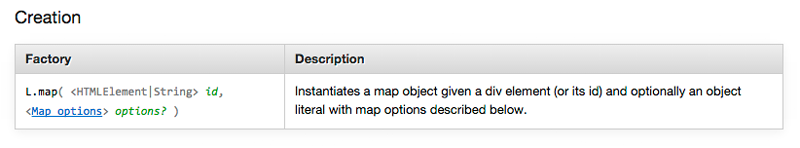
Figure 08-02. API Reference Documentation for creating a Leaflet map object.

### The first parameter (id)
Let's switch to the figure below (Figure 08-3) and see how this works. Down on line 70 you can see the use of the L.map method which is defining a parameter call map which -- as we just outlined -- has to be a String type (hence the word 'map' being written using quotations). This String must correspond to the id attribute of the HTML div element (see line 59) within which we want the Leaflet map to appear. 

This is a little confusing, because on line 70 we have the word *map* three times but each use is actually distinct. 

  * The first *map* is a JavaScript variable we're using to reference the Leaflet map object. Hence the `var`.
  * The second *map* is the name of a particular Leaflet method, `L.map` in its complete form.
  * The third *map* is the name of the target div element's id that was defined on line 59. This is where the map we are making actually appears.

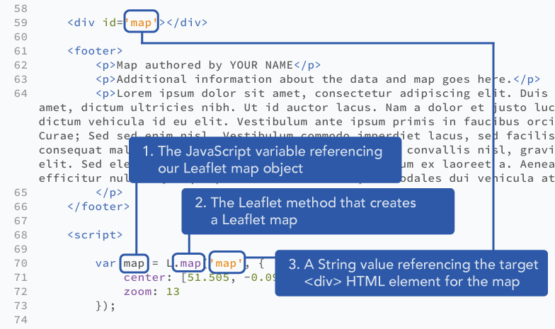
Figure 08-03. Explanation of the three uses of 'map' in creating a Leaflet map.

### The second parameter (options) - center and zoom
Okay, now that we've cleared that up, let's return to the arguments of Leaflet's *.map* method call. We see in Figure 08-2 that beyond designating the target `<div>` element, the method also takes one additional (and optional) argument that is rather confusingly referenced as `options`.  Remember that the question mark at the end indicates that it is an optional rather than required argument. What is the data type of this argument? Hint: it's contained within curly braces and comprises comma-separated properties distinguished by a key and a value, separated by a colon.

In other words it is a JavaScript object!!!

Consider this code again:

```javascript
    var map = L.map('map', {
        center: [51.505, -0.09],
        zoom: 13
    });
```

So the second argument we are passing to Leaflet's *map* method call is an object with two properties, one with a property name of "center" that is associating an Array (containing two coordinate values), and a second property with a property name of "zoom" associating the Number value 13. Encoding the latitude and longitude values within a simple Array form is familiar to us. But if we read the Leaflet API Reference, we note that the value's type for the *center* property is a *LatLng* type (Figure 08-04). 

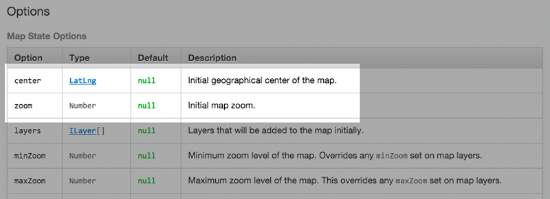
Figure 08-04. Leaflet API Reference for Map State Options.

What's a *LatLng* data type!? Turns out this isn't a native JavaScript type either, but is actually referring to another Leaflet object, linked to from within the Reference itself ([L.latLng](http://leafletjs.com/reference.html#latlng)). Note that Leaflet's *map* method also accepts simple Arrays with the latitude and longitude within them, so we don't need to create a new Leaflet object to center our map. 

However, sometimes we do want to make use of this *LatLng* object because it allows for other useful methods. In other words `L.latLng()` is creating objects that are 'more' than just Arrays. So if we wanted to use the leaflet *.latLng* method with our map options, it would go like this:

```javascript
    var mapCenter = L.latLng(38.0489,-96.5025); // defining a variable using `L.latLng()`

    var map = L.map('map', {
        center: mapCenter,  // using this variable to center our map
        zoom: 4
    });
```

Again you might this this is overkill -- after all the first example works just fine -- but using the `L.latLng()` method let's you do cool things such as calculating the distance between points.  Try this code and see what happens.

```javascript
var mapCenter = L.latLng(38.0489,-96.5025);
var otherCity = L.latLng(38.1489,-96.5125);
var distance = mapCenter.distanceTo(otherCity);
console.log(distance); // will output distance between cities in meters
```

In this examples, *distanceTo* is a method we can use on a *LatLng* object to calculate the distance between it and another *LatLng* object.

Finally, note that we can also store a reference to the *map* method's second optional argument (with the center and zoom properties) within a variable, which highlights that we're working with a JavaScript object, and not some fancy Leaflet thing:

```javascript
    var options = {
        center: [38.0489,-96.5025],
        zoom: 4
    }
    var map = L.map('map', options);
```

### More properties for the second parameter (options)
Within Leaflet's API Reference, the properties contained within this second parameter, this object, are known as "options." [Leaflet options](http://leafletjs.com/reference.html#map-options) Leaflet's map object has a lot of options to play with, organized under such categories as "Map State Options", "Interaction Options," and "Control Options."

Question: how do we add additional options to a Leaflet map then? The first answer is that we simply add additional properties to that second argument (i.e., to the object) when we create the map. Let's practice both reading the Leaflet API Reference and applying a couple options to our Leaflet map. Upon inspecting the Reference we note there are a couple options named *minZoom* and *maxZoom* (Figure 08-05).

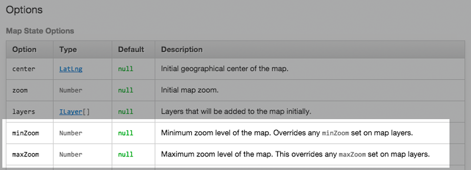
Figure 08-05. The minZoom and maxZoom options of Leaflet's map object.

Under the first column of "Option," the Reference provides the property name of each option (which will be used on the left side of the colon with the object). The second column of "Type" refers to the data type to be used for the property's value. The reference also provides the "Default" value for each option. Even if we don't define these properties these options are available when the map object is created (or "instantiated"), and assigned the default value. Null in this case which means there is no limit to the zooms beyond the capabilities of the map tiles. Each option also includes a "Description" as well. 

In this case, we see that *minZoom* and *maxZoom* each require values of a Number type and are initially given a value of *null* (meaning there will be no constraints upon the zoom level unless we specify these). So, we can add these options like so:

```javascript
    var options = {
        center: [38.0489,-96.5025],
        zoom: 4, // initial zoom level
        minZoom: 4, 
        maxZoom: 7
    }
    var map = L.map('map', options);
```

This prohibits the user from zooming farther in our out than we wish (and, depending on the goal of the map, why would we want the user to have free range over so many zoom levels?). This is cartographic power at work. With these new commands we are constraining users to a particular view that we wish to emphasize.

Leaflet provides many options for us to play around with. For instance, we could disable the panning of the map altogether with the *dragging* option given a Boolean value of `false`. Of course, it seems a bit odd to disable panning but still allow the user to zoom in, so you'd probably want to constrain the zoom level as well in most cases) or remove the default zoom control on the map with a *zoomControl* option. Try it out and see what happens to your ability to shift the map.

```javascript
    var options = {
        center: [38.0489,-96.5025],
        zoom: 4,
        minZoom: 4,
        maxZoom: 7,
        dragging: false,
        zoomControl: false
    }
    var map = L.map('map', options);
```
### Putting events (user interaction) into your map

Continuing to read through the Leaflet API Reference, we see that the Leaflet map makes many map "Events" available to us ([http://leafletjs.com/reference.html#map-events](http://leafletjs.com/reference.html#map-events). These include such fun user interaction (UI) events as clicking and dragging on the map, changing the zoom level, and adding or removing different data layers from the map. We also notice that the Reference tells us we "subscribe to the following events using [these methods](http://leafletjs.com/reference.html#events), which links us to the *Events methods* documentation within the API Reference. We won't spend too much time on these now, but let's implement the basic example shown to get a sense for what's possible?

```javascript
    map.on('click', function(e) {
        console.log(e.latlng);
    });
```

Because the variable `map`, used in this example, was created using Leaflet's *map* method, the *.on* method is referencing a Leaflet map object. The *.on* method takes two arguments, the first being a String designating what kind of user interaction the method is "listening" for. In this case it's a mouse "click" event. There are a whole bunch of events that can be monitored such as double clicks, button pushes, etc. See ([http://leafletjs.com/reference.html#map-events](http://leafletjs.com/reference.html#map-events)).

The second argument is a bit more complicated. It's a function, though not written like we've seen quite yet. It's not a typical function declaration, because there appears to be no function name and hence is called an anonymous function. Written as is, as an *on* method's argument, this function is actually invoked immediately when the user interaction event (e.g., "click") occurs. It is also refered to as a "callback function." The function call passes an argument as well, its corresponding parameter here written as *e* for "event" (though note that we could really use another letter or word here other than "e"). The example above will log to the Console the *LatLng* object encoding the latitude and longitude location where the user has clicked on the map.

Is this great? We now have a way of capturing user input in a really useful way!

### Putting "methods for modifying map state" into your map

Let's continue with those methods categorized under [Methods for Modifying Map State.](http://leafletjs.com/reference.html#map-set-methods) These methods can be used to apply or update some of the map properties we've already looked at using Leaflet's options. 

For example, we can center the map and set it to a particular zoom level using the *setView* method. Again, looking closely at the API Reference, we see that the *setView* method requires one argument (the *LatLng* object used to center the map), and two optional arguments (a Number for a zoom level and another set of options called 'zoom/pan options,' which we can ignore for now).

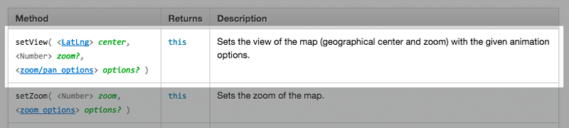

Think of Leaflet's "Options" as properties you set when the map is initialized (i.e., when the *map* method is first called and the Leaflet map object is instantiated), and Leaflet's map "methods" as setting these options at a later time in the script. For example, if we don't set the center and zoom when we first create the Leaflet map object, we can do it later using the *setView* method:

```javascript
    var map = L.map('map');
    map.setView([38.0489,-96.5025], 4);
```

While this may not initially seem useful, consider the case when we allow the user to click and zoom into various places on a map.

### Putting "methods for getting map state" into your map

Beyond setting the map state (i.e., it's geographical center or zoom level), there are also Leaflet methods for retrieving information about a map state, categorized in the Reference under [Methods for Getting Map State](http://leafletjs.com/reference.html#map-get-methods). Let's consider three of these, *getCenter*, *getZoom*, and *getBounds*:

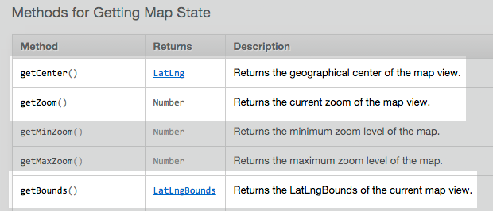

We notice that each of these returns something different. The *getCenter* method returns a Leaflet *LatLng* object, (which we've already seen) and represents a geographical point with a latitude and longitude value (see its documentation here: [http://leafletjs.com/reference.html#latlngbounds](http://leafletjs.com/reference.html#latlngbounds)). The *getZoom* method returns a Number value representing the current zoom level of the map (whew, that one is easy enough!). The *getBounds* method returns a *LatLngBounds* object, which represents a geographical area of a map (see its documentation here: [http://leafletjs.com/reference.html#latlngbounds](http://leafletjs.com/reference.html#latlngbounds). In practical terms, it is providing the Northeast and Southwest corners of a box from which we can derive the extend of a map. Let's first write the following code into our script and examine the output in the Console:

```javascript
    var center = map.getCenter();
    console.log(center); // returns a LatLng object
    var zoom = map.getZoom();
    console.log(zoom); // returns a Number
    var bounds = map.getBounds();
    console.log(bounds); // returns a LatLngBounds object
```

In the Console, we see that in fact we have logged three different values types, what's been logged as `o.LatLng`, `4`, and `o.LatLngBounds` (Figure 08-06):

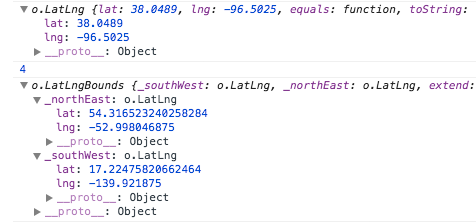
Figure 08-06. Console output from logging return values from *getCetner*, *getZoom*, and *getBounds* methods.

Let's look closely at the first one (oh, and for now just ignore the `_proto_` stuff you don't recognize). While the first and third lines of Console output may at first look fairly cryptic to us, look closely to see that they are merely JavaScript objects (again, recognize the curly brackets that contain comma-separated properties of key/value pairs separated by a colon). The first one, `o.LatLng`, is fairly simple and has two properties with names of `lat` and `lon`. So ... we could modify our *console.log* output to access these values directly. Just like we did in the last task.

```javascript
    var center = map.getCenter();
    console.log(center.lat, center.lng); // outputs the specific latitude and the longitude values
```

The return value of the Number type for *getZoom* is easy enough to work with since it is already output as a Number value, `4`. 

But what about this return value of *LatLngBounds*? This one seems a bit more complicated. From our earlier console log, we can see that the `o.LatLngBounds` object's first two properties are themselves objects, curiously named with a preceding underscore, `_southWest` and `_northEast`, each of which contain latitude and longitude values for their properties:

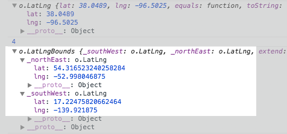
Figure 08-07. Closer inspection of the output of the *LatLngBounds* object

What do these underscores mean? While we could access the individual latitude and longitude values using dot notation like above (i.e., `console.log(bounds._southWest.lat)`), this is not intended within Leaflet. The underscore is a hint to remind us that there's actually a Leaflet method available to us for accessing these values. Indeed, if we compare the [documentation of the returned *LatLng* object](http://leafletjs.com/reference.html#latlng) with that of the [*LatLngBounds* object](http://leafletjs.com/reference.html#latlngbounds), we see that the *LatLng* provides *properties* of *lat* and *lng* for accessing these values directly using dot notation (just like we can acccess the length of an Array using the Array property of *length*, e.g., `myArray.lenth`). 

In contrast, the *LatLngBounds* object does not. Instead it provides various methods for returning the *LatLng* objects of the bounding box's four corners:

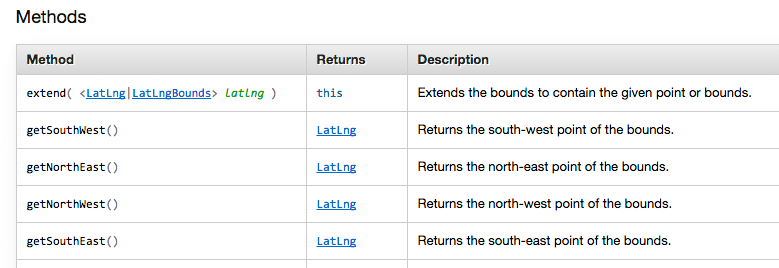
Figure 08-08. The methods available to Leaflet's *LatLngBounds* object

So, if we wanted to access the individual latitude and longitude values of the extent of our Leaflet map's current view port, we could write the following JavaScript:

```javascript
    var bounds = map.getBounds(); // returns the LatLngBounds object
    var bottomLeft = bounds.getSouthWest(); // returns a LatLng object
    console.log(bottomLeft.lat, bottomLeft.lng); // outputs the lat and lng values
```

The key thing to remember here is that we need to look closely at the API Reference to determine subtle differences between Leaflet's objects. While the *LatLng* object provides properties for accessing *lat* and *lng* values, the *LatLngBounds* object provides methods to do so. So, when you're running into errors or wondering how to access certain data or object properties, be sure to closely examine the Leaflet API Reference

### Putting "methods for layers and controls" into your map

Okay ... we're not having quite enough fun yet, so let's move on to Leaflet's next set of methods, "Methods for Layers and Controls," found here [http://leafletjs.com/reference.html#map-stuff-methods](http://leafletjs.com/reference.html#map-stuff-methods).

You may notice that the starter template and task *.html* files you've been using so far actually have one of these methods, the *addLayer* method.

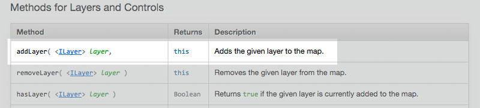

Specifically, we've been using the *addLayer* method to add a raster tile set to the map, which we've been using as our basemap. Remember this bit of code in your tasks? 

```javascript
    var tiles = L.tileLayer('http://a{s}.acetate.geoiq.com/tiles/acetate-hillshading/{z}/{x}/{y}.png', {
            attribution: '&copy;2012 Esri & Stamen, Data from OSM and Natural Earth',
            subdomains: '0123',
            minZoom: 4,
            maxZoom: 7
    });
    map.addLayer(tiles); // 
```

This method is straightforward. It's attached to the `map` variable via dot notation `.addLayer` and passes one argument.  In this case it is a *tileLayer* object which we have named `tiles`, that includes methods which load 256 x 256 pixel raster map images we use as the "slippy" reference basemap. 

Let's have a closer look at Leaflet's *tileLayer* method (documentation is found here: [http://leafletjs.com/reference.html#tilelayer](http://leafletjs.com/reference.html#tilelayer)). The *tileLayer* method passes two arguments: the first being a URL address to a public tile service, and the second being an object containing a number of Leaflet options.

The magic of these "slippy" tiled basemaps involves our ability to request pre-built tile sets and use them in our maps. Thus by changing one line -- the URL to a set of tiles -- you can change what the background of your map looks like.

Fortunately there are many good ones to choose from. You can explore various tile sets available to load within a Leaflet map here: [http://leaflet-extras.github.io/leaflet-providers/preview/](http://leaflet-extras.github.io/leaflet-providers/preview/). This fun viewer even provides a code snippet you can cut and paste into your script. Feel free to experiment with various tile sets. Note that you need not replace the current acetate tile set, but can add another one and simply change the name of the variable referencing the tile set we're adding to the map:

```javascript
    var OpenStreetMap_Mapnik = L.tileLayer('http://{s}.tile.openstreetmap.org/{z}/{x}/{y}.png', {
        attribution: '&copy; <a href="http://www.openstreetmap.org/copyright">OpenStreetMap</a>'
    });
    map.addLayer(OpenStreetMap_Mapnik);
```

##Glossary
* **Leaflet**: JavaScript library built to load custom tile sets and draw graphics upon the map
* **JavaScript library**: collection of objects, methods, and functions designed to solve a particular problem
* **API (Application Programming Interface)**: set of routines and protocols that allow various computer applications to talk with each other
* **central class (e.g., Leaflet L)**: the main template from which specific instances of a map or map objects are created
* **Leaflet options**: a set of properties contained within a JavaScript object that can be applied to a Leaflet map or map layer


