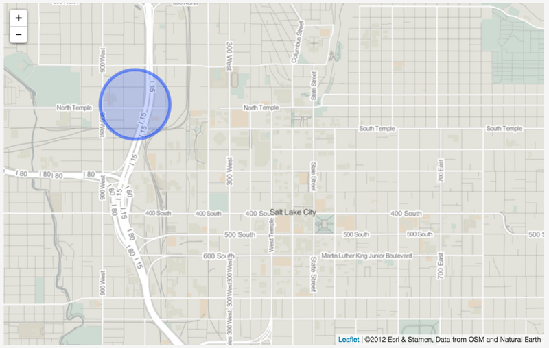
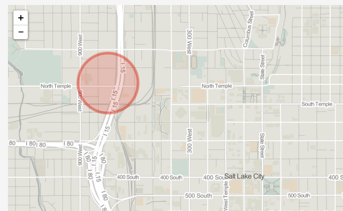
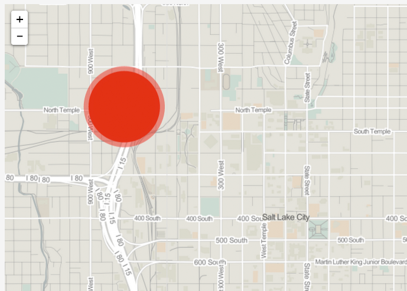
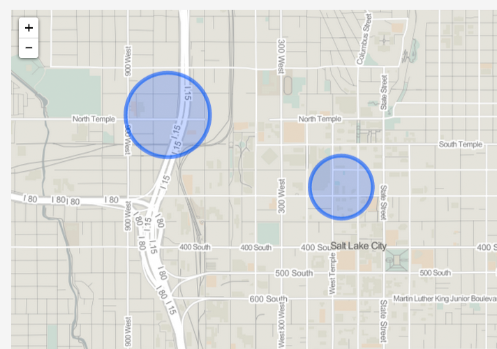
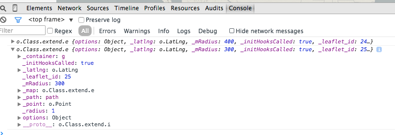

#Module 09: Markers and Drawing SVG with Leaflet

##Overview

This lab does the following:

* explains in detail how Leaflet marker objects work, including its options, events, and methods
* explains how Leaflet employs SVG to draw features on a map
* explores in depth Leaflet's *L.circle* class
* explains the computer science 

###Working files

You should use the index.html file located in the session-09/lab/ directory from the course Github repository. Remember to sync your local version of the course repository with the online version first. *NOTE* that the index.html file for lab 09 has all the code examples within this module within it, currently commented out. Uncomment the code (and tweak the examples) to see the results.

## UI Layers

Today is the day we starting talking about the stuff we put on top of maps. Placemarks, lines, polygons. We won't be tackling this all at once but some of the black box things are going to be opened today.

### Leaflet markers

Let's start by looking more closely at the default markers we've been using for Leaflet maps. They are documented here: [http://leafletjs.com/reference.html#marker](http://leafletjs.com/reference.html#marker).

Similar to creating a Leaflet map object, 

```javascript
    var map = L.map('map', {
        center: [51.505, -0.09],
        zoom: 13
    });
```

we create a Leaflet marker object by using the capital L and dot notation. But in this case we use the *marker* method. 

We see in the API Reference that this method accepts two arguments. The first one is required and is a *LatLng* object. The second argument, similar to the *map* method, is an object of options pertaining to the marker object we're creating. But since were creating a marker rather than a map these options will be different than the options we can apply to the Leaflet *map* object. Given that the second option is optional, let's first just put a marker on the map using no options:

```javascript
    var redIguanaLocation = L.latLng(40.7718,-111.9124);
    var redIguanaMarker = L.marker(redIguanaLocation);
    redIguanaMarker.addTo(map);
```

Boom! Really simple but really powerful. You just marked up your map.

Here the first line creates a new *LatLng* object using the coordinates of the Red Iguana Restaurant. The second line passes a reference to that object as an argument when calling the *marker* method (effectually passing that value as the argument). The third line then uses the method *addTo* to add that marker to the map (we'll look at the *addTo* method of the *marker* object in a moment, but it's similar to the *addLayer* method we looked at in Module 08, and you can guess what it does). Or at least we hope you can imagine, if you can't you probably need an emergency imagination transplant.

### Leaflet marker options

You already know how to use options with the *map* method. Good thing that you can use the same principles to apply options to the *marker* object. First question, where do you get a list of all the options?

That's right, at the Leaflet documentation that we already linked to at the top of this module [http://leafletjs.com/reference.html#marker](http://leafletjs.com/reference.html#marker). Again we want you to get used to going to these pages because it gives you a whole list of what you can do with Leaflet, including stuff we don't talk about in this course. It is pure unadulterated mapping POWER!

Let's play with a couple of these (though we expect you to experiment with others yourself). The *draggable* and *opacity* options look fun, so let's include those when we create the marker. What do these do? You can probably guess but check the reference and see what the description says.

Modify the code so that it looks like this:

```javascript
    var redIguanaLocation = L.latLng(40.7718,-111.9124);
    var redIguanaMarker = L.marker(redIguanaLocation, {
        draggable: true,
        opacity: .4
    });
    redIguanaMarker.addTo(map);
```

Changing the marker's default *draggable* option to true and the *opacity* to .4 (btw, valid *opacity* values in Leaflet range from 0 to 1), allows the user to drag the marker around the map, as well as makes it fairly transparent.  Woohoo!!! Moveable markers, take it out for a drive!

The icon option is also a fun one, but we'll skip over that for now.

### Leaflet event methods

There are also a number of events which we can attach to Leaflet markers. Events are things that can 'happen' on a page. For example, a user can click somewhere, or click and drag, or double-click etc. When we attach these events to a marker (or any other Leaflet object), it means that that marker will then 'listen' for these events. When an event happens, it will pick up on it and subsequently execute some pre-defined code.

Many of the marker events are named similarly to the events we can use with the Leaflet *map* object such as *click* and *dbclick*, though others such as *popupopen* pertain solely to marker objects. Again, to use these events we need to make use of Event methods ([http://leafletjs.com/reference.html#events](http://leafletjs.com/reference.html#events)).  You could also just scroll down from the list of options for Leaflet markers as the Event methods are located just below them in the reference document.

The most useful of these Event methods which is the *on* method. For example, suppose we want to log to Console the location of the marker while we're dragging it. After making the *draggable* option true (btw, notice that we're not including the opacity option here and the marker looks different), we can use the 'drag' event's callback to log its *LatLng*:

```javascript
    var redIguanaLocation = L.latLng(40.7718,-111.9124);
    var redIguanaMarker = L.marker(redIguanaLocation, {
        draggable: true   
    });
    redIguanaMarker.addTo(map);
    redIguanaMarker.on('drag', function(e) {
           console.log(e.target.getLatLng());
    });
```

Wow! Look at all that data showing up in the console. You can probably also imagine that one could use this input to creat a line that visualizes how you are dragging the icon across the map. We won't do that here but it is always useful to think about how these events and options might be used.

The `e.target` bit might be a little confusing at first. Again, this is where the Leaflet documentation helps us out. Go to [http://leafletjs.com/reference.html#event-objects](http://leafletjs.com/reference.html#event-objects). You see there that `e` holds the event object, which has two properties: the type of the event (in this case 'drag') and the target. In our case, the object that 'fired' the event is the redIguanaMarker. So accessing `e.target` is functionally the same as accessing the redIguanaMarker directly! That's why we can use the `getLatLng()` function here -- it's a method available to any Leaflet marker ([http://leafletjs.com/reference.html#marker](http://leafletjs.com/reference.html#marker)).

You should recognize another *marker* method in the API Reference named *bindPopup*. We've been using this the past couple of labs to fill the Leaflet marker popups with content. 

```javascript
    var redIguanaLocation = L.latLng(40.7718,-111.9124);
    var redIguanaMarker = L.marker(redIguanaLocation);
    redIguanaMarker.addTo(map);
    redIguanaMarker.bindPopup("Bow down to your Iguana overlords!");
```

Looking now at the API reference (scroll down to the methods section of markers), we see that the first argument of the *bindPopup* method can be either a String of text (interpreted as HTML text) OR HTML elements (e.g., "`<div class='colorValue'>`..."), which is how we've been using it, OR a Popup. What is this third possibility? 

The *marker*'s* *bindPopup* method is actually invoking another Leaflet method, *popup*, documented here: [http://leafletjs.com/reference.html#popup](http://leafletjs.com/reference.html#popup), which creates a Popup object. The *bindPopup* method allows you to create this object first, and then bind it to a marker. The Popup has numerous options as well (feel cuurious and play with them!).

And now for a further point of clarification. Perhaps you've noticed, within the scripts we've been working with so far in class, the following code:

```javascript
    L.marker([40.21,-88.154]).addTo(map).bindPopup(popup);
```

What we're looking at here are three methods, *marker*, *addTo*, and *bindPoup* which have been chained together to one another using dot notation. This is known as "method chaining," as each method is chained to its predecessor. This is supercool but also can be a bit confusing the first time you see it.

How this works: the *marker* method is called first and returns a Leaflet *Marker* object. The *addTo* method is then applied to that return object, which adds it to the map (the *Marker* object remains the return object). The *bindPopup* method is then applied to that *Marker* object. The result of this code is exactly the same as writing this more verbose version:

```javascript
    var city =  L.marker([40.21,-88.154]);
    city.addTo(map);
    city.bindPopup(popup);
```

Both will work but the method chaining approach is more compact and is also the stuff you are most likely to see in other people's code.

## SVG Vector Layers

Leaflet's default markers, while sometimes appropriate, have limited utility for us as web cartographers. Sometimes we want something more than just a placemark marking a point.

Drawing various vector objects allows us to represent a wider range of geographic phenomena than simple point markers. This section of the module introduces Leaflet's capacity to draw vector layers using SVG (Scalable Vector Graphic), which is a text-based web standard similar to HTML used for describing vector graphics and text.

### Vector vs. raster

As a refresher, what's the difference between vector and raster? In the simplest of terms, vector representations of geographies use points, lines, and polygons, while raster representations use gridded cells of varying colored values (i.e., raster stores information as images). So far we've just been using raster imagery in Leaflet in  different ways. Can you think of what they are?

  * The first way are the raster tile images we bring in to use as our basemap. You now know how to do this and can bring in a publically available set of tiles (or even make you own if you are really ambitious).
  * The second way are the Leaflet markers (that we're perhaps getting tired of seeing). These markers are simply small raster images we're placing on the map.

### Leaflet's vector layers - example of the circle class

Leaflet makes some basic vector geometries available as SVG elements. [Leaflet's API Reference](http://leafletjs.com/reference.html) refers to these as "Vector Layers": *Polyline*, *Multipolyline*, *Polyline*, *Polygon*, *MultiPolygon*, *Rectangle*, *Circle*, and *CircleMarker.* It's useful to remember that Leaflet considers every individual vector object its own "layer" ... so if you have a collection of Leaflet circles, each one is considered its own layer (see below under Other Layers).

We'll begin playing with vector graphics in Leaflet with the *Circle* class ([http://leafletjs.com/reference.html#circle](http://leafletjs.com/reference.html#circle)).

The API Reference tells us that we create a new instance of a Leaflet *Circle* by using a *circle* method: (i.e., `L.circle()`) with which we can pass two required arguments (a *LatLng* object for the location of the circles center and a Number for the radius of the circle, in meters). Let's say we've learned that the [Red Iguana Restaurant](http://www.rediguana.com/) is cooking a new batch of pork green chile, and iguanas can smell the deliciousness from 400 meters away. How can we represent this incredibly important geography visually on a map? 

Here's a JavaScript solution using Leaflet:

```javascript
    var redIguanaLocation = L.latLng(40.7718,-111.9124);
    var redIguanaCircle = L.circle(redIguanaLocation, 400);
    redIguanaCircle.addTo(map);
```
This code first creates a *LatLng* object to hold our location data and stores that as a variable. The second statement then passes that object as the first argument within the *circle* method, and passes the Numeric value of 400 as the second argument. This statement then assigns the return value to the variable `redIguanaCircle.` 

What's the data type of this return value assigned to `redIguanaCircle`? 

It's a Leaflet *Circle* object. The next statement then adds this *Circle* object to the map using the *addTo* method. When we refresh our browser (and perhaps zoom into the location) we see a basic Leaflet SVG *Circle* placed at the location of the Red Iguana Restaurant (Figure 09-01). A mapped circle of pork green chile deliciousness that will be of great interest to iguanas everywhere, although in truth iguanas are more likely to be interested in flies.  There's no accounting for taste!

;
Figure 09-01. A Leaflet map with a Leaflet Circle with default style options.

### Understanding path options and extend/inheritance

The reference page also shows that a third optional argument we can pass using the *circle* method are *Path options*. 

Wait! What are *Path* options and why are we not passing options specific to the *Circle* class? If we look closely at the API, we see that it tells us that the Leaflet *Circle* class "Extends [Path](http://leafletjs.com/reference.html#path)".

To understand what this "extends" means, we need to take a moment to understand a fundamental concept in computer science and programming: that of *inheritance*. Remember when we talked about a "class" being a kind of template from which specific instances of that class can be constructed? The classic metaphor for a class is that of the blueprint of a house. The blueprint provides for basic instructions about how many rooms are in the house, how the doors open, where the iguana run is placed, where the kitchen is located, if there is a garage, etc. We can take this blueprint--this class--and then build (or "instantiate," in computer lingo) many different instances of this house. And when we do, we don't need to follow the blueprint exactly. Maybe we paint one house red and the other blue. Perhaps we include a garage on one house, or use beaded curtains instead of a swinging door on another. 

In other words there is a plan one follows but within the plan are many different points where we can select options. This is how Leaflet's classes (and all classes in computer programming) work. 

The Leaflet *Map* class provides a blueprint for making many different kinds of maps -- fun maps providing information about iguanas or boring old maps showing streets. The same thing holds true for Leaflet's *Circle* class.  We can use it to make many different kinds of circles -- representing zones of deliciousness or flood areas -- but all of these circles have the characteristics provided for by the blueprint (or, the JavaScript code underlying the Leaflet library). And the cool bit is we can also modify and customize the specific instances of these circles.

Okay, what about this "extend" business then? Returning to our house blueprint metaphor, suppose we want to build a houseboat. We don't need to start from scratch, because we already put a lot of work into a blueprint for building many parts of a house. We want our houseboat to also have a kitchen, a bathroom, a bedroom, and doors, just like the house. But we also what our houseboat to have additional features (such as iguana diving board) and functionality. So, we create a houseboat blueprint that extends the blueprint of the house to keep all of the  features of a house, but will also include the features and functionality of the boat.

The Leaflet *Circle* class "Extends [Path](http://leafletjs.com/reference.html#path)," so we need to look more at the *Path* class to understand what's available to our *Circle* class.  Again, just as the houseboat would inherit all the features and functionality of the house, so to will *Circle* will inherit all of *Path's* options, events, and methods. 

As always we start with a look at the API Reference for path: [http://leafletjs.com/reference.html#path](http://leafletjs.com/reference.html#path). 

First, notice that the API Reference informs us that the *Path* class is: "An abstract class that contains options and constants shared between vector overlays (Polygon, Polyline, Circle). Do not use it directly." So we won't see some "Factory" method for its creation (don't worry about what Factory means right now), like we have with the other classes so far (e.g., `L.map()`, `L.marker()`, `L.circle()`). Instead, Leaflet uses the *Path* class as a blueprint for extending the other classes (e.g., *Polyline*, *Polygon*, *Circle*, etc.). These will all inherit *Path*'s options, events, and methods.

  * **OPTIONS** The *Path* options include such things as the stroke color and weight of SVG lines, fill color and opacity of SVG polygons, and whether or not an object contructed with the *Path* class is clickable or not. 
  * **EVENTS** The *Path* events are also similar to the events we've previously seen (e.g., "click", "dbclick", "mouseover", etc). 
  * **METHODS** Path methods include a *addTo* method (which can be used to add a vector layer to the map), a *bindPopup* method (which behaves the same as the one used for binding popups to the Leaflet *Markers*), and a *setStyle* method which allows you to change the *Path* options after you've create an object extending *Path.* 

Remember, we can't directly create a "path" element,  but rather all these options, events, and methods are available to Leaflet objects that extend the *Path* object. So let's dive into the Leaflet Circle object to play with some of this functionality now.

### Putting path options to work in *L.circle*

Let's return to our basic Leaflet map then to apply some *Path* options to improve the circle's appearance. Keep in mind that the circle as is isn't unstyled; it has color, opacity, and a border. But rather than being defined by us, Leaflet has applied some default styles to the circle. 

There are two solutions for changing these basic styles: doing it upon object creation and after object creation.

Because the Red Iguana is red and not blue (like it's sister restaurant, the [Blue Iguana](http://blueiguanarestaurant.net/)), it would be better to make the circle red. We want to change both the stroke (or border) and fill of the circle, so we need to refer to the [Path](http://leafletjs.com/reference.html#path) documentation. Remember, we include these options as the third argument in the *Circle* class instantiation by included them as key/value pairs within an object:

```javascript
    var redIguanaLocation = L.latLng(40.7718,-111.9124);
    var redIguanaCircle = L.circle(redIguanaLocation, 400, {
        color: "#d72b1e",  // changes the stroke color
        fillColor: "#d72b1e"  // changes the fill color
    });
    redIguanaCircle.addTo(map);
```

When we save our changes and refresh the map, voila! We've now changed the color styles of the SVG circle (Figure 09-02). We are boss!


Figure 09-02. Leaflet *Circle* with stroke color and fill color styled as red.

Note that can also update the styles of a Leaflet vector layer after we create it (similar to how we can update the properties of a Leaflet *Map* object after we create it). This example demonstrates changing the styles of our *Circle* using the *setStyle* method inherited from the *Path* class (and modifies the default values for the stroke width and fill opacity):

```javascript
    var redIguanaLocation = L.latLng(40.7718,-111.9124);
        var redIguanaCircle = L.circle(redIguanaLocation, 400);
        redIguanaCircle.addTo(map);

        redIguanaCircle.setStyle({
            color: "#d72b1e", // sets stroke color to red
            weight: 15, // sets the stroke width to 15 pixels
            fillColor: "#d72b1e",  // sets fill color to red
            fillOpacity: 1  // sets the fill opacity to 1

        });
```

We can save and refresh the browser to see the results (Figure 09-03).


Figure 09-03. Circle with thicker stroke with and fill color set to opacity 1

The *Circle* class also has its own methods that don't belong to *Path*. These include methods for getting the latitude and longitude of the circle's center point, getting the circle's radius, as well as (re)setting these values. Consider the following code, which first creates an "empty" *Circle* object and then supplies the location coordinates and radius:

```javascript
        var redIguanaLocation = L.latLng(40.7718,-111.9124);
        var redIguanaCircle = L.circle();
        redIguanaCircle.setLatLng(redIguanaLocation);
        redIguanaCircle.setRadius(400);
        redIguanaCircle.addTo(map);
```

If you're paying attention, you should be saying, "Wait a minute!!!" I thought the location and radius were *required* arugments for creating a *Circle*!" Well, you're correct. While Leaflet's code allows us first instantiate a *Circle* without passing these arguments, if we tried adding it to the map we would get an error. The example above works because we've used the *setLatLng* and *setRadius* methods before we've added it to the map.


## Working with LayerGroup

We're going to spend more time with the other Leaflet Vector Layers in the coming weeks. To finish off this module, however, we're going to look at some functionality used in Leaflet to group layers. Remember above when we said that Leaflet treats each SVG object (and each marker element) as its own "layer?" Well, it begins to get kinda messy if we're simply adding a bunch of different elements to the map itself (especially when we start adding different sets of related geographical elements). 

To help with this, and to provide some other useful functionality, Leaflet provides some objects used to group layers together. We're going to look at a class called *LayerGroup*, which Leaflet says is used to "group several layers and handle them as one," as documented here: [http://leafletjs.com/reference.html#layergroup](http://leafletjs.com/reference.html#layergroup).

Let's continue with our mapping of delicious Mexican food in Salt Lake City to better understand how to use the *LayerGroup.* The following code first creates an empty *LayerGroup* object or something to which we can add stuff, like circles representing the delicious smells coming out of Iguana restaurants.  After creating each layer (namely our *Circle* objects) we use `.addTo` to that the layer to the *layerGroup*. We've give the Blue Iguana a slightly smaller radius because, while delicious, the aroma of its green chile doesn't travel quite as far as its sister restaurant:

Nothing really has changed to the layer (or *Circle* objects) associated with either restaurant, they are just now associated with this *layerGroup* which we can add to the map in one step at the end.

```javascript
        var iguanaRestaurants = L.layerGroup();
        var redIguana = L.circle([40.7718,-111.9124], 400);
        redIguana.addTo(iguanaRestaurants);
        var blueIguana = L.circle([40.7657, -111.8930], 300);
        blueIguana.addTo(iguanaRestaurants);
        iguanaRestaurants.addTo(map);
```




So the *LayerGroup* object allows us to conveniently group geographic elements together. Eventually we'll be doing things like adding and removing layer groups (say, for instance, the user can toggle on and off various sets of geographic features). For now, let's look a little more closely at an important method we use with *layerGroups* (and eventually *featureGroups* and *GeoJSON* layers): the *eachLayer* method.

Leaflet's *eachLayer* method allows us iterate through all the layers within a *layerGroup* object. So, it operates like the for and while looping we've already practiced with JavaScript. Let's start with a basic example, looping through our newly created `iguanaRestaurants` *layerGroup*:

```javascript
        var iguanaRestaurants = L.layerGroup();
        var redIguana = L.circle([40.7718,-111.9124], 400);
        redIguana.addTo(iguanaRestaurants);
        var blueIguana = L.circle([40.7657, -111.8930], 300);
        blueIguana.addTo(iguanaRestaurants);
        iguanaRestaurants.addTo(map);
        
        iguanaRestaurants.eachLayer(function(layer) {
            console.log(layer);
        });
```

This output in the Console looks a little convoluted:


Figure 09-03. Leaflet layer output

However, each of these layers are the Leaflet layer contained within that *layerGroup,* in this case our *L.circle* objects. So, we can treat this `layer` as the *L.circle* objects themselves and apply options, events, and methods to them. For example, let's bind a 'mouseover' event to these circles that changes their color to yellow on the hover (in User Interaction design, this is called providing an "affordance" to the user, i.e., feedback that they have triggered some kind of event):

```javascript
    var iguanaRestaurants = L.layerGroup();
    var redIguana = L.circle([40.7718,-111.9124], 400);
    redIguana.addTo(iguanaRestaurants);
    var blueIguana = L.circle([40.7657, -111.8930], 300);
    blueIguana.addTo(iguanaRestaurants);
    iguanaRestaurants.addTo(map);

    iguanaRestaurants.eachLayer(function(layer) {
        layer.on('mouseover', function(e) {
           e.target.setStyle({
               color: 'yellow',
               fillColor: 'yellow'
           });
        });
    });
```

Oohh, isn't that neat!? However, we also want the circle to change back to it's default color on mouseout, so we could add another event, a 'mouseout' event to each layer:

```javascript
    iguanaRestaurants.eachLayer(function(layer) {
        layer.on('mouseover', function(e) {
           e.target.setStyle({
               color: 'yellow',
               fillColor: 'yellow'
           });
        });
        layer.on('mouseout', function(e) {
            e.target.setStyle({
               color: '#03f',
               fillColor: '#03f'
            });
        });
    });
```

Now we're starting to get into some fun user interaction (UI) stuff. To finish up this module, let's say that we want to complete our map of these two iguana restaurants. Our requirements for this little example include:

1. sizing each circle according to the distance of juicy aroma
2. coloring each circle according to whether it's red or blue
3. providing a hover affordance (turning the circle yellow)
4. returning the circle's color to its original, default color

To achieve this, this example demonstates two new (and useful) coding tricks when making maps with Leaflet. First we're storing the "options" properties for each circle in separate variables. We use this variable when we first create the circles, but we're also using to restore each circle back to its original color. Second, when we're looping through each layer, we need a way to determine which circle is which (so we apply the red style to the red circle and blue to the blue). To do this, we store a unique identifier as a property of each circle. We simply use dot notation to create a new property and assign it a respective value ('red' or 'blue'), and we've arbitrarily chosen the property name 'color' here. Then, we can use conditional logic within the *eachLayer* looping structure to determine which style to apply:

```javascript
    var iguanaRestaurants = L.layerGroup();
    var redIguanaOptions = {
        color: 'red',
        fillColor: 'red'
    };
    var blueIguanaOptions = {
       color: '#03f',
       fillColor: '#03f'
    };
    var redIguana = L.circle([40.7718,-111.9124], 400, redIguanaOptions);
    redIguana.color = 'red';
    redIguana.addTo(iguanaRestaurants);
    var blueIguana = L.circle([40.7657, -111.8930], 300, blueIguanaOptions);
    blueIguana.color = 'blue';
    blueIguana.addTo(iguanaRestaurants);
    iguanaRestaurants.addTo(map);

    iguanaRestaurants.eachLayer(function(layer) {
        layer.on('mouseover', function(e) {
           e.target.setStyle({
               color: 'yellow',
               fillColor: 'yellow'
           });
        });
        layer.on('mouseout', function(e) {
            if(e.target.color == 'red') {
                e.target.setStyle(redIguanaOptions);
            } else if (e.target.color == 'blue') {
                 e.target.setStyle(blueIguanaOptions);      
            }
        });
    });
```

The examples and concepts within the module are directly applicable to your first map assignemnt, so be sure to carefully consider the code and ask questions for clarification. Have fun.
