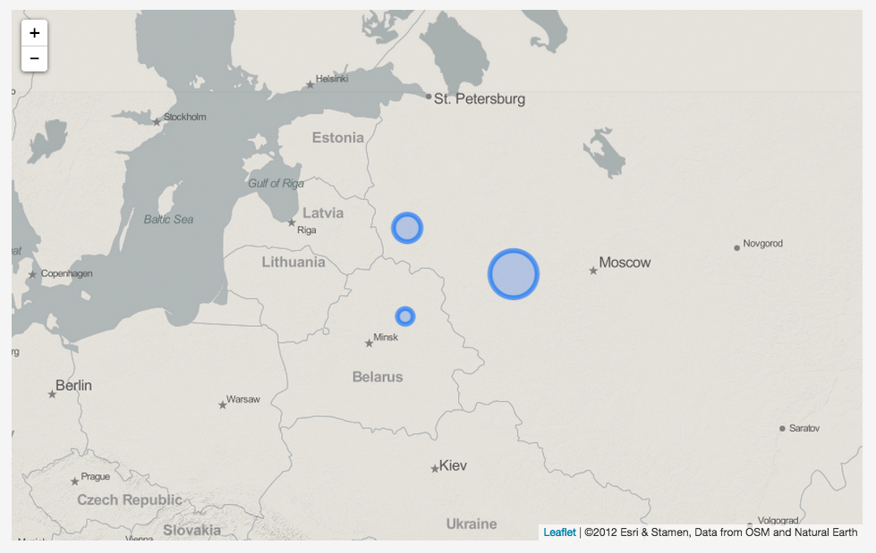

#Module 10: Using GeoJSON with Leaflet

##Overview

This lab does the following:

* introduces you to the GeoJSON specification
* acquaints you with a cool website called geojson.io and shows you how to create some GeoJSON data
* teaches you how to use GeoJSON-encoded data within Leaflet to draw all sorts of geographic layers
* explores the Leaflet options and methods available to a Leaflet GeoJson layer

###Working files

You should use the index.html file located in the session-10/lab/ directory from the course Github repository to practice coding the examples provided below. A second copy of this file with the coded examples commented out has been provided for your reference. Remember to sync your local version of the course repository with the online version first.

##What is GeoJSON?

GeoJSON, or the [The GeoJSON Format Specification](http://geojson.org/geojson-spec.html), is a now widely embraced open interchange format used for encoding geographic data (i.e., points, lines, polygons). It has recently replaced such data formats as KML (Keyhole Markup Language, pioneered within Google Earth) and ESRI's Shapefile format for representing spatial data, particularly on the web. Today it is the de facto standard used within such mapping libraries as Mapbox.js, Leaflet.js, CartoDB, and Data Driven Documents (D3.js). In short, GeoJSON is a convenient way to store your spatial data and load it into a web map. 

There’s nothing particularly special about GeoJSON that demarcates it from the JavaScript Object Notation (JSON) from which it was derived, and with which you are already familiar. In terms of its structured syntax, it's simply another (nested) JavaScript object (although the specification does require that the **key names of properties must be encoded within quotations**). 

What makes it "Geo"JSON (and useful for map maps) is that certain key values use a standardized way of encoding and referencing simple geographic features, with the value of its type member encoded as one of the following: `"Point"`, `"MultiPoint"`, `"LineString"`, `"MultiLineString"`, `"Polygon"`, `"MultiPolygon"`, `"GeometryCollection"`, `"FeatureCollection"`. This specification for Geometry objects is nothing new, having been established by the Open Geospatial Consortium (OGC) and International Organization for Standardization (ISO) for quite some time now (certainly before we were putting maps on the web).

GeoJSON objects will always contain a key name of `"type"`, usually designating whether it is a `"FeatureCollection"` or a simple `"Feature"` (`"Feature"` members are usually collected within a `"FeatureCollection"` object). The member type and its coordinates are encoded within a `"geometry"` object. A `"properties"` object is typically reserved for encoding data associated with the feature such a a name.

```javascript
    {
      "type": "Feature",
      "geometry": {
        "type": "Point",
        "coordinates": [125.6, 10.1]
      },
      "properties": {
        "name": "Dinagat Islands"
      }
    }
```

A final important thing to remember about the GeoJSON specification is that the **coordinates are encoded as `[longitude, latitude]`.** That's different from how we usually say it ('latitude, longitude') but makes sense when you remember that longitude represents the *x* coordinate and latitude the *y* coordinate. Annoying but as the saying goes, "Don't grab a gift iguana by the tail."

##Let's create some data encoded as GeoJSON

Creating our own GeoJSON structures by hand would be extremely laborious. And as much as we know you would enjoy doing it (NOT!) it would be rather silly, especially when there are plenty of other tools for the job. One common way to create GeoJSON is to use a desktop GIS such as QGIS (Q will actually export any vector layer as GeoJSON). This is useful if you're working with existing geometry data, so keep this in mind.

For now, we're going to use a useful web-based tool for this learning module. Tom Macwright, one of the talented programmers at [Mapbox](https://www.mapbox.com/), created the website [geojson.io](http://geojson.io/). Macwright describes the site as a "a quick, simple tool for creating, viewing, and sharing maps." You can use it to upload data in formats such as KML, GeoJSON, or CSV (provided there is lat and lon data columns provided) for various purposes. We're going to use this tool to draw and create some GeoJSON-formatted data for us. We'll then paste that code into the JavaScript we're using to build our Leaflet web maps.

First go to the site ([http://geojson.io/](http://geojson.io/)). While you can use the site without logging in, note that you can login to the site using your GitHub credentials. The tool is then linked to your GitHub account and allows you to save maps you're creating with geojson.io as GitHub repositories, or [GitHub Gists](https://gist.github.com/), which are like small GitHub repositories used for storing code examples. So go ahead and log in.

The site interface is composed of, on the left side, a Leaflet map used for drawing various geometries on the map, including polylines, polygons, rectangles and point markers. On the right side is a window that displays the GeoJSON markup as you add features to the map. The tool is nice because it correctly formats the GeoJSON structure, as well as allows you to enter properties for each feature. 

For the purpose of this demonstration, we're going to simply create some random arbitrary features. First we'll use the map interface to zoom into some area of our choosing, in this case a map view centered in Eastern Europe at zoom level 5, centered on lat/lon 50.653/30.608: ([http://geojson.io/#map=5/50.653/30.608](http://geojson.io/#map=5/50.653/30.608]).

Since we're already familiar with markers, let start with those. I'll begin by placing a few markers on the geojson.io map using the marker button (on the toolbar on the right side of the map, hover your mouse over each to see what they do).:


Figure 10-01: Three markers on a map in geojson.io 

Note that if we click on an existing marker after we place it, a popup window opens allowing us to add key/value properties (use the add row button) to our marker. This example has added a property "name" with a value of "Some Place", and a property name "size" with a value of 38000. When we click save these are reflected in the GeoJSON at right. Note that geojson.io correctly includes the quotations around the property names, as per the GeoJSON specification.


Figure 10-02: Adding properties in geojson.io 

##Leaflet's GeoJson Layer

Leaflet has its own way of reading GeoJSON objects and converting them into a Leaflet GeoJson layer (these are different things, so be mindful of when we're discussing one or the other in the text that follows; the interchange format will be written as *GeoJSON*, while Leaflet's layer will be written as *GeoJson*). See Leaflet's documentation here: [http://leafletjs.com/reference.html#geojson](http://leafletjs.com/reference.html#geojson). 

Using geojson.io above, we created  a GeoJSON *FeatureCollection* (see the code at the top of the right side of Figure 10-02). Let's see if we can get it into our own Leaflet map. Eventually, we'll be storing our GeoJSON data in external files and loading them into our script dynamically. This is really useful for big data sets but for now, we can simply cut and paste the code from the geojson.io webpage into our script we're editing in Brackets. Let's also create a variable (e.g., `places`) and assign the GeoJSON structure to it as its value (see below).  This is simply the encoding we created in Figure 10-02 -- the three points in Eastern Europe -- and you can use this or even try out a set of your own three points.

```javascript
    var places = {
          "type": "FeatureCollection",
          "features": [
        {
          "type": "Feature",
          "properties": {
            "name": "Some Place",
            "size ": 38000
          },
          "geometry": {
            "type": "Point",
            "coordinates": [
              29.267578125,
              56.8249328650072
            ]
          }
        },
        {
          "type": "Feature",
          "properties": {
            "name": "Another Place",
            "size": 65000
          },
          "geometry": {
            "type": "Point",
            "coordinates": [
              34.013671875,
              55.677584411089505
            ]
          }
        },
        {
          "type": "Feature",
          "properties": {
            "name": "Yet Another Place",
            "size": 22000
          },
          "geometry": {
            "type": "Point",
            "coordinates": [
              29.179687499999996,
              54.59752785211386
            ]
          }
        }
      ]
    }
```

### Adding points to a map using L.geoJson

Next, below that code (or GeoJSON object), let's use the Leaflet method to draw and style these GeoJSON points to our map. To do so, we'll use the Leaflet *L.geoJson()* method, which parses (i.e., reads) the GeoJSON data and creates a GeoJson layer in Leaflet to be displayed on the map. **Remember the difference between *GeoJSON* and *GeoJson* that we discussed above?**

We'll pass the variable -- *places* -- with which we're referencing our GeoJSON data as the first argument before adding this new layer to the map. We can do this with a single statement, and assign that return object (a Leaflet *GeoJson* layer) to another variable (`placesLeaflet`) to access later on:

```javascript
    var placesLeaflet = L.geoJson(places).addTo(map);
```

Leaflet's *L.geoJson* method has parsed that data structure and (by default) converted it to a Leaflet GeoJson layer and drawn those GeoJSON Point Features as Leaflet markers. The *addTo* method, of course, adds this layer to the map. That's really powerful for a short line of code!

We can refresh our browser and yippie! We're looking at our old friends, the Leaflet markers!


Figure 10-03: Leaflet markers 

It's worth comparing a `console.log(places)` statement with a `console.log(placesLeaflet)` statement at this point to begin unravelling what Leaflet's doing with the GeoJSON data its given. If we drill down a bit into our console, we recognize the GeoJSON structure we've assigned to `places`. The output for `console.log(placesLeaflet)` reveals that the *L.geoJson* method has converted the GeoJSON data into a Leaflet object (a.k.a. Leaflet "layer"), which means there are options, events, and methods now available to this object for use within our map.


Figure 10-04: Console log comparing the difference between GeoJSON and GeoJson (Leaflet object) 

### Using the pointToLayer option for L.GeoJson

Okay, we're really getting tired of those same old markers, right? Someday there will be an Iguana layer created for Leaflet but until that glorious day let's at least draw these points as Leaflet *Circles.  To do so, let's have a look at the options available to use when we invoke this *L.geoJson* method ([http://leafletjs.com/reference.html#geojson](http://leafletjs.com/reference.html#geojson). 

The first option available to us is *pointToLayer*, which Leaflet tells us is "used for creating layers for GeoJSON points (if not specified, simple markers will be created)." The method passes two arguments, the GeoJSON *featureData* and a *LatLng* object. 

Where do we get these two arguments? 

The answer is somewhat unsatisfying because we need to be content knowing that these values are passed implicitly (i.e., "behind the scenes" a.k.a. "under the hood") within the inner workings of the *L.geoJson* method. The code is a bit complicated too, so let's just look at this example. We've included a *console.log* statement as well, to example what gets passed with the function assigned to *pointToLayer*:

The `feature` and `latlng` objects both show up on the second line (as well as the third although that's the console log and not required). The `latlng` also appears on the fourth line to provide the center point for each of the circles.

```javascript
    var placesLeaflet = L.geoJson(places, {
        pointToLayer : function(feature, latlng) {
            console.log(feature,latlng);
            return L.circle(latlng, 40000);
        }
    }).addTo(map);
```

Note that the `feature` and `latlng` are nothing defined persistently within this script, nor are they required words. They are in fact parameters of that function, so we can name them whatever we wish. For example `f` and `ll` work just as well:

```javascript
    var placesLeaflet =  L.geoJson(places, {
        pointToLayer : function(f, ll) {
            console.log(f,ll);
            return L.circle(ll, 40000);
        }
    }).addTo(map);
```

The return statements is critical here, returning the Leaflet *Circle* object we've created (we just hard-coded a value of 40000 meters for *L.circle*'s second required argument). But of course we could have altered that based on other data in the GeoJSON (as we'll do it a bit).  That *Circle* layer will now be drawn to the map by the *L.geoJson* method. The result is a pleasing 3 circles instead of the three markers:


Figure 10-05: Circles with a standard radius

It's okay if all this seems a little murky. Again, the reason we're using Leaflet is because it's running a bunch of code we don't need to (or want to!) wrestle with or need to fully understand. The important thing here is that we pass a GeoJSON FeatureCollection as the first argument and can use the *pointToLayer* option to convert the layers created from Leaflet *markers* to Leaflet *circles*.

### Using L.geoJson to access properties data

Now for something really important. We're obviously using the latitude and longitude values for each point to place the Leaflet circles on the map. But why is that *pointToLayer* function also passing each feature data as well? The answer is that we often wish to access data held within the properties of a GeoJSON Feature. 

For this example we encoded each of our three markers with a property named `"size"`. Rather than hard-coding a radius for each cicle (e.g., 40000), let's use that feature parameter within the function to access the value of `"size"` and use it to determine the radius for each circle. Btw, get excited, because we're getting dangerously close to thematic mapping here! Try the following code, modified from the previous example:

```javascript
    var placesLeaflet = L.geoJson(places, {
        pointToLayer : function(feature, latlng) {
            return L.circle(latlng, feature.properties.size);
        }
    }).addTo(map);
```

We can see that instead of hard-coding a numeric value for the second argument of the `L.circle` method, we've accessed the "size" value within the JS objects for each Feature using dot notation, and then used that information to dynamically re-size each circle. The result is evident when we refresh the browser:


Figure 10-06: Circles with dynamically sized radius

Circles. Of. Different. Sizes.  Ok, maybe you aren't as excited about this as we are but this simple example is the gateway to unlocking an enormous amount of options. Based on data about mappable things stored in a GeoJSON, we can do all manner of things to our maps.

But before fully explore how we harness the power of Leaflet's *L.geoJson* method, let's return to the geojson.io tool and create some other geometry features. After all the world isn't comprised solely of points!!!

##Complex GeoJSON FeatureCollections in Leaflet

Let's add a polyline, a polygon and a rectangle (which is technically also a polygon) to our map. (You'll also see three points albeit in different locations from earlier). We won't add any property values to these features for this demonstration. Let's cut and paste this (rather large) GeoJSON structure into our map script (just copy over the existing code we've written, also saved here (as a Github Gist) [http://geojson.io/#id=gist:rgdonohue/08f9f9d99fcee13450c8&map=5/53.015/31.772](http://geojson.io/#id=gist:rgdonohue/08f9f9d99fcee13450c8&map=5/53.015/31.772)) and assign it to a variable named `myFeatures`:

```javascript
    var myFeatures = {
      "type": "FeatureCollection",
      "features": [
        {
          "type": "Feature",
          "properties": {},
          "geometry": {
            "type": "LineString",
            "coordinates": [
              [
                27.5537109375,
                53.90433815627468
              ],
              [
                30.278320312499996,
                55.25407706707272
              ],
              [
                32.08007812499999,
                54.80068486732233
              ],
              [
                34.453125,
                53.225768435790194
              ],
              [
                39.7265625,
                54.648412502316695
              ]
            ]
          }
        },
        {
          "type": "Feature",
          "properties": {
            "name": "Another Place",
            "size": 65000
          },
          "geometry": {
            "type": "Point",
            "coordinates": [
              38.67187499999999,
              52.16045455774706
            ]
          }
        },
        {
          "type": "Feature",
          "properties": {
            "name": "Yet Another Place",
            "size": 22000
          },
          "geometry": {
            "type": "Point",
            "coordinates": [
              29.3994140625,
              52.802761415419674
            ]
          }
        },
        {
          "type": "Feature",
          "properties": {
            "name": "Some Place",
            "size": 38000
          },
          "geometry": {
            "type": "Point",
            "coordinates": [
              33.7939453125,
              56.53525774684848
            ]
          }
        },
        {
          "type": "Feature",
          "properties": {},
          "geometry": {
            "type": "Polygon",
            "coordinates": [
              [
                [
                  22.2802734375,
                  49.809631563563094
                ],
                [
                  22.2802734375,
                  51.481382896100975
                ],
                [
                  33.0029296875,
                  51.481382896100975
                ],
                [
                  33.0029296875,
                  49.809631563563094
                ],
                [
                  22.2802734375,
                  49.809631563563094
                ]
              ]
            ]
          }
        },
        {
          "type": "Feature",
          "properties": {},
          "geometry": {
            "type": "Polygon",
            "coordinates": [
              [
                [
                  35.8154296875,
                  57.468589192089325
                ],
                [
                  40.517578125,
                  57.397624055000456
                ],
                [
                  36.25488281249999,
                  55.4040698270061
                ],
                [
                  35.33203125,
                  56.24334992410525
                ],
                [
                  35.8154296875,
                  57.468589192089325
                ]
              ]
            ]
          }
        }
      ]
    }
```

Let's first simply try using the *L.geoJson* method to parse this data structure and add it to the map (again, assigning it to a variable, `europeFeatures`, for later access):

```javascript
    var europeFeatures = L.geoJson(myFeatures).addTo(map);
```

We can see the result now on our map. Under its hood, Leaflet has used the "type" property within each feature to figure out if it's a polyline, polygon, or point (i.e., marker by default) Geometry type. The result is some rather boring looking geometric shapes drawn with Leaflet's default blue SVG styles. Note: Figure 10-07 is showing the points as circles rather than placemarks as the code above would produce.
 
  
 Figure 10-07: Polylines, Polygons, Points/Circles and Rectangles! Oh My!

### Using onEachFeature 

Let's give ourselves the task now of styling each of these SVG objects differently, with a different color, based upon it's Feature type. To do so, we're going to again look toward the Leaflet API Reference [http://leafletjs.com/reference.html#geojson](http://leafletjs.com/reference.html#geojson) and employ another one of *L.geoJson*'s options, the *onEachFeature* option, which essentially iterates over each feature within the GeoJSON structure as its parsed and calls a function on each Leaflet layer created from it. This function passes two arguments (i.e., accepts two parameters): the GeoJSON feature and the Leaflet layer created. Again, you should examine the output of a couple *console.log* statements to better understand what this code is doing:
 
 ```javascript
     var europeFeatures = L.geoJson(myFeatures, {
        onEachFeature: function(feature, layer) {
            console.log(feature);
            console.log(layer);
        }
    }).addTo(map);
 ```

Remember that access to the *features* is how we access our data contained within the properties of our original GeoJSON data. We use the *feature* parameter for accessing the GeoJSON information (particularly held in each feature's *properties*) and *layer* for directly creating and modifying the SVG elements we're drawing on our Leaflet map. 

#### Path options and onEachFeature to stylize

To complete our silly coloring task here then, let's create a different Leaflet *Path* option for each, and use some conditional logic to apply the appropriate styles. We know we can determine the type of geometry feature for each layer we're creating by accessing its value with `feature.geometry.type`. Note that there isn't a special Feature type for rectangles (it is a polygon).

```javascript
    var pointOptions = {
        color: "purple"
    }
    var lineOptions = {
        color: "yellow"  
    }
    var polygonOptions = {
        color: "red"   
    }
    
We then fire up `L.geoJson` and pass it the large GeoJSON structure we've called `myFeatures`.  We first use `pointToLayer` to define the points as dynamically sized circles (we don't have to do this, we're tired of points) and then use the `onEachFeacture` option to iterate over each feature and assign it the appropriate *Path* option.
    
    var europeFeatures = L.geoJson(myFeatures, {
        pointToLayer : function(feature, latlng) {
            return L.circle(latlng, feature.properties.size);
        },
        onEachFeature: function(feature, layer) {
            if(feature.geometry.type == "Point") {
                layer.setStyle(pointOptions);
            }
            if(feature.geometry.type == "LineString") {
                layer.setStyle(lineOptions);
            }   
            if(feature.geometry.type == "Polygon") {
                layer.setStyle(polygonOptions);
            }
        }
    }).addTo(map);
```

The map is clearly becoming a cartographic masterpiece! 


Figure 10-08: Getting colorful with onEach Feature

#### Binding popups with the onEachFeature 

The *onEachFeature* option is also useful for binding popups and other events to Leaflet layers. For example, beyond calling the *setStyle* method on each respective layer, we could also bind a popup and use the respective feature data to populate its contents:

```javascript
    onEachFeature: function(feature, layer) {
        if(feature.geometry.type == "Point") {
            layer.setStyle(pointOptions);
            layer.bindPopup("I am a "+feature.geometry.type+ " Feature!")
        }
        if(feature.geometry.type == "LineString") {
            layer.setStyle(lineOptions);
            layer.bindPopup("I am a "+feature.geometry.type+ " Feature!")
        }   
        if(feature.geometry.type == "Polygon") {
            layer.setStyle(polygonOptions);
            layer.bindPopup("I am a "+feature.geometry.type+ " Feature!")
        }
    }
```

The result is the following popup:


Figure 10-09: Making popups with onEach Feature

### Using the style option to apply universal options

A couple other of Leaflet's *GeoJSON* layer's options are worth noting. The style option can be used to apply Leaflet *Path* options universally to all features within the GeoJson layer. For instance, say we wish to make the stroke of these features dashed, and change the default width of 5 pixels to 2. We can simply include the *style* option, and within its function's callback, return a JS option containing the *Path* options we wish to apply to the features. Note that the conditional statements within the *onEachFeature* still apply the distinct style options -- in this case color.

```javascript
    var europeFeatures = L.geoJson(myFeatures, {
        pointToLayer : function(feature, latlng) {
            return L.circle(latlng, feature.properties.size);
        },
        style : function(feature) {
            return { dashArray: "5, 10",
                     weight: 2
                   }   
        },
        onEachFeature: function(feature, layer) {
            if(feature.geometry.type == "Point") {
                layer.setStyle(pointOptions);
                layer.bindPopup("I am a "+feature.geometry.type+ " Feature!")
            }
            if(feature.geometry.type == "LineString") {
                layer.setStyle(lineOptions);
                layer.bindPopup("I am a "+feature.geometry.type+ " Feature!")
            }   
            if(feature.geometry.type == "Polygon") {
                layer.setStyle(polygonOptions);
                layer.bindPopup("I am a "+feature.geometry.type+ " Feature!")
            }
        }
    }).addTo(map);
```

And the result:


Figure 10-10: Applying universal styles

### Using the filter option, stay tuned

Finally, the *filter* option can be used to only draw certain features from a GeoJSON data structure, using conditional logic (we'll demonstrate this one later when we have larger datasets to play with). But for now, just realize that once we start working with datasets of a decent size, this comes in very useful.

##Using methods on a L.GeoJSON layer

Okay, so we've seen how we can use some powerful options when we create a Leaflet *GeoJSON* layer (i.e., *pointToLayer*, *onEachFeature*, etc). But let's say we've created a GeoJSON layer and want to update it or access the layers within it. We can use methods to do this.

### Adding an additional feature with the addData method

For instance, say we want to add an additional feature after we've drawing our GeoJSON Features. We can simply use the *addData* method and add it to the existing L.GeoJSON object. For example, below we define an additional polygon feature called newPolygon. Ok, not very original but it is the end of the lab and we're running out of steam.

```javascript
   var newPolygon = {
      "type": "FeatureCollection",
      "features": [
        {
          "type": "Feature",
          "properties": {},
          "geometry": {
            "type": "Polygon",
            "coordinates": [
              [
                [
                  28.125,
                  58.859223547066584
                ],
                [
                  23.1591796875,
                  58.44773280389084
                ],
                [
                  21.3134765625,
                  56.17002298293205
                ],
                [
                  25.6201171875,
                  56.12106042504407
                ],
                [
                  28.212890625,
                  57.37393841871411
                ],
                [
                  28.125,
                  58.859223547066584
                ]
              ]
            ]
          }
        }
      ]
    }
```    

Now this new polygon is just handing out and not being particularly useful to us since we're working with the variable `europeFeatures` and all our code references that name. But the `addData` method means we can simply glom (ahem, a [very technical term](http://www.urbandictionary.com/define.php?term=glom)) this new polygon to the rest of the features we are already working with.

```javascript
    europeFeatures.addData(newPolygon);
```
Note that the styles that were applied to the original GeoJSON layers are also reflected in the updated GeoJson layer:


Figure 10-11: Adding a feature with the addData method

### Styling with the *setStyle* and *resetStyle* methods

The *setStyle* and *resetStyle* methods can also modify the *Path* Options of the entire GeoJSON layer (i.e., all its features) after creation. Feel free to experiment with these on your own.

## The power of GeoJson inherited capabilities

Okay, so you're probably thinking ... "these aren't very many methods for the oh so important GeoJson layers we're creating! How do I change the styles of individual layers (i.e., circles, polylines, polygons) after I create a GeoJson layer? Or add events such as mouse clicks or hovers to them?" 

The answer lies in our programming practices of extension and inheritance. 

Notice the API Reference tells us that the GeoJson layer "Extends [FeatureGroup](http://leafletjs.com/reference.html#featuregroup)." This means that a GeoJson layer inherits all the options and methods of a Leaflet *FeatureGroup*, which itself extends Leaflet's *LayerGroup*. In the previous module we explored the *LayerGroup*, which is used to group together Leaflet layers. An important method of *LayerGroup* was the *eachLayer* method, which iterates through all the layers contained within it. Well ... *FeatureGroup* inherits this functionality from *LayerGroup* (while providing some additional methods for binding mouse events), and *GeoJson* inherits this from *FeatureGroup.*

We've covered a lot of material in this module, so we'll leave you with that for now. In the next module we'll be making use of some of these inherited methods and applying them to larger GeoJSON data sets.
