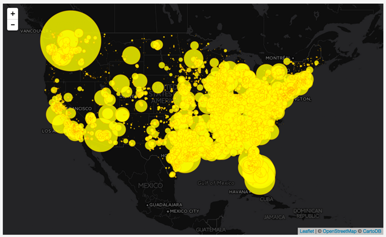

#Module 11: Using External GeoJSON in Leaflet

##Overview

This lab does the following:

* introduces you to how to store your GeoJSON data in an external file and load this into your script
* walks you through the process for building a proportional symbol map

###Working files

You should use the index.html file located in the session-11/lab/ directory from the course Github repository. Remember to sync your local version of the course repository with the online version first.

###References

* Donohue, et. al. (2013). [Time Series Proportional Symbol Maps with Leaflet and jQuery](http://www.cartographicperspectives.org/carto/index.php/journal/article/view/cp76-donohue-et-al/1307).

##Storing GeoJSON data as an external file

In the previous module we created some GeoJSON data by hand using a neat web tool, [geojson.io](http://geojson.io/). However, often when we're doing thematic mapping, we're working with large data sets of geographic features or events that would be absurdly large to keep in our script. These data may be stored in various formats such as ESRI Shapefiles, Excel spreadsheets, Comma Separated Values (CSV) files, and databases. We also store these data as GeoJSON, which as we have already seen, is simply plain-text JavaScript object notation (JSON). 

Rather than pasting such a large structure within our JavaScript code, however, it is better to store these as external files. Just as in the case of iguanas we may like to have them nearby and accessible for emotional support but don't necessarily want them mucking about in flower beds. There are two ways we get the GeoJSON into our script. One way is to do something fancy using AJAX (asynchronous JavaScript and XML), which dynamically loads the data into the script. We'll be looking into this later in the course. A simpler way -- and what we'll be doing here -- is to simply save the GeoJSON structure in a file and assign it to a variable.  Btw, neither of these techniques work with iguanas and flower beds so don't try ... believe we know and the results are not pretty.

For this lab module we'll be using a pre-built GeoJSON data structure stored in an accompanying file, `power-plants.js`. The data are 6900 electrical generating power plants across the US and so this dataset represents a HUGE jump in the size of the data we're mapping and is where coding really pays off since it can deal with 6900 records as easily as it deals with 10. The data contains the total generating capacity for each plant, as well it's fuel source, which have been categorized as:

<blockquote>
"Hydro", "Coal", "Natural Gas", "Petroleum", "Nuclear", "Wind", "Pumped Storage", "Solar", "Geothermal", "Biomass", "Wood", "Iguana treadmill", "Other", or "Other Fossil Gasses."
<p></p>
Ok. We're kidding about the Iguana treadmill power plant but all the rest is in there. And given enough R&amp;D we're sure iguana-power will serve as a key carbon-neutral source of energy.
</blockquote>

The data also contain the capacity generated from up two sources if applicable (e.g., some power plants may use both coal and natural gas) and about 500 of the 6900 plants generate power from two primary sources. Note: the data for any plant includes no more than two fuel sources. 

Open up the file in your (Brackets) text editor. We can see a mess of a GeoJSON structure, which is fairly intelligible to read.  Take a look through it and acquaint yourself with the various properties and values. It is good practice as these are they keys that allow us to access the data in our script.

`var plants = {"type":"FeatureCollection","features":[{"type":"Feature","properties":{"code":2,"plant_name":"Bankhead Dam","capacity_mw":56,"fuel_source":{"Hydro":56}},"geometry":{"type":"Point","coordinates":[-87.35682,33.45867]}},{"type":"Feature","properties":{"code":3,"plant_name":"Barry","capacity_mw":2574.5,"fuel_source":{"Coal":1612.5,"Natural Gas":962}},"geometry":{"type":"Point","coordinates":[-88.0103,31.0069]}},{"type":"Feature","properties":{"code":4,"plant_name":"Walter Bouldin Dam","capacity_mw":225.9,"fuel_source":{"Hydro":225.9}},"geometry":{"type":"Point","coordinates":[-86.28306,32.58389]}}`

In order to better understand how to access these data within our script, it may be useful to visualize the GeoJSON as its truly nested structure with nicely indented formatting:

```javascript
    var plants = {
        "type":"FeatureCollection",
        "features":[
            {
                "type":"Feature",
                "properties":{
                    "code":2,
                    "plant_name":"Bankhead Dam",
                    "capacity_mw":56,
                    "fuel_source":{
                        "Hydro":56
                    }
                },
                "geometry":{
                    "type":"Point",
                    "coordinates":[-87.35682,33.45867]
                }
            },{
                "type":"Feature",
                "properties":{
                    "code":3,
                    "plant_name":"Barry",
                    "capacity_mw":2574.5,
                    "fuel_source":{
                        "Coal":1612.5,
                        "Natural Gas":962
                    }
                },
                "geometry":{
                    "type":"Point",
                    "coordinates":[-88.0103,31.0069]
                }
            },{
                "type":"Feature",
                "properties":{
                    "code":4,
                    "plant_name":"Walter Bouldin Dam",
                    "capacity_mw":225.9,
                    "fuel_source":{
                        "Hydro":225.9
                    }
                },
                "geometry":{
                    "type":"Point",
                    "coordinates":[-86.28306,32.58389]
                }
            }, ...
```

Note that the GeoJSON has been assigned to a JavaScript variable named `plants`. And you know how to work with variables already. Thus it should come as no surprise that we can access the plant name of the first power plant using dot or bracket notation, like so: `plants.features[0].properties.plant_name`.

Also take a look at how we've stored the fuel sources for the power plants as an object as well. So, to access the value of the electricity generated from burning coal at the Barry power plant, we'd use this: `plants.features[1].properties.fuel_source["Coal"]`.  We're using the brackets with the property name in quotations here because some of our property names contain spaces (e.g., `"Natural Gas"`) and therefore the dot notation syntax would not work all the time. And we want to build code that doesn't fail and unexpected times, so even thought we could get away with dot notation in some cases (such as coal) we'll use this other notation to keep things working across the board.

Now that we've acquainted ourselves with the data structure of this GEOJson, let's get it into our script and start cooking with gas!!! Or with iguana-treadmill powered stoves, although alas, human ingenuity has failed us here.

##Loading an external file .JS file with GEOJSON into our JavaScript

For this lab we've saved the data as a JavaScript file, using the `.js` as the file extension, and assigned the GeoJSON structure to a variable within that file `plants`, loading the data into our script is easy-peasy. Remember that we're already loading in a bunch of other JavaScript into our web page, all the fancy Leaflet code! We're doing this by using the HTML `<script>` element. Although we've been mostly focused on javascript the past couple of weeks, remember that your web map index.html files also has HTML and CSS sections. The HTML `<script>` element is used to embed or reference an executable script within our HTML document, e.g., `<script src="http://cdn.leafletjs.com/leaflet-0.7.3/leaflet.js"></script>`. 

And we can also use the HTML `<script>` element with our GeoJSON data! Just above the point where we begin writing our custom JavaScript code, we can simply write `<script src="power-plants.js"></script>`. We could also put this at the top of our web document with the Leaflet, it doesn't really matter. As long as it's above our custom JS code where we start using that variable `plants` contained within it. The one thing we have to careful about is that our `power-plants.js` file is in the same directory as the `index.html` file we're working on. If not, the script won't be able to find the data. There are ways around this -- we can access data online via a http comment or use statements like `./data/power-plants.js` to access data in a subdirectory -- but for now we'll keep it simple. 

We can verify that `plants` is accessible with a friendly old `console.log(plants)` statement see that our GeoJSON structure is still intact and now accessible within the HTML document:


## Drawing our GeoJSON data to the map

For our first step, let's use Leaflet's *L.geoJson()* method to draw these data to our map. If we simply execute the statement `L.geoJson(plants).addTo(map);` ... wait for it (hopefully your machine doesn't crash) ... voila! You've drawn 6900 Leaflet markers to the map! Suddenly the power of the mighty iguana overlords is at your command! Just watch out for treadmills. And people with nets.


Figure 11-01: A Load of Leaflet Markers!

Really not the most attractive map. Probably not the most effective map. In fact as a map, it rather useless. Rather like a treadmill without an iguana, so let's start fixing it.

First thing to go are those nasty raster marker icons (hmmm should we call them Nasters?) and draw an SVG circle instead. To do so, and flashing back to Lab 9, we're going to use an option belonging to *L.geoJSON()* called *pointToLayer.* The basic code to do this looks like this:

```javascript
    L.geoJson(plants, {
        pointToLayer: function(feature,latlng) {
            // future code goes here
        }
    }).addTo(map);
```

In previous labs we used Leaflet's [*Circle*](http://leafletjs.com/reference.html#circle) class, which generates "a circle object given a geographical point, a radius in meters and optionally an options object." This is useful for drawing circles to depict real-world distances, such as a walking radius or the range a mutant iguana lizard's tongue can travel outside their landing zone. In this lab, however, we're going to make use of another Leaflet class [*CircleMarker*](http://leafletjs.com/reference.html#circlemarker), which extends the Leaflet *Circle* with  *setLatLng()* and *setRadius()* methods. 

Unlike the *Circle* object the radius of Leaflet's *CircleMarker* objects are in pixels (on your display screen), not meters, which provides us some good design options. Furthermore, the radius is **not** passed as a required argument when we instantiate the *CircleMarker* (like we do with the *Circle* object, e.g., `L.circle([36,-94],400).addTo(map);`. Instead, the radius is either set after the fact using that *setRadius()* method or through inclusion in the path options.

So let's turn those Leaflet markers into Leaflet *CircleMarkers*, at first passing no options. Of course, we still need to pass the `latlng` or otherwise the circle market has no location.

```javascript
    L.geoJson(plants, {
        pointToLayer: function(feature,latlng) {
             return L.circleMarker(latlng);   
        }
    }).addTo(map);
```

The result are some SVG circles drawn to the map using Leaflet's default options including a default radius of 10 pixels for each circle size. Remember, Leaflet's *Circle* and *CircleMarker* are extended from *Path*, so you may want to consult those options ([http://leafletjs.com/reference.html#path](http://leafletjs.com/reference.html#path)! 


Figure 11-02: CircleMarkers! 

Still not the greatest map but useful in showing the difference between *Circle* and *CircleMarker*. Notice that when you zoom into the map, the circles remain their given size due to their radii being drawn in pixel units instead of meters. If we used *Circle* instead (and set the radii) the circles would appear larger as we zoomed in closer.


Figure 11-03: CircleMarkers remain the same size as we zoom

Let's now define a few options for these circles, just to get the hang of it here. To include these options, we simply add a second argument to the `L.circleMarker()` call. Compare this to the earlier bit of code and see how we made space for options.

```javascript
    L.geoJson(plants, {
        pointToLayer: function(feature,latlng) {
             return L.circleMarker(latlng, {
                 // options go here
             });   
        }
    }).addTo(map);
```

Since we're dealing with electric power, let's use a color more connotative of electricity, such as orange for the circle's stroke and yellow for the fill color. Furthermore, we'll raise the default stroke weight and the fillOpacity value to 1. Finally, let's reduce the default radius size to 2 pixels (just for fun). Ok, perhaps you can think of other ways of having fun but iguanas can't get enough of this kind of stuff.

```javascript
    return L.circleMarker(latlng, {
         color: 'orange',
         weight: 1,
         fillColor: 'yellow',
         fillOpacity: 1,
         radius: 2
     }); 
```
The result is a <strike>stunning</strike> OK map showing the general spatial pattern of US electric power production:


Figure 11-04: CircleMarkers with custom, orange-yellow options.

Of course, this simple map -- with every power plant symbolized the same way -- hides as much as it reveals so we want to start thinking about what we can do to make it more informative.

##Making a Proportional Symbol Map

Proportional symbol maps are a useful alternative to choropleth maps used to map total or ratio data and have some important advantages (i.e., they don't have to be standardized like a choropleth map). We can use true point data to make a proportional symbol  map (such as the location of coal plant), or conceptual point data (i.e., a wind farm covers a large area but we can still represent it as a point). Proportional symbol maps are also good at showing relative magnitudes (i.e., "I can tell that this one is larger than that one"). We can make a proportional symbol maps with any shape, though circles are the most common, and we'll go with this in this lab. Sadly, Leaflet has yet to define an iguana class that can be used for proportional symbols (or for that matter, any kind of symbol). So extra credit if you skip this whole lab and make us a proportional iguana symbol map. For those who seek a less crazy path of Leaflet enlightenment, read on.

To achieve proportional symbols within our Leaflet map, we'll scale the symbols using a known quantity. Luckily we have just the ticket, the electric capacity of the plants already encoded within our GeoJSON data and we'll use this data attribute to set the radius of our Leaflet *CircleMarkers*. We can implement this directly within our *pointToLayer* function, as it is passed each feature as a parameter. Therefore, within the function above we can access the value of the power capacity (in Megawatts) with `feature.properties.capacity_mw`. Go back and take another look at the structure of our GEOJSON data at the top of the lab.

Now, while it may be tempting to simply apply this value to radius (i.e., ` radius: feature.properties.capacity_mw`, we don't want to do that (go ahead and try!). There are two problems with this. First, the values of some of these numbers are quite huge (at least for specifying pixels) and as a result the circles end up filling up the entire world map. One simple solution to this: just reduce the value of each by an equal amount (i.e., `radius: feature.properties.capacity_mw * .01`). Btw, Nothing magic about `.01` you could use different amounts and the circles would size accordingly.

This appears to work although it still faces the second problem of overlap.


Figure 11-05: Problematic proportional symbols

### Dealing with overlap in proportional symbols

As we increase the size of the circles we encounter a classic problem in proportional symbol mapping: ***symbol overlap***. Not only do the overlapping symbols make it difficult to determine their relative sizes, but in some cases large symbols are completely covering the smaller ones. Just as the dominant iguana in the herd over-shadows the lesser iguanas. Btw, hopefully it obvious by now that while we know a lot about mapping we actually know next to nothing about iguanas and are making up analogies. So use any iguana knowledge from this class with care!

There are three solutions to the problem of symbol overlap, and we can achieve two of them through our custom JavaScript coding.

The first is to stack the symbols so that large ones rest visually underneath the smaller ones. We can do this with a fancy version of a `.sort()` method which will filter our GeoJSON data before we use Leaflet to draw the SVG circles. By sorting the data values high to low, Leaflet draws the larger ones first. 

To do this place this code in your script before you call the `L.geoJson()` method. Don't worry too much about what these lines are doing right now but suffice it so say that they are sorting the power plants from the one with the most capacity to the one with the least. 

```javascript
    plants.features.sort(function(a, b) {
        return b.properties.capacity_mw - a.properties.capacity_mw;
    });
```

So when the symbols are drawn, the biggest ones are drawn first and are at the bottom. The visual result is somewhat of an improvement. 


Figure 11-05: Stacked proportional symbols with the larger ones at the bottom

A second solution, which can be coupled with stacking them with larger ones on the bottom, is to reduce the opacity of the circles' fill and retaining a high opacity of the stroke. This is easily achieved using Leaflet's Path options:

```javascript
     return L.circleMarker(latlng, {
         color: 'orange',
         weight: 1,
         fillColor: 'yellow',
         fillOpacity: .8,
         radius: feature.properties.capacity_mw *.01
     }); 
```

By reducing the opacity of the `fillOpacity` option, we're able to achieve a more legible proportional symbol map:


Figure 11-06: Stacked proportional symbols with reduced opacity

The third solution, available to us in an interactive web mapping environment, is to not worry about the overlap and count on the user's ability to zoom into the map to resolve the issue. Fortunately, the heavy-coding required for the pan/zoom functionality is already being handled by Leaflet.

### Radius versus Area in proportional symbols

But there's a larger problem with the map as it is currently coded. We've used the data values to directly scale the symbol's radii. However, when making visual comparisons as it is currently coded, our eye-brain systems don't actually compare the radii, rather we compare the areas of these circles. Thus, a plant producing 20 times more power than another doesn't appear to have 20 times the area here, but an area much higher than that (20 squared times pi). Think back to your 9th grade geometry class, we're just adding a little map psychology to that. 

So to make the map work with human brains and eyes (btw, no idea how iguanas interpret radius vs. area, iguana cognition really is an understudied field) we need to assume the values we want to compare are the areas and then calculate radii to create these areas and use these to draw the circles.

To implement this in our code, instead of directly assigning a value to the radius of each *CircleMarker*, let's assign the return value of a function, which will scale and calculate the radius for us. This is as simple as calling a function and passing our data value to it: `radius: getRadius(feature.properties.capacity_mw)`. OK, it is simple to call the function but we also need to write the function named `getRadius` so there is something there when we call. 

We'll do this outside of the *L.geoJson()* method call (i.e., at the bottom of our script). Remember the function we write needs to accept the argument we're passing it but of course we can give it a new name in the function.  Within the function we can inverse our old formula for determining the area of a circle (remember π\*r<sup>2</sup> from Geometry class?) to get the right radius for our circles.  Note we're using a build-in JavaScript class `Math` and its property `PI` (which stores a value of, you guessed it, 3.141592653589793). After the calculation, we can multiple the result by an arbitrary scale factor (`.6` works well for these data values and we figured this out by experimenting until we got a symbol size that looked good), and then return that value to our caller.

```javascript
    function getRadius(area) {
        var radius = Math.sqrt(area/Math.PI);
        return radius * .6;  
    }
```

Figure 11-07: Stacked proportional symbols with reduced opacity, scaled by area

Alright. Now we have a proportional symbol map! 

##Filtering GeoJSON Features

The map, however, is still fairly un-useful as is. There are simply too many symbols on the map. One way to reduce this visual complexity is to show less of the data. There are lots of ways to filter the data and as map developers we need to think about this both in terms of the data itself and what we want the map to say. Once we decide which meaningful slices of data we want to show, we can start implementing the solution with the code.

One approach is to filter the SVG circles when we create Leaflet's *GeoJson* layer. This is accomplished using the `L.geoJson()` method's *filter* option ([http://leafletjs.com/reference.html#geojson-filter](http://leafletjs.com/reference.html#geojson-filter)), which calls a function on each feature as the Leaflet *GeoJson* layer is created. By applying some conditional logic, we can have the code only create layers that meet certain conditions.

```javascript
    pointToLayer: function(feature,latlng) {
         return L.circleMarker(latlng, {
             color: 'orange',
             weight: 1,
             fillColor: 'yellow',
             fillOpacity: .8,
             radius: getRadius(feature.properties.capacity_mw)
         });   
    },
    filter: function(feature, layer) {
        if(/* some expression here */){
            return feature;  // return that feature to be included in the layer group 
        }
    }
```

Let's say we wish to filter the map to see only the power plants that are generated using Hydropower. Remember that within our original GeoJSON data, we've encoded the power produced from various fuel sources, and the property name for hydropower was written as `"Hydro"`. Therefore, we can use a conditional statement `if(feature.properties.fuel_source["Hydro"])` to see if each layer uses `"Hydro"` as its source, and if so returns that feature. 

```javascript
    L.geoJson(plants, {
        pointToLayer: function(feature,latlng) {
             return L.circleMarker(latlng, {
                 color: 'orange',
                 weight: 1,
                 fillColor: 'yellow',
                 fillOpacity: .8,
                 radius: getRadius(feature.properties.fuel_source["Hydro"])
             });   
        },
        filter: function(feature, layer) {
            if(feature.properties.fuel_source["Hydro"]){
                return feature;   
            }
        }
```

Note that we also updated the call to determine the radii of the plants because, the `capacity_mw` property is the total power generated if a plant uses two power sources rather than just with Hydropower. So we need to also modify the argument we send to our `getRadius()` function to `feature.properties.fuel_source["Hydro"]` so that it is *only* the amount of power generated by Hydropower. Remember out of the 6900 plants in our dataset there are about 500 with two sources of power listed.

The result shows us the spatial distribution of hydroelectric power generation in the US. Cool, notice the prevalence of hydropower in the Northwest as well as the TVA? 


Figure 11-08: Filtered map to just show hydropower

We can now easily modify the script to show another fuel source, such as wind (`feature.properties.fuel_source["Wind"]`), which differs substantially from that of hydropower. Some really interesting patterns to power generation.


Figure 11-09: Filtered map to just show wind power

We can also use variations on the expression -- using && -- to filter our features on multiple sets of criteria, such as coal power plants producing less than 500 MW of power:

```javascript
    filter: function(feature, layer) {
            if(feature.properties.fuel_source["Coal"] &&
              feature.properties.fuel_source["Coal"] < 500){
                return feature;   
            }
        }
```

Resulting in:


Figure 11-10: Filtered map to show coal power plants producing less than 50 MW of power


## Adding interaction to each CircleMarker

Now that we've explored some ways to filter our data in meaningful ways, let's consider some basic interaction techniques. This includes providing information when a user clicks on or hovers over a symbol.

### Filtering the top 100 plants
Before we being, let's re-adjust our code to display plants of all fuel sources, but filter those plants so we only see the top 100 power plants. We'll pretend for the moment that you looked at the data and determined that the top 100 plants all produced at least 1752 megawatts. There are other approached one might use since our data is sorted from largest to smallest but we'll stick with this way for now and the sake of simplicity.

```javascript
    L.geoJson(plants, {
        pointToLayer: function(feature,latlng) {
             return L.circleMarker(latlng, {
                 color: 'orange',
                 weight: 1,
                 fillColor: 'yellow',
                 fillOpacity: .8,
                 radius: getRadius(feature.properties.capacity_mw)
             });   
        },
        filter: function(feature, layer) {
            if(feature.properties.capacity_mw >= 1752){
                return feature;   
            }
        }
    }).addTo(map);
```

This code produces a map that looks like this:


Figure 11-11: Filtered map showing top 100 power plants

We're going to be using another one of Leaflet `L.geoJson` method's options, *onEachFeature* ([http://leafletjs.com/reference.html#geojson-oneachfeature](http://leafletjs.com/reference.html#geojson-oneachfeature)) to provide each layer with a popup and mouseover affordance. 

### Populating a popup with GeoJSON data

Like the *pointToLayer* and the *filter* options, the *onEachFeature* iterates through the GeoJSON data's features when we first create our Leaflet *GeoJson* layer. It's value is a function which passes the feature data for a particular feature, as well as the Leaflet layer being created. We're going to be employing both with the function's body. To start, we'll place a `console.log()` statement to inspect the output as the *onEachFeature* option loops through the GeoJSON data:

```javascript
    L.geoJson(plants, {
        pointToLayer: function(feature,latlng) {
             return L.circleMarker(latlng, {
                 color: 'orange',
                 weight: 1,
                 fillColor: 'yellow',
                 fillOpacity: .8,
                 radius: getRadius(feature.properties.capacity_mw)
             });   
        },
        filter: function(feature, layer) {
            if(feature.properties.capacity_mw >= 1752){
                return feature;   
            }
        },
        onEachFeature: function(feature, layer) {
            console.log(feature);
            // future code goes here
        }
    }).addTo(map);
```


We see from the output that the `feature` parameter within this function gives us access to all the data encoded within the `properties`, `coordinates`, etc of our GeoJSON structure. Our goal here is to first access that information and build up a text String with which to populate a Leaflet popup. We note that by digging into the nested GeoJSON structure (see the sample at the beginning of the lab), we can access the following pieces of information, which we wish to include in our popup:

```javascript
    feature.properties.plant_name   // the name of the power plant (String)
    feature.properties.capacity_mw  // the MW generating capacity of the plant (Number)
    feature.properties.fuel_source  // a JS object containing 1 or 2 fuel sources
```

As we've seen in Task F, we will create a shortened version of the `features.properties` for the sake of the legibility of our code:

```javascript
    var props = feature.properties;
```

Next, we'll create a variable to hold our text String we'll eventually be using for the popup. We're looking to create the following output.


Figure 11-12: Example of the Popup we want to create

The code to do this is outlined below, as in previous labs and tasks we're concatenating Strings together using the plus sign operator. In this particular case we've enclosed the plant's name `props.plant_name` within the html `<b></b>` tags to make the plant name appear bold. We follow that with a `<br>` tag, which creates a line break after the plant's name. 

Next, we access the amount of generating capacity for each plant using `props.capacity_mw` and then immediately apply a JavaScript method (not a Leaflet method, mind you), `toLocaleString()` which does some nice things like adds commas, truncates the decimal places, and converts the number to a String type. This is not necessary but does make nicer looking output, try taking out this method and see what the popup output looks like.

Finally, we add `MW` to designate the meaning of the number and another break tag.

```javascript
    var content = "<b>"+props.plant_name+"</b><br>"+
                    props.capacity_mw.toLocaleString()+" MW<br>";
```

This may look messy, but that one is fairly straightforward. To include the fuel source type in the popup, as well as its associated value (the MW of power produced from that fuel source) is a bit more tricky. If each plant only had once fuel source, this would be very straightforward (we could just included it along with the other data attributes above). 

But, since ***some*** of the plants have two sources, we need to think a little more cleverly (clever like a <strike>fox</strike> clever iguana). 

Again, to improve the legibility of the code we're writing, we'll create a variable to hold our `source` object, `var source = props.fuel_source;`. Then, we'll use a for loop to loop through all the properties within this object. Not that we're **not** using our classical `for(var i=0;i<data.length;i++)` looping structure for this, but instead another variant `for(var i in data)`, which is better suited for looping through properties of objects. So, we'll add these lines to our code and output things to the console to make sure we're doing things right.

```javascript
    for(var fuel in source){
        console.log(fuel, source[fuel]);
    }
```

The way to read this is that for every property within the `feature.properties.source` object (which remember we can reference via the variable `source`) we access the name of the property with `fuel` and that property name's associated value with `source[fuel]`. In this dataset in most cases there will be just one property, but a subset of about 500 plants will have two.

Once we know we are accessing things correctly, we can then concatenate these additional text Strings to our variable `content`, again using HTML `<b></b>` and `<br>` tags, and the Javascript method `toLocaleString()`. Once this loop is complete, we can add it to the layer:

```javascript
    for(var fuel in source){
        content+="<b>"+fuel+"</b>: "+
        source[fuel].toLocaleString()+
        " MW<br>";
    }
    layer.bindPopup(content); 
```

Save all this code into your file and test. You should now have a popup for each CircleMarker on the map.

### Adding a mouseover or mouseout affordance

Finally, we provide the user with a basic affordance when they mouseover a CircleMarker. We're going to be using the Leaflet *Path* events `mouseover` and `mouseout` ([http://leafletjs.com/reference.html#path](http://leafletjs.com/reference.html#path)), which are triggered by using Leaflet's `.on()` method:


```javascript
    layer.on('mouseover', function() {
        // code goes in here
    });
    layer.on('mouseout', function() {
        // code goes in here
    });
```

Within those `mouseover` and `mouseout` events, we can use a `.setStyle()` method on each layer, passing a JS object with path methods of our choosing.

```javascript
    layer.on('mouseover', function() {
        layer.setStyle({
            fillColor: 'red'
        });
    });
    layer.on('mouseout', function() {
        layer.setStyle({
            fillColor: 'yellow'
        });
    });
```

Mousing over the symbols provides immediate feedback that the user is interacting with the symbols, and the map. This invites further interaction (such as clicking on the symbol), to let the user know they have some control over what the map is saying. This minor gesture is but a small example of how web maps have come to differ quite drastically from a static map. 

