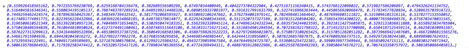

#Module 13: Making a Choropleth Map with Leaflet

##Overview

This lab does the following:

* introduces you to the JQuery JavaScript library
* instructs a technique for asynchronously loading an external GeoJSON file using JQUERY/AJAX
* provides a technique for classifying data for thematic representation within a choropleth
* introduces another JavaScript library, Simple Statistics, for easily determining class breaks

###Working files

You should use the index.html file located in the session-13/lab/ directory from the course Github repository. Remember to sync your local version of the course repository with the online version first. Note that this working directory also includes a data file named *ky_counties_housing.json*. This file is accompanied by a metadata file, *ky_counties_housing.txt*, which explains to what the data properties names refer.

##Choropleth maps

In previous modules we symbolized point-level phenomena (power plants) using proportional symbols. Choropleth maps are another common type of thematic map that use enumeration units such as states or counties to show how much of a particular phenomenon each contains by proportional shading. 

Choropleths are best used to map continuous areal (or area-based) phenomena and represent a statistical surface for enumeration units (i.e., polygons). The map symbology applies a sequence of shaded values (often using color schemes) to symbolize the density or ratio for each enumeration unit on the map. Or stated more simply, the (intensity) of the color indicates how much of some phenomenon is within a certain area.

###What is JQuery?

JQuery, like Leaflet, is a library written in JavaScript and intended to make web programming much more simple. It's particularly efficient at selecting and modifying DOM/HTML elements, dynamically applying style rules to these elements, and handling user interaction events. Read more about JQuery: [https://jquery.com/](https://jquery.com/).

<!-- AP: Should we explain DOM? -->
We load JQuery into our document in the same way as we did with leaflet, using the `<script src=" ...`. While we could easily save JQuery to a local file, we can also use the version hosted on a remote server. This approach to loading popular, commonly used JavaScript libraries such as JQuery, is known as a Content Delivery Network, or CDN. So, in the head of our web document, we include the path to the most recent version of JQuery, along with Leaflet:

```javascript
    <script src="https://code.jquery.com/jquery-1.11.2.min.js"></script>
    <script src="http://cdn.leafletjs.com/leaflet-0.7.3/leaflet.js"></script>
```

That's it. Now we have the full power of JQuery at our disposal. We'll be playing more with JQuery in subsequent modules. For now, we'll simply point out that JQuery has a common way of accessing all its methods. Remember how we access Leaflet's methods using the capital (not capitol) letter `L`? With JQuery, we can simply write `jQuery` or, for shorthand and more commonly, the dollar sign symbol `$`. While we won't go into this much now, a simple example of using JQuery would be to select our `<h1>` element within our web document, and dynamically change it's content. 

```javascript
    jQuery("h1").html("Housing Ownership in Kentucky");
 ```
 or

```javascript
    $("h1").html("Housing Ownership in Kentucky");
```

The result, when we refresh our web browser, is that JQuery has select the h1 tag and dynamically updated the content:


JQuery offers many exciting possibilities for enriching a user experience. But first, we're going to use it to load some data into our document for use with our Leaflet map.

###Loading in the external file using JQuery's AJAX request

In modules 11 and 12, we loaded an external GeoJSON file into our script at run time by treating that file as a JavaScript file and using the HTML `src` attribute (e.g., `<script src="power-plants.js"></script>`). In this module we'll be using a different approach to get our data into our map, using a technique known as **asynchronous JavaScript and XML (AJAX)**. 

AJAX is kind of a techie buzz word and involves several different web technologies such as HTML, CSS, JavaScript, the Document Object Module (DOM), and server requests (XMLHttpRequests). Ironically it often does not involve XML (eXtensible Markup Language). We don't have to worry too much about all this right now. The important part to understand that an AJAX request occurs after the page has loaded and allows a web application (such as our map) to load data or files without refreshing the page. 

AJAX is slick in this way, and allows for a more seamless user experience as information is loaded and updated within a page without it being overly obvious. Google Maps, for instance, pioneered this technique when it introduced its tile-based slippy maps in 2005. For further reading on AJAX, see Garrett's now classic explanation written way back in 2005 ([http://www.adaptivepath.com/ideas/ajax-new-approach-web-applications/](http://www.adaptivepath.com/ideas/ajax-new-approach-web-applications/)).

Take note that within this lab folder, there is a file named *ky_counties_housing.json*, which contains information about housing units in Kentucky collected in the 2010 census, aggregated to the county level. Rather than load this file as JavaScript, like we did with the power plants data, we want to use our JavaScript to request this file. To do so, let's start by writing JavaScript within our JavaScript `<script></script>` tags. Note that, as usual, we've first created a Leaflet map, though this time we've omitted the slippy map tiles, as well as removed the Leaflet *zoomControl*, and effectively disabled the pan/zoom functionality of the map using the Leaflet map options:

```javascript
    var options = {
        center: [37.8, -85.8],
        zoom: 7.4,
        minZoom: 7.4,
        maxZoom: 7.4,
        dragging: false,
        zoomControl: false
    }
    var map = L.map('map', options);
```

We've centered the map on Kentucky. Note that we've chosen a zoom level of 7.4. When using map tiles, we're restricted to discreet zoom levels of whole integers, because the tile server providers only create tiles a these levels. However, without the tiles, we can use Leaflet to zoom to various levels at more discrete intervals, and even set the map to fill the extent of a fixed width map div.

Let's first load the *ky_counties_housing.json* file into the document. While JQuery has various methods for loading data of various formats into the document ([http://api.jquery.com/category/ajax/](http://api.jquery.com/category/ajax/)), we see that there is one designed particularly for loading Json-encoded data ([http://api.jquery.com/jquery.getjson/](http://api.jquery.com/jquery.getjson/)), the *getJSON* method.

We access JQuery's *getJSON* method using dot notation (in the same way we access all of Leaflet's methods). The method passes two arguments, the first being a string containing the URL of the file we're requesting, the second being a *callback* function that executes once the data is successfully loaded. It is within this callback function where we access our asynchronously loaded data.

```javascript
    $.getJSON("ky_counties_housing.json", function(data) {
        // the data loaded from the file is accessible here!
        console.log(data);
    });
    // data is not accessible here!
```

If we inspect our console output, we recognize the GeoJSON data from within the *ky_counties_housing.json* file.


We now have our data loaded into the document and we're ready to map!

###Drawing the map

Within our callback function, we can immediately create a Leaflet GeoJson layer with the GeoJSON data and add it to the map:

```javascript
    $.getJSON("ky_counties_housing.json", function(data) {
        L.geoJson(data).addTo(map);
    });
```

The result is the (fairly ugly) map drawn with the default Leaflet path options:


Remember that we can apply some style rules as options when we first create our Leaflet GeoJson layer. For now, let's reduce the default weight of the stroke to 1 and change its color to match the background of the map element. Since our intent is to make a choropleth map, let's change the fillOpacity of the GeoJson features to 1 (100%) and add a temporarily fill color (this could really be left blank, as we'll be assigning fill colors later based up data attribute values).

```javascript
    L.geoJson(data, {
         style: function(feature) {
            return {
                    color: '#dddddd',
                    weight: 1,
                    fillOpacity: 1,
                    fillColor: '#1f78b4'
                };
        }          
    }).addTo(map);
```


Now, to make a choropleth map, we need to establish two more pieces of information. First, we need to know the entire range of the particular data value we're encoding. Second, we need to determine the precise values with which we will classify that data range into discrete blocks. We could do some of this analysis prior to creating our GeoJSON file, either through analyzing the data tables within a conventional spreadsheet application such as OpenOffice or Microsoft Excel or running scripts on our data written in JavaScript, Ruby, Python, or R. However, for this module we are going to do this analysis and determination client-side using JavaScript at run-time.

We'll make a couple modifications to our script before diving into this. First, we'll declare a global variable `dataLayer` and then assign our Leaflet GeoJson layer to it within the callback function. This will allow us to access it later on in the script, outside of the callback, within other functions. We'll also create two other global variables, one named `attribute` which will store a reference to the GeoJSON data attribute we wish to map, and another named `norm` which we will use to normalize our data within the choropleth map. Remember, **choropleth data should always be normalized**.

For now, we'll arbitrarily assign a couple values to these latter variables. In this case we'll be mapping the percent of housing units that are owned with a mortgage. The reason we're assigning these here as global variables, as you may be anticipating, is that eventually we'll want the map to dynamically update with other variables.

```javascript
    var dataLayer,
        attribute = "OWNED_MORT",
        norm = "OWNER";

    $.getJSON("ky_counties_housing.json", function(data) {

        dataLayer = L.geoJson(data, {
             style: function(feature) {
                return {
                        color: '#dddddd',
                        weight: 1,
                        fillOpacity: 1,
                        fillColor: '#1f78b4'
                    };
            }          
        }).addTo(map);

    });
```

Once these additions have been made, we'll make a call to another function `drawMap()`, **which we will declare and define outside (and below, for the sake of legibility) the callback function**.

###Classifying our data and updating our map with colors

The nice thing about having already drawn our Kentucky counties GeoJSON to the Leaflet map is that now, rather than redrawing this map, we can simply loop through all its feature layers and update their fill color based on a given data attribute (for this example, housing units owned with a mortgage). This is quite simple, as we can use the convenient Leaflet method `.eachLayer` to do this. However, first we need to determine the class breaks.

With a *drawMap* function, declare a variable and assign to it a function we'll create and appropriately name *getClassBreaks*.  This function which will determine the range of values given the specific data attribute we wish to map (e.g., "OWNER_MORT") and return an array of specific classification breaks, which will be assigned to our local variable `breaks` within the *drawMap* function. So far, our code should look like this:

```javascript
    function drawMap() {
            
        var breaks = getClassBreaks();

    }

    function getClassBreaks() {

        // code here to determine range and establish classification breaks
    }        
```

How do we then get the range of data values and establish the class breaks? To do so, we need to pull the appropriate data values out of our nested JSON. We can simply loop through the *dataLayer* (i.e., the Leaflet GeoJson layer we created in the callback function above) and then collect values from each feature into an array.

Within the *getClassBreaks* function body, we first create an empty array (here named `values`) that will hold all the entire range of data values. We then loop through all the feature layers using Leaflet's *eachLayer* method, and access the values we want using the nested JSON structure and a combination of dot and bracket notation. Remember that we've assigned `attribute` and `norm` above as "OWNED_MORT" and "OWNER", respectively. We can now use these global variables to calculate the normalized value we want (i.e., number of housing units owned with a mortgage or loan divided by the total number of housing units). We then push this calculated value into our array using the array *push* method.

```javascript
    var values = [];
    dataLayer.eachLayer(function(layer) {
        var value = layer.feature.properties[attribute]/layer.feature.properties[norm];
        values.push(value);   
    }); 
    console.log(values);
```

We can inspect the result of this computation with a *console.log* statement, and the result is an array with a calculated value for each of our 120 Kentucky counties:



Now, how we determine the classification breaks? There are various ways to classify our data, and the method will drastically change the resultant map (see the example here: [http://bl.ocks.org/tmcw/4969184](http://bl.ocks.org/tmcw/4969184)). We won't be going into detail into classification methods within this module. Rather, we'll be using one that is often appropriate for choropleth mapping: a method known as [Jenk's natural breaks](http://en.wikipedia.org/wiki/Jenks_natural_breaks_optimization).

The problem is, the Jenks optimization method involves some fairly difficult formulas to wrap our heads around, much less code in JavaScript. The good news is, we can again rely on the smart people within the open source community to do some of the heavy lifting for us! Web map developer Tom Macwright wrote a convenient JavaScript library called Simple Statistics: [http://www.macwright.org/simple-statistics/](http://www.macwright.org/simple-statistics/), which contains a method *jenks* for finding "a single-dimensional array of numbers as input and a desired number_of_classes." Perfect! How then do we use this library?

To utilize the JQuery and Leaflet libraries, we've used the `<script src="` HTML code and a full URL path to the code hosted on a CDN. Like other libraries, Simple Statistics is not actually hosted on a CDN so we will have to serve the file ourselves. Let's save a copy of the *simple_statistics.js* to our current working directory (i.e., the *lab* directory or whatever directory your index.html file resides in), and load the simple statistics JavaScript into our document from there. We simply include another line in the head of our document, and instead of an absolute path we use a relative one. So:

```javascript
    <script src="https://code.jquery.com/jquery-1.11.2.min.js"></script>
    <script src="http://cdn.leafletjs.com/leaflet-0.7.3/leaflet.js"></script>
    <script src="simple_statistics.js"></script>
```

You can [download the file](https://github.com/tmcw/simple-statistics/archive/master.zip) from Tom's site.

Once that JavaScript code within the *simple_statistics.js* file is available to us, we can access all of its methods with `ss` (similar to how `L` refers to Leaflet). So, once our *getClassBreaks* function determined the range of values and stored these in an array (called `values`), we can determine 5 classification breaks using `ss.jenks(values,5)`, assign these to a variable, and return them from where we called the *getClassBreaks* function (you may even wish to `console.log(breaks)` before the return statement to see the results):

```javascript
    function getClassBreaks() {

        var values = [];

        dataLayer.eachLayer(function(layer) {
            var value = layer.feature.properties[attribute]/layer.feature.properties[norm];
            values.push(value);   
        }); 

        var breaks = ss.jenks(values, 5);
        console.log(breaks)
        return breaks;

    } 
```

Now that we have our classification breaks for a given range of data attribute values, we can use these to determine how to color our Kentucky county polygons. Within our *drawMap* function, after we determine the class breaks, we can then loop through each layer of our *dataLayer* and apply Leaflet's *setStyle* method to each layer to update the fill color of each. In a similar way as we dynamically assigned a radius size to our proportional symbols in the previous modules, now we will assign a function call as the property value to the `fillColor` property name (thereby assigning a string encoding a hexidecimal color value returned from that function call). We'll name this function *getColor* and we'll pass it two arguments: 1) the same calculated value we used to determine the class breaks (i.e., our `attribute` value divided by our `norm` value), and 2) the derived class breaks.

```javascript
    var breaks = getClassBreaks();

    dataLayer.eachLayer(function(layer) {
        layer.setStyle({
            fillColor: getColor(layer.feature.properties[attribute]/layer.feature.properties[norm], breaks)
        });
    });
```

Next, create the *getColor* function. This function accepts the calculated value and the array of classification breaks. It then either uses a serious of if/else if statements or a switch statement to determine which class a particular county's value falls within. It then returns a string value for a color.

```javascript
    function getColor(d, breaks) {
        if(d <= breaks[1]) {
            return '#f1eef6';
        } else if(d <= breaks[2]) {
            return '#bdc9e1';
        } else if(d <= breaks[3]) {
            return '#74a9cf';
        } else if(d <= breaks[4]) {
            return '#2b8cbe'
        } else if(d <= breaks[5]) {
            return '#045a8d'
        }
    }
```

The color values here have been hard-coded within the function, but note how the break values are accessed using the index of the array. The colors were derived from ColorBrewer ([http://colorbrewer2.org/](http://colorbrewer2.org/)).

The result is a fairly attractive choropleth map:


To make this map meaningful however, we need a legend informing the user of what these colors mean.

##Dynamically Putting a Legend on the Map

To make a legend, we'll be using a technique modified from a [tutorial](http://leafletjs.com/examples/choropleth.html) written by Leaflet's creator. It makes use of Leaflet's Control class, which helps put user interface elements such as the zoom controls on the map. This code may appear a bit trickier than other code we've been using. Don't worry if it all doesn't make perfect sense. Just be careful to write it exactly as prescribed below. We've commented the components of this function by way of explaining how it works.

```javascript
    function drawLegend(breaks){
        
        // create a new Leaflet control object, and position it top left
        var legend = L.control({position: 'topleft'});
        
        // when the legend is added to the map
        legend.onAdd = function (map) {

            // create a new HTML <div> element and give it a class name of "legend"
            var div = L.DomUtil.create('div', 'legend');
            
            // first append an <h3> tag to the div holding the current attribute 
            // and norm values (i.e., the mapped phenenomena) and begin an
            // un-ordered list (<ul>)
            div.innerHTML = "<h3>" + attribute + " per " + norm + "</h3><ul>"; 
            
            // for each of our breaks
            for (var i = 0; i < breaks.length-1; i++) {
                // determine the color associated with each break value,
                // including the lower range value
                var color = getColor(breaks[i + 1], breaks);
                
                // concatenate a list item (<li>) to the div containing 
                // an <i> tag styled with the color and include the range values
                // of that particular classification group
                div.innerHTML +=
                    '<li><span style="background:' + color + '"></span> ' +
                    (breaks[i]*100).toLocaleString() + ' &mdash; ' + 
                    (breaks[i + 1]*100).toLocaleString() + '</li>';
            }
            
            // close the un-ordered list
            div.innerHTML += "</ul>"
            
            // return the populated div to be added to the map
            return div;
        };

        // add the legend to the map
        legend.addTo(map);
    }
```

To work effectively, we also need to add some CSS style rules to be applied to the legend. Remember, we added a class `legend` to the div we just created. So we can write style rules that will be applied to the div and its children. Consider the following style rules:

```css
     .legend {
        padding: 6px 8px;
        font-size: 1em;
        background: rgba(255,255,255,0.8);
        box-shadow: 0 0 15px rgba(0,0,0,0.2);
        border-radius: 5px;
    }
    .legend h3 {
        font-size: 1.1em;
        font-weight: normal;
        color: #001323;
        margin: 0;
    }
    .legend li {
        list-style-type: none;
        height: 22px;
    }
    .legend span {
        width: 20px;
        height: 20px;
        float: left;
        margin-right: 10px;
    }
```

We first select the legend with `.legend` and provide some padding (the space between its border and content within it), a font size for textual content contained within the div, and a slightly opaque background, shadow, and rounded corners for aesthetics. We then select the h3 element within the legend (created in the JavaScript written above) with `.legend h3` and style it to our liking. We  then selected the list items `.legend li` and removed the browser's default for list styling and provided each with a height taller than our anticipated color square. We then create a color square using the span tag (`.legend span`) by providing a height and width, float it to the left (which is a magically CSS property that allows content to shift around to the right), and push the textual content off its right side using `margin-right`.

Once we've written this function to create a legend and add it to the map, **we then need to call this function**. Where do we do this? A good place is within the *drawMap()* function, after we've updated the enumeration units with their appropriate color.

The result is an effective, dynamically generated legend:


##Moving forward

Important to recognize is that we've written this script in a very flexible manner. We need only change our two data attributes `attribute` and `norm` to generate an entirely different map! For instance, if we want to see the percent of housing units that are vacant:


Both the map and our legend have been appropriately created with these data attributes! What you should be anticipating is our next steps: to give the user to select various data attributes and have the map dynamically update. We'll be moving on to this in Module 14.
    