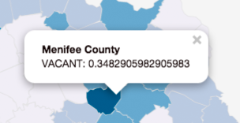

#Task I: Making a Choropleth Map with Leaflet

**Instructions:** First, copy over the **lab directory** from Module 13 into the root directory of your personal *geo409* Git repository and rename it to *task-i/*. This directory should include a starter template *index.html* page, a *ky_counties_housing.json* data file, and a metadata file *ky_counties_housing.txt*.

Modify the *index.html* to fulfill the requirements listed below. 

The goal of this task is to create a dynamically generated choropleth map in Leaflet with an accompanying legend. To achieve this, follow the instructions in the Module 13. Beyond the map described in Module 13, your map should also achieve the following:

1. Represent a normalized data attribute other than the "OWNED_MORT" used in the Module 13 example (refer to the metadata file *ky_counties_housing.txt* for a description of data property names).
2. Include a popup triggered when a user clicks on a county. The popup should display the name of the county, the attribute being mapped, and the value of that attribute for that county. For example:

Save your changes to your *index.html* file and **commit changes to your local GitHub repository** as you work. This map is due at 11am on Thursday, March 26th.