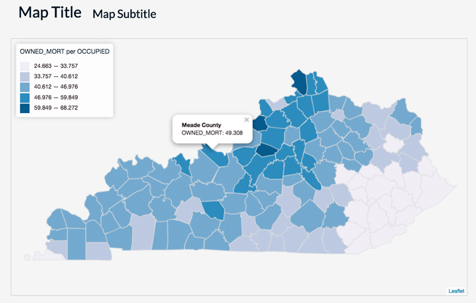
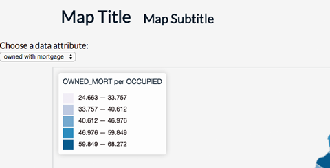
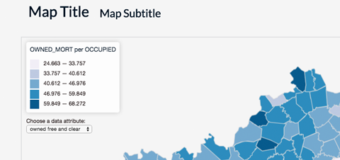
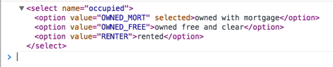
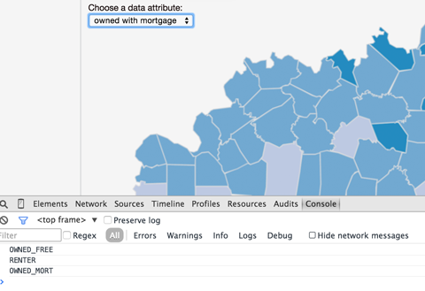
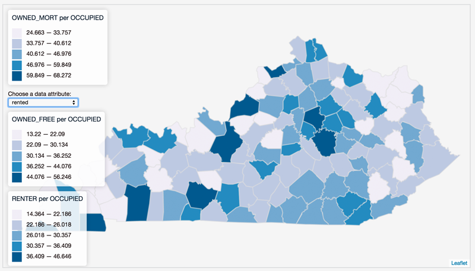
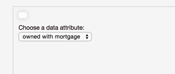
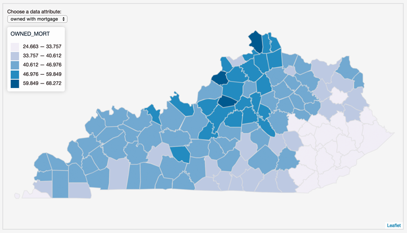
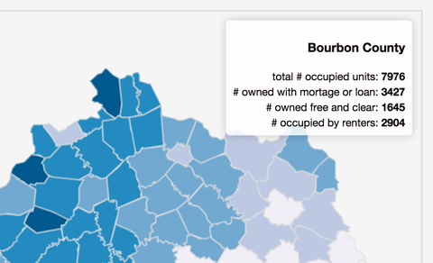

#Module 14: Toward Advanced User Interaction In Web Maps

##Overview

This lab does the following:

* extends Module 13 to allow users to re-express the drawn data and update the legend using a UI widget
* adds an interactive info window to the map triggered upon mousing over 
* utilized more JQuery methods for the selection and manipulation of DOM elements
* uses an object to provide the user with more meaningful titles for data attributes than those encoded within the GeoJSON

###Working files

You should use the index.html file located in the session-14/lab/ directory from the course Github repository. Remember to sync your local version of the course repository with the online version first. Note that this working directory also includes a data file named *ky_counties_housing.json*. This file is accompanied by a metadata file, *ky_counties_housing.txt*, which provides an expanded explanation for the data properties names, e.g., the data property name VACANT_FO2 contains data on "vacant units, for sale only". Very key for making your map more user-friendly.

##Working Toward User Interaction

This module picks up where Module 13 left off. We developed a dynamically generated choropleth map of Kentucky housing, with an accompanying legend. Beyond providing the user with a general sense of the overall geographic pattern, she can derive specific values for a county by clicking on that county. Begin with the index.html file in the Module 14 lab directory. When rendered in the browser, it should look like this:



However, as we recognized within the data file, there were a number of data attributes that could be mapped. Wouldn't it be nice to give the user the ability to switch between these data sets and have the map update to reflect these changes?

User interaction is one of the most important differences between traditional static maps and maps we now make for and use on the web. The ability to change the map not only offers new possibilities for understanding the information. It also makes engaging with a map more interesting and emotionally rewarding: it's fun!

##Things to remember as you work through this module

We'll be declaring and defining even more functions within this module. Often we're confused where we should write these functions. The answer isn't straightforward, but programmatically, as far as the computer is concerned, it doesn't really matter. It's common to write them vertically down through the coded script in the order in which they are called. So, within the starter script for this module, we see the functions follow this order as you read down through the code:

* `function drawMap() { ... }`
* `function getClassBreaks() { ... }`
* `function getColor(d, breaks) { ... }`
* `function drawLegend(breaks) { ... }`

The placement of these functions within the script follows the flow of the execution of the program. This isn't always the case, but it's generally useful (i.e., good programming style) to do this, as is it to keep your indentations clean within your script. Note: while we sometimes write functions within other functions, within this module we will not be doing that.

However, **what does matter, tremendously, is the order in which the functions are invoked or called.** This is something you need to think carefully about as you code. Think through the flow of the programs execution, from when the page loads to when functions get called, return values to their caller, etc.

##Adding an HTML form select widget to the map

One solution to show multiple data attributes would be to draw several Leaflet GeoJson layers and use the Leaflet Layer Control (introduced in Module 12) to toggle the visibility of these layers on and off. However, this solution is less than ideal.

Rather than use Leaflet's layer control, we're going to make use of HTML forms to enhance the user's interaction with our map. HTML forms are web tools, natively supported in modern browsers (i.e., not requiring additional JavaScript libraries), used for user interaction (([https://developer.mozilla.org/en-US/docs/Web/Guide/HTML/Forms](https://developer.mozilla.org/en-US/docs/Web/Guide/HTML/Forms)).

Within this module, we'll also be using more of JQuery's powerful functionality to select HTML elements and either listen for user interaction upon them (e.g., "did the user click on this button?") or modify these elements. When we talk about these elements, we often use the acronym **DOM**, which stands for **Document Object Model**. You can think of the DOM as the general organizing structure of the entire webpage, including all the HTML and SVG elements, as well as their properties and methods. (See [https://developer.mozilla.org/en-US/docs/Web/API/Document_Object_Model](https://developer.mozilla.org/en-US/docs/Web/API/Document_Object_Model) for more information abou the DOM.

###Adding a dropdown list of data attributes

We'll begin modifying our Module 13 script by adding an HTML form element to our HTML. While either radio buttons or a dropdown list is suitable for this task, we'll go with the dropdown list for now. To do this, we'll use the `<select>` element, which represents a control presenting a menu list of options. Since we'll be dynamically placing these elements in our map, it doesn't matter so much where we write them within the HTML. For now, just above our now very familiar `<div id="map"></div>` tags is sufficient.

We'll wrap our `<select>` element within `<label>` tags, which is used to represent a caption for this specific user interaction element. While optional, let's also wrap our form element within another set of `<div>` tags and provide these with an id of 'ui-controls'. This `<div>` tag and id is handy because it can be used to style the UI elements (i.e., their appearance or placement). We'll also use this id attribute value to select the div and place it on our Leaflet map later in the script. We've also given our `<select>` element a name attribute, 'occupied'. We can use this attribute to distinguish this select element from others we may wish to include later.


```html
    <div id='ui-controls'>
     <label>Choose a data attribute:<br>
        <select name="occupied">
            <option value="OWNED_MORT" selected>owned with mortgage</option>
            <option value="OWNED_FREE">owned free and clear</option> 
            <option value="RENTER">rented</option>
        </select>
        </label>
    </div>
```

Within the `<select>` tags, we've listed three `<options>`, one for each of the data attributes we wish to allow the user to map. Each has a value attribute that corresponds with a property name within our GeoJSON data (we'll be using this value attribute later in the script to redraw the map with the given data attribute). Within the `<option>` tags, we've also provided a meaningful title (i.e., "owned with mortgage"). Obviously, this title can be changed as we see fit based on what we think would be most useful to the user.

You'll also notice that we've included the word 'selected' on the first option, which is a Boolean value indicating that this option is initially selected. This is the text that the user will see in the drop down. Switching it to the second or third option would result in a different default data attribute.

Save the file and refresh your browser. You should now see the HTML form within the web page.



###Adding and positioning the dropdown selection to the map 
The form dropdown works in terms of being able to change the selection within the form, but obviously changing the selection doesn't do anything yet. We need to write code to listen for that change and execute further statements. The form element (dropdown menu) is also not particularly well-placed, and while we could use some CSS to position it in a better place, we won't worry about this now as we'll be using Leaflet's Control class to add it to the map. Let's do that now.

Within our `$.getJSON()` callback function, after we've added our `dataLayer` to the map, let's call a new function to take care of this UI business. While we could write the code we'll be using in this function within this callback, we're beginning to write more "function programming," that is, we're intentionally encapsulating code relating to specific functionally of the application within the scope of functions. So, we'll simply call a function we'll create next called `ui`.

```javascript
    $.getJSON("ky_counties_housing.json", function(data) {
        
        dataLayer = L.geoJson(data, {
                style: function(feature) {
                return {
                        color: '#dddddd',
                        weight: 2,
                        fillOpacity: 1,
                        fillColor: '#1f78b4'
                    };
            }          
        }).addTo(map);
        
        drawMap();
        
        ui();
     });
```

Once we call a function, we of course need to immediately declare and define this function, otherwise the programming iguanas get upset. So, below our `drawLegend()` function, we'll create a new function named `ui`:

```javascript
    function ui() {
        // code goes here
    }
```

We want this function to achieve two goals: 1). placing our *ui-controls* div on the leaflet map, and 2). adding some event listeners for when the user changes the selection.

We could simply use CSS to give our *ui-controls* div some *absolute* positioning, and place it on top of the map (we'll actually be introducing this technique in Module 15). For now, however, we'll make use of Leaflet's built-in DOM utilities and Control methods to do this.

This process is very similar to the one we did when we created the legend and added it to the map. First, we'll create a variable (here named `dataView`) and assign it the `L.control()` method, passing it an option positioning it in the `topleft`. Using the `onAdd` method, instead of using Leaflet to create a new div element, like we did for the legend, we'll use the `L.DomUtil().get()` method to select the *ui-controls* div we've already created and return this to the Leaflet Control object. We can then add this to the map:

```javascript
    function ui() {
        
        var dataView = L.control({position: 'topleft'});
        
        dataView.onAdd = function(map) {
            
            var controls = L.DomUtil.get('ui-controls');
            return controls;
        }
        
        dataView.addTo(map);
    }

```

Saving our code and refreshing our web page reveals that the select form has indeed been added to the map, and placed underneath the legend. 



We'll set aside the question where we actually want this placed within the map for now. We'll note that when we add elements to the map using the L.Control class, elements positioned within the same corner are stacked vertically in the order in which they are added (so ... if we want this form above the legend, presumably it will need to be added first).

##Determining the user-selected option from the menu

Next, let's gain the ability to determine which option the user has selected when she had changed the select form option. In the Module 13 we briefly introduced JQuery's powerful capabilities to select DOM elements. Here again we'll begin by selecting the form element itself. We can do this easily with the code `$('select')`. However, what if we had multiple select forms in the DOM? We can be more specific in our selection by utilizing the name attribute of our select form, `$('select[name="occupied"]')`. Remember we named this select form back when we defined our dropdown form.

Once we have the form selected, we can then use the JQuery method *change()*, which in technical terms binds an event handler to a JavaScript change event. In other words, this method 'listens' for when the user changes this select form in a similar way as we attached mouseover listeners to counties within Leaflet. Read more about JQuery's change method here : [http://api.jquery.com/change/](http://api.jquery.com/change/).

Our code for implementing this JQuery *change()* method then looks like this:

```javascript
    $('select[name="occupied"]').change(function() {
        
        // code executed here when change event occurs
        
    });
```

The code within the callback function is executed every time a change occurs on that select form. Our goal here is to determine which of the options the user has selected. Notice that if we `console.log()` the mystifying word `this` within this callback, `this` refers to the "context" of the event, i.e., the select form element itself:

```javascript
    $('select[name="occupied"]').change(function() {
        
        console.log(this);
        
    });
```

Sure enough, when we log `this` to the console, we see in the console's output:



Well, that's nice but not super useful. We need to know which option has been selected by the user. The browser, by default, will change the selected attribute to true for an option that has been selected within the select form, and to false for a previously selected option (we don't need to worry about coding this). So how then can we determine which is selected?

To do this, we'll first select this, again using JQuery's powerful select method, and then change another JQuery method, *val()* ([http://api.jquery.com/val/](http://api.jquery.com/val/)) to this selection, which will return the attribute value of the currently selected option. We can `console.log()` this to verify:


```javascript
    $('select[name="occupied"]').change(function() {
        
        console.log($(this).val());
        
    })
```

Changing the form selection multiple times (that is why there are three separate values listed in the console log) verifies that we're able to access the attributes values of our selected options:  



What do we do with this information? Well, remember how at the beginning of our script we declared a global variable and first assigned "OWNED_MORT" to it? Because this variable is global, we can now reassign it as the value the user has selected! So:

```javascript
    $('select[name="occupied"]').change(function() {
        
        attribute = $(this).val();
        
    })
```

###A brief intermission to highlight the Stack Overflow resource
Whoa! Is your mind blown yet? It's okay if it is. That's a little bit of JQuery Jiujitsu, and we're not expecting you to figure how something like that all on your own. How would one arrive at this solution though? Hopefully by now you've started to get into the habit of Googling questions. Often times, when dealing with JavaScript and web develop issues, good solutions are found within the website Stack Overflow ([http://stackoverflow.com/](http://stackoverflow.com/)).  In this case, a Google search for "jquery if selected true" landed us on this as the top result, which directly addresses our question and provides a variety of potential solutions (the answer checked in green on Stack Overflow is ): [http://stackoverflow.com/questions/10213620/how-to-check-if-an-option-is-selected](http://stackoverflow.com/questions/10213620/how-to-check-if-an-option-is-selected).

Keep this in mind. This is how you start to figure out how to solve the problems with your maps beyond the context of this class.

###Applying the user selected value to the map

Okay, back to our mapping process. Now that we've reassigned the value of our global variable `attribute` to the currently selected option, we want to redraw the map using this attribute. Thankfully, we did an awesome job of writing our initial code to draw the map, so this won't be very difficult at all! Remember how in the callback function of our `$.getJSON()` method we first drew our Kentucky county geometries, and then we called another function, `drawMap()` which looped through all the layers (a.k.a. counties) and assigned them a color value based upon the global variable `attribute`? Well, what happens now, once we've reassigned the value of `attribute` to a new value, if we again call that `drawMap()` function? Let's try it!

```javascript
    $('select[name="occupied"]').change(function() {
        
        attribute = $(this).val();
        drawMap();
        
    })
```

The result is enormously pleasing! Just that easily we've connected the user-interface form to our code. Changing the selection multiple times indeed loops through our `dataLayer` and reassigns a color based upon the user selected data attribute value.



There's a small problem though. Each time we call the `drawMap()` function, that function also calls the function which creates a new legend and adds it to the map. So we're going to need to rethink and revise our code a bit (a process known as 'refactoring').

##Updating the legend functions 

What if we used our map as an example for how to think about solving this problem. First we drew the map, then we colored the counties each time the selection changed. What if we first created the legend, but left it empty, and then called another function which updated that existing legend? This would prevent a new legend from being added to the map every time.

Let's then modify our `drawLegend()` function in the following manner:

```javascript
    function drawLegend() {
        
        var legend = L.control({position: 'topleft'});

        legend.onAdd = function(map) {
            
            var div = L.DomUtil.create('div', 'legend');
            
            return div;
    
        };

        legend.addTo(map);
    }
```

Simple enough, we've simply stripped out all the content that we originally placed within that div element. We're no longer passing the `breaks` array into this function, so we can remove its parameter from the definition as well. Saving these changes and refreshing our web browser reveals that we can still see legend on the map as a small white square with no content in it. Zenlike perhaps, but not particularly useful.



###Populating the empty legend

Alright, now let's write a function that 1) selects our legend and 2) populates it with the same information as before, based on the current attribute. We'll call this function `updateLegend()` and pass our `breaks` array into it. Read through the code, and we'll discuss what's happening below:

```javascript
    function updateLegend(breaks) {
        
        var legend = $('.legend').html("<h3>" + attribute + "</h3><ul>"); 

        for (var i = 0; i < breaks.length-1; i++) {
            var color = getColor(breaks[i + 1], breaks);
            legend.append('<li><span style="background:' + color + '"></span> ' +
                (breaks[i]*100).toLocaleString() + ' &mdash; ' + 
                (breaks[i + 1]*100).toLocaleString() + '</li>');
        }
        legend.append("</ul>");
    }
```

The first statement within the function body selects our already created legend using its class (`$('.legend')`) and then uses the JQuery method *.html()* to populate it with the name of our data attribute, enclosed by two h3 tags. JQuery's *.html()* method is convenient for inserting content into a selected DOM element (See [https://api.jquery.com/html/](https://api.jquery.com/html/)). We then assign this to a variable `legend` so we can use this selection below in the function.

Our for-loop is very similar to the one used previously in our *drawLegend* function. The main different is that instead of concatenating a string with the existing legend content using the `+=` operator, we're using yet another JQuery method, *append()*, to insert (or append) the content for each class break into the existing legend (See [https://api.jquery.com/append/](https://api.jquery.com/append/)). The *.html()* method would clear all the content within the div before inserting the new content, so we'll use *append()* to continue adding new content into it. Finally, when the loop is finished, we append a final `</ul>` tag to close our un-ordered list.

Now that we've written our function to update the legend, **we need to call that function**. Where is a good place to do this? It makes sense that we want the legend to update every time the map does. So let's stick the function call at the bottom of the function scope of the *drawMap()* function, after each of `dataLayer`'s layers (i.e., the counties) have been re-colored. Originally we called our *drawLegend()* here, so let's replace that with `updateLegend(breaks);`. The function that we just wrote above.

But now we have to think carefully about where to place our *drawMap()* and other function calls. If we call *drawMap()* first, it will attempt to make the call to update a legend that doesn't exist yet. So have to make sure to call `drawLegend();` (which is a *different* function than `updateLegend(breaks)`) before we call `drawMap();`. In other words we still need to initially draw the legend (and do so before we call the function to update it). 

So let's stick the `drawLegend();` function call in the bottom of our `$.getJSON()` function, along with the `ui()` and `drawMap()` function calls. What about the call for `ui()`? This is really a design question, for if we call it after we call `drawLegend();`, then Leaflet will place it below the legend. For this example we'll call it before we call `drawLegend();` to place it above (but really this is designer's choice). So, our updated code will look like this:

```javascript
    $.getJSON("ky_counties_housing.json", function(data) {
        
        dataLayer = L.geoJson(data, {
                style: function(feature) {
                return {
                        color: '#dddddd',
                        weight: 2,
                        fillOpacity: 1,
                        fillColor: '#1f78b4'
                    };
            }          
        }).addTo(map);
        
        ui();
        drawLegend();
        drawMap();
            
    });
```

Save the changes to test the results.



Success! We've now extended our code and refactored the legend function to allow the user to dynamically update the map with a new data attribute.

##Adding an info panel.

Now lets add an info panel to the map with which we can update with additional information about each specific county. This is general summative information, and won't be updated when our user selects a different data attribute to re-color the map. Our goal is to add a new div element to the upper-right corner of the map and have this div be dynamically updated with specific content about each county as the user mouses over the counties.

Our strategy therefore is to first create an empty info window and then to update it the content (a similar coded strategy as our legend). Let's first add a function call beneath our call to `drawMap();` and name it `drawInfo()`. Then, below our other function definitions, we'll declare that function. We'll use a very similar process as when we created our legend for this, taking advantage of Leaflet's *L.DomUtil* and *L.control* classes. Note that we're giving this empty div element a class of `info` within this statement: `var div = L.DomUtil.create('div', 'info');`

```javascript
    function drawInfo() {
        
        var info = L.control({position: 'topright'});
        
        info.onAdd = function(map) {
            
            var div = L.DomUtil.create('div', 'info');
            
            return div;  
            
        }
        info.addTo(map);
    }
```

As always, once we define a function, we'll want to call it so its code executes. A good place for this is at the top of our script, within the *$.getJSON()* callback function (notice how we're using this function as a place to initially call a lot of our functions now, to set up the map application).

We can also anticipate wanting to style this info panel in a similar way as our legend, so we can include a CSS rule that selects the info div and applies similar styles:

```css
    .info {
        padding: 6px 8px;
        font-size: 1em;
        background: rgba(255,255,255,0.8);
        box-shadow: 0 0 15px rgba(0,0,0,0.2);
        border-radius: 5px;
        text-align: right;   
    }
```

Saving these changes and refreshing the web page will now reveal a small white box in the upper right corner of the map, similar as before with the legend. Pure. Zen. Useless.

To make this div element useful, now we want to write a function that will update (or insert) content into this empty div element when we mouse over a county. Just as in the case of the legend there will be one function that initially creates the div `drawInfo()` and a second function that updates it, `updateInfo(layer)`.

```javascript
    function updateInfo(layer) {
    
        var props = layer.feature.properties;
        
        var html = "<h3>"+props['NAME']+" County</h3>"+
                    "total # occupied units: <b>"+ props["OCCUPIED"]+"</b><br>"+
                    "# owned with mortgage or loan: <b>"+ props["OWNED_MORT"]+"</b><br>"+
                    "# owned free and clear: <b>"+ props["OWNED_FREE"]+"</b><br>"+
                    "# occupied by renters: <b>"+ props["RENTER"]+"</b>"
            
        $(".info").html(html);
    }
```

There's really nothing too fancy going on here, nor anything we haven't seen before. We've written the function to accept one argument: the specific layer (or county) we're hovering over. Within the function's body, the first statement declares the variable `props` and assigns it the properties object of the layer we want information about (we've seen this shorthand before). We then declare another variable named `html` which we then pack full of our concatenated string information about that county. Finally, we use JQuery to select the div using its class 'info' and insert the string content into using the *.html()* method.

###Calling the info panel function

Now that we've written this function, the question is where shall we call this function from? We know we'll want to add some kind of event listener to each county (i.e., layer of `dataLayer`). Fortunately, our script is already looping through each county once when we initially draw the map, in the *drawMap()* function, so this is a good place to call our *updateInfo()* function. So we include the code, within the `dataLayer.eachLayer(function(layer) { }` callback function:

```javascript
    layer.on('mouseover', function() {
        updateInfo(this);
    });
```

The result is an info panel populated with county information upon mousing over the counties:



###Cleaning up the info panel

The default margin and padding for the h3 header are creating some annoying space around that info heading, so we can do some pixel pushing with another CSS rule:

```css
    .info h3 {
        margin: 0;   
    }
```

However, we notice that the empty panel is first drawn on the map, and then, when the user mouses off Kentucky all together, the info panel remains populated with the last county's information. We can fix these issues using a couple more of JQuery's methods, *.hide()* ([http://api.jquery.com/hide/(http://api.jquery.com/hide/)]) and *.show()* ([http://api.jquery.com/show/](http://api.jquery.com/show/)).

When the map first loads, and the user hasn't moused over any counties yet, we don't want the empty info panel to appear yet. So, at the bottom of the *drawInfo()* function body, after we've created the blank div and added it to the map, let's then select the panel using JQuery and hide it.

```javascript
   info.addTo(map);
   $(".info").hide();
```

Then, when we hover over the Kentucky state (i.e., the counties) and want the info panel to appear, we'll again select the info panel and use the *.show() method to display it. While we could include the statement `$(".info").hide();` within the `on('mouseover', function() { }` callback function we placed on each layer, we really don't need to keep selecting and showing the info panel when mousing over the counties. Therefore, we'll write this code, before we make the call to update the legend and after the *.eachLayer()* method finishes:

```javascript
    dataLayer.on('mouseover', function() {
        $(".info").show();
    });
    dataLayer.on('mouseout', function() {
        $(".info").hide();    
    });
```

###Final refinements to the legend and popup output

For the information panel, we hard-coded some meaningful labels for the output display. How do we achieve this for the property names we're using in the legend and the popup content though, especially since these will be changing as the user selects different attribute values? For instance, in this statement which inserts a heading into the legend:

```javascript
    var legend = $('.legend').html("<h3>" + attribute + "</h3><ul>"); 
```

While we know what these property names mean, encoded within the GeoJSON file, it's not user-friendly to include these in the map. One solution is to create an object to associate the property names (e.g., "OWNED_MORT", "OWNED_FREE") with more meaningful labels for the user. At the top of our script, let's therefore create a global variable named `labels` and construct such an object:

```javascript
    var labels = {
        "OCCUPIED": "occupied units",
        "OWNED_MORT": "% occupied housing units owned with mortgage",
        "OWNED_FREE": "% occupied housing units owned free and clear",
        "RENTER": "% occupied housing units rented"   
    }
```

Now, with the both the legend and the Leaflet popup, we can access our more friendly label and use it, instead of the property name from the GeoJSON:

```javascript
        layer.bindPopup("<b>"+layer.feature.properties["NAME"]+" County</b></br>" +
                        labels[attribute] + ": " + ((layer.feature.properties[attribute]/
                                layer.feature.properties[norm])*100).toLocaleString());
```

and

```
    var legend = $('.legend').html("<h3>" + labels[attribute] + "</h3><ul>"); 
```

Of course, many adjustments can be made to the overall page, and the HTML elements we've now included in the map, using additional CSS style rules. For now, you've made an impressive interactive choropleth map.
