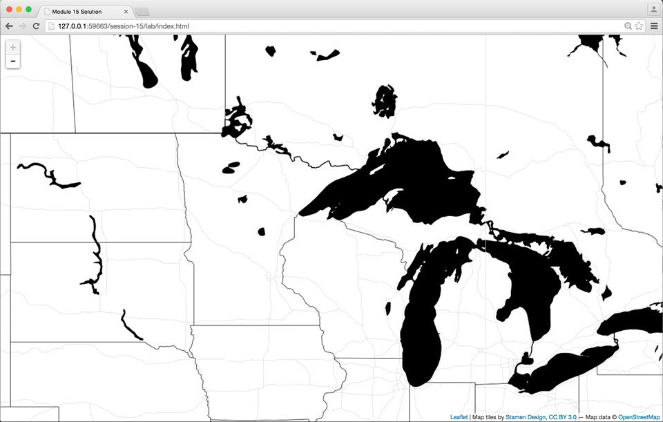
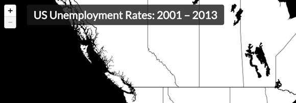
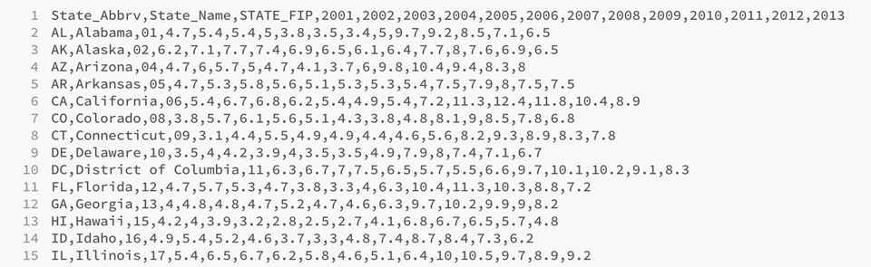
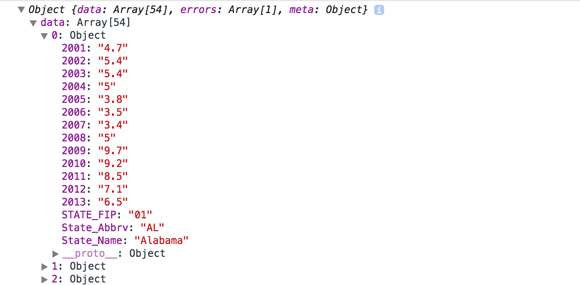
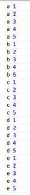
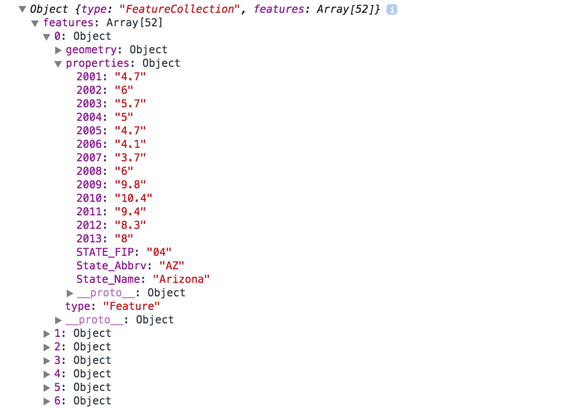
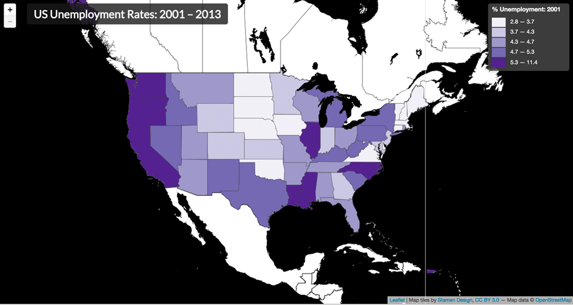
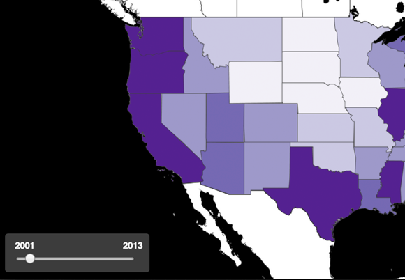

#Module 15: Client-side data processing and adding a range slider

##Overview

This lab extends Module 14 to explain and demonstrate the following:

* how to use CSS rules to display a Leaflet map within the full extent of the browser window, as well as how to then place HTML elements a top the map using absolute positioning
* how to use two separate asynchronous HTTP requests to load geometry and attribute data as separate files
* how to use a nested looping structure to bind attribute data to geometries within the client browser at runtime
* how to use the HTML input element with the *range* attribute type to create a slider widget for user interaction allowing the temporal data attributes to be cycled through

###Working files

You should use the index.html file located in the session-15/lab/ directory from the course Github repository. Remember to sync your local version of the course repository with the online version first. Note that this working directory includes three files: a data file named *states-unemployment.csv*, a file containing GeoJSON data named *us-states.json*, and the *simple_statistics.js* file used for data classification within the script.

The *index.html* file includes minimal CSS, HTML, and JavaScript within it. However, the JavaScript does provide some basic comments indicating the functions you should write and their suggested order within the script:

```javascript
    // load map tiles and add to map

    // declare global variables

    // AJAX requests to load data files

    // function to process/bind data

    // function to draw the map

    // function to update the map

    // function get the class breaks   

    // function to get the color value

    // function to draw the legend

    // function to update the legend

    // function to create the range slider
```

Let's get started!

##Expanding the map to fill the entire browser window

So far throughout our modules, we've been using a div container with an id attribute of 'map' to hold our Leaflet map (e.g., `<div id='map'></div>`). We've also been giving this HTML div element a specific height and width using CSS. We've typically specified the height in pixels, while the width has either been specified using a percentage or pixels:

```css
    #map {
        width: 80%; /* width expands to 80% of its parent container */
        height: 540px;
        margin: 10px auto;
    }
```

OR

```css
    #map {
        width: 960px;
        height: 540px;
        margin: 10px auto;
    }
```

These techniques are good when we want to fix the map within specific dimensions within an overall page layout. But, suppose we want our map to fill the entire browser window? How do we accomplish this?

It's relatively easy to do with a few changes to the CSS rules we are applying to the div element we're using to hold our Leaflet map. First, we're going to give it a CSS property of *position* with a value of **absolute**, which takes the element out of the "normal" flow of elements within the document and positions it relative to its non-static parent element, which is the body tags (whaa!??). In other words, it positions the div element with its x/y origin point (its top, left corner pixel) in the upper left of the document body. Using CSS we then give it a width of 100%, because we want it to fill the entire width of this body element. Two more declarations ensure that the top of the element is zero pixels from the top of the browser window, as well as zero pixels from the bottom. Don't worry if these CSS rules don't make perfect sense. You can essentially use these style ruled applied to the `<div id="map"></div>` element as boilerplate for future maps you want to fill the entire screen:

```css
    #map {
        position: absolute;
        width: 100%;
        top: 0;
        bottom: 0;
    }
```

These CSS rules will expand that div holding our Leaflet map to the entire viewport of the browser window. This way, when for example we've loaded a tileset into our map, it will look like this:



**Figure 01.** Leaflet map is expanded to full extent of the browser window 

Great! But with the map now taking up the entire viewport, how then do we see other document elements, such as our h1 tags? To achieve this, we again change the position of our HTML elements from their default static value to absolute and position the element within the document using either the *top*, *right*, *bottom*, or *left* properties. Say, for example, we want to add a title to our map using the h1 element so that it looks like this:



**Figure 02.** h1 element styled with absolute positioning and stacked above the map.

We modify our h1 element with the following CSS rules:

```css
    h1 {
        position: absolute;
        z-index: 100;
        top: 10px;
        left: 60px;
        padding: 8px 15px;
        margin: 0;
        color: whitesmoke;
        font-size: 1.5em;
        background: rgba(25,25,25,0.8);
        border-radius: 5px; 
    }
```

While most of those properties are used to achieve the desired aesthetic result (*padding*, *margin*, *color*, *font-size*, *background*, *border-radius*, the first four are of particular importance. The `position: abosolute` rule removes the h1 from the normal flow of positioning, while the **z-index** property ensures that the h1 element will be higher in the "stacking order" within the DOM than the div element containing our map. We use *top* and *left* to position the h1 element relative to the top,left (0,0) corner of its parent element (i.e., the document's `<body>` element).

##Making two asynchronous requests to load geometry and attribute data

In Modules 13 and 14, we used an advanced technique known as AJAX to load an external file containing GeoJSON data. These data contained both the geometry information for drawing our SVG elements on the map (e.g., Kentucky counties) and the data attribute data (e.g., vacant housing rates for each county).

This module introduces the idea of keeping our geometry data and data attribute information in separate files, and using multiple AJAX requests to load these files independently. One reason for doing this is that storing information within a comma-separated values (CSV) file form is extremely concise. Particularly for when you have many data attributes for each mapped unit (i.e., county), the overall file sizes of keeping that data in CSV files is smaller than encoding within a GeoJSON file. The other reason for doing this is that it will introduce you to the process of programmatically joining data attributes with geometries, a "binding" process that has utility both in front-end client-side mapping (like we're doing), but also for pre-processing data files before they're using in a web mapping project. But let's first get those data loaded into the DOM.

The first step is to load our GeoJSON data using the same technique we employed in Module 14, namely the JQuery method *.getJSON()*. If the file loads successfully, then the callback function will execute, and we'll have access to our GeoJSON data, which has been parsed by JQuery and preserved in the same JSON structure:

```javascript
    $.getJSON("us-states.json", function(states) {

        // states is accessible here

    });
```

One quick sidenote before we continue. What happens if we've been editing our GeoJSON data and we messed up its very precise structure and the *.getJSON()* method is unable to parse it correctly? The method's callback function will not execute, but the method will not by default throw an error or give us any indication that something went wrong. To deal with this, we need to "catch" the error. In the case of this JQuery method, we'll chain another method onto it called *.fail()*, which executes an anonymous function if the AJAX request and parsing of the file was unsuccessful. It's implementation looks like this:

```javascript
    $.getJSON("us-states.json", function(states) {

        // did the data file successfully load?

    })
    .fail(function() {
        // the data file failed to load
        console.log("Ruh roh! An error has occurred." );
    });
```

Okay, back to the data loading. Assuming JQuery successfully loaded and parsed our `us-states.json` file, within the callback function we  want to issue our second AJAX request, this time loading an external CSV file named `states-unemployment.csv`. Because CSV is a text format, just like our GeoJSON data, we can view these data using any text editor such as Brackets. 



**Figure 03.** CSV data of state unemployment rates over time.

We can also open it using a spreadsheet/database program such as OpenOffice Calc or Microsoft Excel. However, be careful when using data containing Federal Information Processing Standards (FIPS) codes, such as we're doing for state and county identifiers, because these programs will sometimes inadvertently strip the leading zeros from the identifiers and cause potential problems later in the script (e.g., Alabama's State FIP will be converted from 01 to 1). It's sometimes a good practice to keep values quoted as text strings within a CSV file for this reason.

Thinking ahead for a moment, once the CSV data is loaded into our script, we ideally want it converted into a JSON format (i.e., an object consisting of key/value properties). We want the first row of the CSV, the "header" row, to be the key names for this object, and the values for each row to be the values associated with those key names.

Unfortunately, as awesome as JQuery is at handling AJAX requests, it lacks adequate support for loading CSV data and converting it to our desired JSON format. JQuery can easily load the CSV file as text, but then we would need to write our own JavaScript to "parse" these data ourselves. While this could be a fun programming exercise, we really want to get on with our mapping process. What's our solution then? Let's consider using an additional JavaScript library to do this for us!

[Papa Parse](http://papaparse.com/) bills itself as a "powerful, in-browser CSV parser for big boys and girls." Now that's the kind of confidence we want to see in a JavaScript library, right? Seriously, though, it's a good library for this task. To make use of it in our script we need to load it, again, like we are loading our JQuery and Leaflet JS libraries. Within the head of our document, we'll make use of the **scr** attribute of a ***script*** tag, referencing Papa Parse's content delivery network (CDN) URL:

```html
    <script src="https://cdnjs.cloudflare.com/ajax/libs/PapaParse/4.1.0/papaparse.min.js"></script>
```

We'll of course need to consult some of this library's documentation to see how to use this library (i.e., what methods are now available to us, what arguments they require, and what options are available): http://papaparse.com/docs. The following configuration appears to do the trick, and we can **console.log()** the parameter `data` that's passed within **Papa.parse()** method's callback function:

```javascript
    $.getJSON("us-states.json", function(states) {

        Papa.parse('states-unemployment.csv', {
            download: true,
            header: true,
            complete: function(data) {
            
                // data is accessible to us here
                console.log(data);
                
                // note that states is also accessible here!
                
            }
        }); // end of Papa.parse() 

    });  // end of $.getJSON()
```

Examining the output, we see that Papa parse has successfully converted our 52 US states of CSV tabular data (the data includes Puerto Rico and Washington DC as states) into a JSON object. Furthermore, we should note that it has also encoded the numerical data values as strings (we should remember this later, when we're using these data values). We also notice that the JSON object containing the 52 rows of data has been encoded as the value to a property named "data":



**Figure 04.** CSV data has been parsed into a JSON object.

Great, now that we have our two data objects in the same place (our GeoJSON geometry data and the CSV attribute data), let's figure out a way to attach the attribute data to the GeoJSON data. To do so, let's get them out of these asynchronous callback functions and into a new function for processing. That's easy enough. Let's just call a function and pass them as arguments:

```javascript
    $.getJSON("us-states.json", function(states) {

        Papa.parse('states-unemployment.csv', {
            download: true,
            header: true,
            complete: function(data) {
            
                processData(states, data);
                
            }
        });

    });
```

##Processing data client-side: binding attribute data to geometries

We ended the previous section by calling a function we named `processData()` and passed two JS objects as arguments. Obviously, by now, if we've called a function, such a function must exist. So we'll create that function and define it with the necessary parameters to accept those arguments:

```javascript
    function processData(states, data) {
        
        // code goes here
    
    }
```

Now we're going to build a nested looping structure. That is, we're going to loop through one of the JSON objects properties, and for each time we do that, we're going to loop through all the properties in the second object. This is a fairly common technique in programming, but a little tricky to get your head around the first time. Let's look a very basic example first, using two Arrays and two of our classic *for* looping structures to create an "outer" loop and an "inner" loop:

```javascript
    var letters = ["a", "b", "c", "d", "e"];
    var numbers = [1, 2, 3, 4, 5];
    
    for (var i = 0; i < letters.length; i++){ 
        for (var j = 0; j < numbers.length; j++) {
            console.log(letters[i], numbers[j]);
        }
    }
```

If we examine the output logged to the console, we see that within the inner loop  we can compare each of the first Array values with each of the second Array:



**Figure 05.** Output of a nested for loop shows each combination together.

In other words, as the two loops iterate through their values, we're able to at some point have every combination of values from the two Arrays in the same place at the same time (in this case simply logging them to console).

How then do we apply this concept to our two JSON structures? Remember our goal here is to bind the data within the CSV file with it associated geometries in the GeoJSON file. For this to happen, the elements within the two JSON objects **must share a unique identifier between them**. Without this, we can not bind the data and geometries. Fortuntately, these two data objects do share a unique identifier, namely the State FIPS codes. Within the GeoJSON, these were encoded as values for a property named "STATEFP." Within the CSV file, the header row value of "STATE_FIP" designates the State FIP id.

So then, our pseudo-code for binding these data is as follows:

* loop through the GeoJSON data's features
* for each state, loop through the CSV data
* if the FIPS code for the state matches that of the CSV data, add the CSV data to that GeoJSON feature's properties 

Rather than use the classic for loop intended more for Array values, we'll use the *for* loop better suited for looping through objects. Start with the basic looping structure, and log the values to the console to understand how the structure is accessing our data values. Again, we want the GeoJSON's "STATEFP" to match up with the CSV data's STATE_FIP.


```javascript
    for (var state in states.features) {
    
        var props = states.features[state].properties;
        
        console.log(props.StateFP);
        
        for(var d in data.data) {
        
            console.log(data.data[d].STATE_FIP);
        }
    }
```

Within the inner loop, we know that eventually the GeoJSON feature will be associated with the CSV (now JSON) property, and we can use a conditional statement within that inner loop to determine when this happens. If there is a match, we can replace the GeoJSON's properties with those of the CSV file, since there's no other information in the GeoJSON beyond the FIP we wish to retain (if there were, we'd have to figure out a way to add or append the CSV data to the GeoJSON).

Finally, since we know there should only be one match for each state, once we've made a match we can use a `break` statement to break out of the inner loop and continue with the outer loop (this will help speed up this already fast processing).

```javascript
    for (var state in states.features) {

        var props = states.features[state].properties;

        for(var d in data.data) {
           if(props.STATEFP == data.data[d].STATE_FIP) {
              states.features[state].properties = data.data[d]; 
              break;
           }  
        } // inner for loop is complete

    } // outer for loop is complete
    console.log(states);
```

Once this nested looping structure is complete, our `states` object should contain the data from the CSV within it's properties. A trusty console.log() statement is used to verify this:



**Figure 06**. CSV data have now been bound to the GeoJSON features.

The GeoJSON data is now packed with our data attribute information and we're finally ready to create our map!

##Making a classed choropleth map and legend

Now that we have a GeoJSON data object with all our attribute information, we can go ahead and make a classed choropleth map and accompanying legend using the same procedures from Module 14. 

Now, this part of the module isn't going to walk us through all these steps again. Refer to the explanation in Module 14 and the coded solutions for Task J to get a working, classed choropleth map with a legend, before moving on to the next section of this module. Your JavaScript code should include 6 independent functions that will: 

1. draw the map's initial geometry features as SVG within the Leaflet map
2. update the map by looping through all the features and assigning a fill color
3. determine the class breaks of a range of data attributes
4. determine which class break a given value falls within and returns a hexidecimal color value based upon that value
5. draw (i.e., creates) an empty div container to hold the legend information
6. update that legend container based upon the current data attribute.

A couple suggestions though:

* use Colorbrewer ([http://colorbrewer2.org/](http://colorbrewer2.org/))to select an appropriate **sequential** color scheme with the number of class breaks you're creating with Simple Statistics
* The Jenks method we used with Simple Statistics in the last lab may not be appropriate for the relatively small number of observations being made in this map (i.e., 52 states). Therefore, it may be better to use the quantile method. So rather than writing this to derive 5 classifications:

```javascript
    var breaks = ss.jenks(values, 5);
```

You may want to write:

```javascript
    var breaks = ss.quantile(values, [0, 0.2, 0.4, 0.6, 0.8, 1]);
```

This will create 5 categories of values that fall within the designated intervals.

Finally, remember you'll want to create at least a couple global variables. One should reference the Leaflet GeoJSON layer you create from the `states` GeoJSON data we created above. The other should be a reference to the current data attribute, i.e., the year of data we're looking at.

Note that because the states-unemployment.csv data is already a rate (a percentage), there's no need to normalize these data computationally within our JavaScript.

When this is complete you should have a working map that looks something like this:



**Figure 07.** A classed choropleth map with legend. 

CSS rules are primarily used for styling the "look and feel" of our maps, so you'll want to experiment with the various CSS property values to achieve your own design. However, for reference I used the following CSS rules for this demonstration (again, these are similar to those already used in the previous modules):

```css
    .legend {
        padding: 6px 8px;
        font-size: 1em;
        background: rgba(75,75,75,0.8);
        color: whitesmoke;
        box-shadow: 0 0 15px rgba(0,0,0,0.2);
        border-radius: 5px;
        width: 160px;
    }
    .legend h3 {
        font-size: 1.1em;
        font-weight: bold;
        line-height: 1em;
        color: whitesmoke;
        margin: 0;
    }
    .legend li {
        list-style-type: none;
        height: 22px;
    }
    .legend span {
        width: 30px;
        height: 20px;
        float: left;
        margin-right: 10px;
    }

```

While visual design is one of the more difficult aspects of cartography and information design (as if the programming wasn't challenging enough!), here's a few design principles you may find useful moving forward:

* Don't add color just for the sake of it. Start with a greyscale design and slowly add color either to encode information or to provide subtle highlights or to establish figure/ground (data/interface) relationships. Use subtle changes in hue (color) and contrast.
* Be consistent in how you design elements. If you've made your h1 and legend with an opaque grey background with rounded edges, make other elements containing UI controls or an information panel consistent with this look and feel.
* Use a single typeface, or at most two different fonts.
* Consider the visual hierarchy: what is most prominent within the overall design and where is the user's eye drawn first? Is this the entry point you want into exploring the map? I.e., if you make the background a bright, highly saturated red color, this may ascend the visual hierarchy. Do you really want your user looking at the background first?
* Whitespace is your friend. The goal of visual design isn't to crowd as much information into a small space as possible. In the web environment, you can use the *padding* and *margin* properties of elements' CSS rules to create space around elements affording a better visual balance.
* Show your design to people and elicit design critique. Visual design is an iterative process.

##Adding a slider UI to our map

Once we've drawn the map and initially updated it with a single year's data, like in Module 14, we want to give the user the power to change the map by cycling through our data attributes (in this case, yearly unemployment rates per state). We do this by calling the function to update the map, which in turn calls the function to update the legend. From where do we call this function? While we could detect a change of selection of a dropdown menu built from an HTML input element, like the previous module, this module introduces you to another convenient HTML element used to build a slider widget. 



**Figure 08.** Slider widget built from the HTML5 input range.

Note that we'll want to encapsulate all this code within a single function. We can name this function **createSliderUI()** or something like that. We'll also need to call this function, obviously. A good place to call this function is where we're calling the functions to initially draw the map and the legend (i.e., make sure we're only calling this function once).

We actually use the same HTML element, the `input` element, as we used for the dropdown ([https://developer.mozilla.org/en-US/docs/Web/HTML/Element/Input](https://developer.mozilla.org/en-US/docs/Web/HTML/Element/Input)). We'll begin by creating this HTML element within the DOM by directly writing it within the HTML (rather than creating the element dynamically with the JavaScript). 

We're going to give it a different type attribute value though, a recent additional to the HTML5 specification known as 'range'. We also give this input element several other attributes. In this example, we're essentially hard-coding these values in so they correspond with our data. We know, looking at our CSV data, that we want to slide from an initial minimum value of 2001 to a maximum value of 2013. We also know we have data attributes for every year (i.e., whole integer) between these years, so we want the increment level to be one. We encode these values into the input element using the attributes **min**, **max**, **value** (which sets the initial slider widget position when the element loads in the DOM), and **step**. Note that if our data were, say decennially census data, we could make the **step** attribute value 10 and the slider would register change in values of 10 with each step. We want to place this HTML code up within the `<body>` tags, either above or beneath our `<div id="map"></div>` element (since we'll be dynamically placing it on the map, it doesn't really matter where in relation to this element the code is written).

```html
    <div id="ui-controls">
        <input type="range" min="2001", max="2013", 
                value="2001", step="1" class="year-slider"></input>
    </div>
```

We'll also give our input element a class named "year-slider" and wrap it within a div element with an id attribute of "ui-controls." We use these class and id attributes for both styling with CSS rules and selection with the JavaScript. 

```css
    #ui-controls {
        width: 176px;   
        padding: 8px 15px 8px 15px;
        background: rgba(75,75,75,0.8);
        box-shadow: 0 0 15px rgba(0,0,0,0.2);
        border-radius: 5px; 
        color: whitesmoke;
    }
    .year-slider {
        width: 100%;
    }
```

While we could use CSS absolute positioning to add these elements atop our map, similar to the h1 element, we can also use Leaflet to do this. We've seen this before, but to recount it:

```javascript

    // create a Leaflet control object and store a reference to it in a variable
    var sliderControl = L.control({ position: 'bottomleft'} );

    // when we add this control object to the map
    sliderControl.onAdd = function(map) {

        // select an existing DOM element with an id of "ui-controls"
        var slider = L.DomUtil.get("ui-controls");

            // when the user clicks on the slider element
            L.DomEvent.addListener(slider, 'mousedown', function(e) { 

                // prevent the click event from bubbling up to the map
                L.DomEvent.stopPropagation(e); 

            });
        
        // return the slider from the onAdd method
        return slider;
    }

    // add the control object containing our slider element to the map
    sliderControl.addTo(map);
```

Note the curious event listener that's listening for a 'mousedown' on the slider, and then invoking the method *stopPropagation()* within the callback. Without that, when the user uses the range slider, the slippy map panning functionality also occurs, annoyingly moving the map when the slider widget is dragged across the track. Stopping propagation prevents the event target's parent element (i.e., the map) from detecting the click event. In programming terms, stopping propagation prevents the event from "bubbling up" the DOM tree.

Okay, if we saved our file and tested that, we'd see we have added our range slider to the map and we can slide the widget along the widget's track, although it's currently not updating the map. We need to write this functionality into our code.

Just as we used a JQuery method to detect the UI change in a dropdown menu, we'll do the same to detect when the user is sliding the input range element and call the function to update the map then.

* We'll first select our input element using the class attribute value we gave it: `$(".year-slider")`
* We then chain the JQuery *.on()* method to this selection and pass the string argument `'input change'`, which listens for changes to this input element
* Upon a change, the callback function is fired. We can again select the context of the event using that magic word `this`, and employ the JQuery method *.val()* to derive the current value of the *value* attribute, which is updated as the user drags the range slider widget (`$(this).val()`).
* Once we have this value, we can then assign it to our global variable attribute (i.e., the one we're using to access each of the enumeration unit's currently mapped property values) and make the call to update the map:

```javascript
    $(".year-slider")
        .on('input change', function() {
            attribute = $(this).val();
            updateMap();
        });
```

The *.on()* method remains listening to any changes to the input range slider and continues to update the `attribute` variable's value and update the map with the user drags the widget (also note that once the widget has been clicked, the user can use arrow keys to move the slider up and down the track).

Finally, we want to provide the user with some visual labels of the range slider's min and max values (the currently value of the slider is updated within the legend). To do this, we can wrap our *input* element within a *label* element and manually hard-code our min and max values between two *span* tags:

```html
    <label><span class="min">2001</span><span class="max">2013</span>
        <input type="range" min = "2001", max= "2013", 
               value = "2001", step= "1", class="year-slider"></input>
    </label>
```

We can then select these span using their respective class attributes of `min` and `max` using CSS and provide some style to position these two values at the two ends of the slider widget:

```css
    #ui-controls .min {
        float: left;   
    }
    #ui-controls .max {
        float: right;
    }
```

You can also refine the display of the label content by selecting the lable with CSS and applying style rules, e.g.,:

```css
    label {
        font-size: 1.1em;
        font-weight: bold;
    }
```

This section demonstrated how to implement a slider widget. This specific implementation used the slider to change the currently mapped data attribute to redraw the map. However, a slider widget could be used for various other UI changes such as adjusting the transparency of a drawn data layer or universally adjusting the size of the proportional symbols drawn in earlier modules. The key learning objective here was to understand 1.) what the element is (e.g., an HTML input element), 2.) how to select that element using JQuery (e.g., `$('.slider')`, and 3.) how to derive a value from that UI element and incorporate it back into the script.
