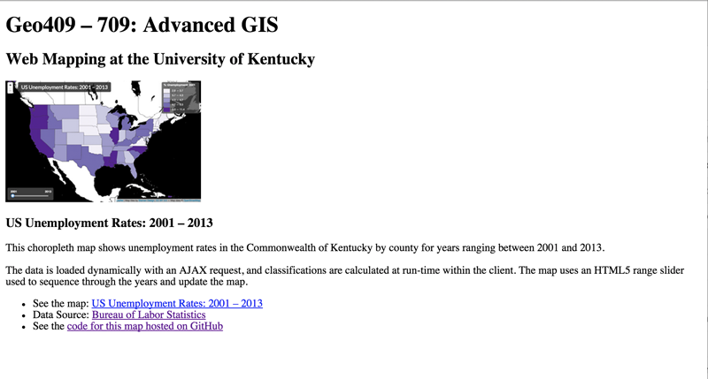

#Module 16: Web hosting a portfolio page and 

##Overview

This module introduces the following:
* hosting your maps on a remote web server
* the difference between typical GitHub repositories and GitHub Pages
* the process of building a basic portfolio page using HTML and CSS

###Working files

Begin with the basic index.html page provided in the *lab/* directory of this module. You'll be copying over previous map project files and folders to include with your web portfolio.

##Web hosting and creating a GitHub Pages repository

So far, we've been developing our web maps locally and using GitHub repositories to host and share our code (and various other files).  But, the point of making web maps is to share them with the general public, *on the web*. How do we do this?

Specifically, we've been using a web *server* that Brackets runs to "serve" our web document within a web browser on our local machine. We need a web server available to "host" our projects as well, but one that is accessible to the broader public through a URL address (i.e., not our own laptops or the lab computers). While there are various web hosting companies that can provide you with web server space, GitHub fortunately offers this service as well. These are a special kind of GitHub repository, referred to as [GitHub Pages]([GitHub Pages](https://pages.github.com/)). 

While these repositories are similar to the ones we've been using to commit, backup, and share our code, the HTML documents within these GitHub Pages repositories will be "served" to the user as HTTP requests and rendered within their browser (rather than displayed as raw HTML text like our current repos do).

To create our GitHub Pages repository, we'll be following the instructions provided on GitHub's website: [GitHub Pages](https://pages.github.com/).

When answering the question, *What git client are you using?*, you'll likely want to choose either "GitHub for Windows" or "GitHub for Mac.

For their step 3, *Create an index file,* you can simply use the starter *index.html* file provided within this module's *lab/* directory, which contains the following HTML:


```html
    <!DOCTYPE HTML>
    <html>
    <head>
    <meta charset="utf-8">
    <title>Geo404/709 Portfolio Example</title>

    <meta name='viewport' content='initial-scale=1,maximum-scale=1,user-scalable=no' />
    
    <style>
        
    /* CSS style rules go here! */   
    
    </style>
    </head>
    
    <body>
    
        <p>Hello World! I'm going to be a portfolio page.</p>
        
    </body>
    </html>
```

##Building a portfolio page

This section will walk us through building a basic, single page HTML document that will serve as the main portfolio page for an online portfolio. While, when ready, we will be placing these files within GitHub Pages repository for deployment to the general public, it's still a best practice to develop and test these locally. Again, when you sync these local commits with the GitHub remote repository in your GitHub pages, those changes are then live and viewable to the public.

In the previous section we created a new repository (*username*.github.io) in the web interface of GitHub, and then we pulled this repository to our local machine. We then created a file named *index.html* within that repository, added some minimal HTML, and then pushed that change back up to the repository. Now we will continue to edit that file to make a web portfolio page.

This module walks us through writing the HTML and CSS, and organizing some accompanying image files, to make a web page that will look something like this:


**Figure 1.** Example Portfolio Web Page Layout

While you may eventually use JavaScript to enhance the experience of using your web portfolio, for now we won't be writing any JavaScript. We're going to build this webpage solely using HTML and CSS.

###Creating Structured Content with HTML

So far throughout this course, we've actually written very little HTML. We've used basic `<h1></h1>` tags to describe the header titles for our maps. We've used `<footer></footer>` tags to enclose meta content within the web pages holding our maps. We've used a `<div></div>` tag with an id attribute of "map" (e.g. `<div id="map"></div>`) for holding our dynamically produced Leaflet web maps. And, in recent modules, we've included some other elements to act as user interface controls for our maps (e.g., `<input type="range" min = "2001", max= "2013", value = "2001", step= "1", class="year-slider"></input>`).

We'll begin building our portfolio web document by structuring our content within HTML tags. If we remember all the way back to Module 3, we use HTML to structure (or "describe") our content, and we use Cascading Style Sheets (or CSS rules) to determine how that content is displayed, its "look and feel". This distinction is also the classic distinction between content (HTML) and form (CSS) made within design.

We'll begin writing our HTML directly beneath the opening `<body>` tag. For this example, we're going to have a main page title we'll enclose within the `<h1>` tag, as well as a subheading we'll enclose within a `<h2>` tag. For some styling purposes we'll see later on, we're also going to wrap both of these header tags within an HTML tag named `<header>`. So our HTML will look like this (further examples will omit the `<body></body>` tags, but understand that all HTML displayed on the webpage will be contained within these tags):

```html
    <body>
    <header>
        <h1>Geo409 &ndash; 709: Advanced GIS</h1>
        <h2>Web Mapping at the University of Kentucky</h2>
    </header>
    </body>
```

You'll of course want to use your own name and some title to describe yourself or your work, such as "Matt Zook: Big Data Wrangler and Purveyor of Fine Iguanas." If we save these changes and refresh our browser (Brackets may be automatically updating these content changes as you enter them, which is super cool!), we see some basic unstructured HTML.


**Figure 2.** Un-styled header tags.

Now we want to think about how to describe the content we wish to display for each project. This is really a content question, What do you want your content to say? Once we establish this, we can then think about what the appropriate HTML elements are used to describe this content. 

For this example, we want to entice our user to look at our map by showing them a nice image of the map (`<image>`). We also what a heading to serve as a subtitle for that map (`<h3></h3>`). Perhaps we want to offer the reader a couple paragraphs that describe what the map says or does (`<p></p>`), or to highlight some particular functionality or technology used, to grab the attention of a potential employer or client. We may wish to list some features as well (`<ul><li></li></ul>`) and/or provide links to the data sources or the code for the map hosted on our GitHub repo (`<a href="">`). Before we start entering in our content, we can build a snippet of HTML skeleton that we can then copy and reuse for each of our portfolio project entries. We'll so structure each of these entries within some `<section></section>` tags.

```html
    <section>
        <image src="" alt="">
        <h3></h3>
        <p></p>
        <p></p>
        <ul>
            <li><a href="" /></li>
            <li><a href="" /></li>
        <ul>
    </section>
```

Remember that we can look up what all these HTML entities are and their intended purpose within a web document:

* section
* image
* h3
* p
* ul
* li
* a

Okay, now that we have the basic HTML structure for a section, let's start populating with our content. 

Let's deal with the image first. Since images aren't text (unless we're creating some fun ASCII art), we'll need to create screenshot images of our maps, crop and save these images into a directory, and then link to these images using the `src` attribute of our `<image>` tag.

**1. Grab a screenshot of your map**

Depending on if you're using a Mac or a PC, the keyboard commands will be different. Consult online documentation and consider your options depending on your operating system ():

* Screenshots on a mac: [https://support.apple.com/en-us/HT201361](https://support.apple.com/en-us/HT201361)
* Screenshots on Windows 8: [http://windows.microsoft.com/en-us/windows/take-screen-capture-print-screen#take-screen-capture-print-screen=windows-8](http://windows.microsoft.com/en-us/windows/take-screen-capture-print-screen#take-screen-capture-print-screen=windows-8)

Different options for capturing screenshots include saving them to file or copying them to the clipboard

**2. Crop and resize your image**

Remember that we're hosting these images on the web. The larger the image, the larger the file size, the longer it will take for your web page to load for your user. Furthermore, since an image screenshot may be very large (Native resolution for a 15" Macbook with retina display is 2560 by 1600 pixels).

You may also wish to not show the entire map as this image, but focus on a particular area. Therefore, you may wish to crop it in some way.

There are various ways to crop and resize an images. You may use software applications such as Photoshop or Inkscape. There are also various online web applications that allow you to upload an image, crop/resize, and then download.

For the layout of this design, we've chosen to display our images at a width of 388px and a height of 240px (which just happens to be the [golden ratio](http://en.wikipedia.org/wiki/Golden_ratio)). The size of your images is a design question, and up to you.

Before saving your image to your working directory (i.e., your local GitHub Pages repository directory with the `index.html` file in it), create a subdirectory within it and name it *images*. Its a good practice to store media assets like images in their own directory. Save your image within this *images* directory.

**3. Provide a relative link to the image within the HTML**

Once we've done that, we can then link to that image from within our HTML to display the image in the web document. It's also a good practice to provide a textual description of the image within the `<alt>` tags, which will describe the image to the user if the image doesn't display, as well as to those with who may be using a visual screen reader. Note that we are not using a closing (e.g., `</image>`) tag. The image tag is a special breed of HTML elements called "self-closing" tags, and does not require this. Update the HTML then using a relative path to the image and the alt text:

```html
    <image src="images/us-unemployment.png" alt="US unemployment map" />
```

Provided the image is saved to the correct directory, and we've given it the right path, our refreshed browser should now be displayed within the web page (note that we can see the bullets for the two empty list items):


**Figure 03.** Portfolio image displayed in the HTML document

Okay, now we're cooking with gas. Let's go ahead and create the content for the rest of the portfolio project entry:

```html
    <section>
        <image src="images/us-unemployment.png" alt="US unemployment map" />
        <h3>US Unemployment Rates: 2001 &ndash; 2013</h3>
        <p>This choropleth map shows unemployment rates in the Commonwealth of Kentucky by county for years ranging between 2001 and 2013.</p>
        <p>The data is loaded dynamically with an AJAX request, and classifications are calculated at run-time within the client. The map uses an HTML5 range slider used to sequence through the years and update the map.</p>
        <ul> 
            <li>See the map: <a href="#">US Unemployment Rates: 2001 &ndash; 2013</a></li>
            <li>Data Source: <a href="http://www.bls.gov/data/">Bureau of Labor Statistics</a></li>
            <li>See the <a href="https://github.com/newmapsplus/geo409/tree/master/map-04">code for this map hosted on GitHub</a></li>
        </ul>
    </section>
```

Note that we've provided a title for our map within the `<h3></h3>` tags, some textual description of the map within the `<p></p>` tags, as well as three links (making use of the anchor tag `<a>` using the `href` attribute). The result within the refreshed web document now looks like this:



**Figure 04.** Un-styled HTML content for a single portfolio project entry.

###Building the directory structure to display a web map (linking between pages)

Two of the URL links provided in the HTML above are absolute paths to external websites (the BLS website and the GitHub repository). Notice that the link to the web hosted map is a `#` symbol. This is a temporary placeholder, until we establish where this hosted web map will reside. Remember that we have the project code hosted in our conventional GitHub repositories, but that the general public can't view the rendered web page and map. So, we need to copy that project until this GitHub pages repository. 

Create a new directory within the working directory and give it a meaningful name describing your map project. Also, **do not use spaces or special characters** in directory (or file) names for documents to be served over the web. For our example here, we create a directory named *us-unemployment* (we've used a hyphen in place of a space). You want to share these maps with the general public or potential employers, so a meaningful name for this directory is more appropriate than calling it *map04* or something.

After creating this directory, copy the contents of your map (i.e.g, the *index.html* file and any associated data or JavaScript files) into that new project directory. Our current directory structure looks like this within the Mac OS Finder:


**Figure 05.** Directory structure with image and project directories within it.

That we have our project folder and files in our working directory we can link to that directory using a relative path. We'll update the link in our HTML to do this. 

Also, it's a good idea to give the user multiple links to access your map (you really want them to click on the link and check it out!). So, we'll also wrap both the image of our map and the map title content within our `<h3></h3>` tags in `<a></a>` tags as well:

```html
    <section>
        <a target="_blank" href="us-unemployment/"><image src="images/us-unemployment.png" alt="US unemployment map" /></a>
        <h3><a target="_blank" href="us-unemployment/">US Unemployment Rates: 2001 &ndash; 2013</a></h3>
        <p>This choropleth map shows unemployment rates in the Commonwealth of Kentucky by county for years ranging between 2001 and 2013.</p>
        <p>The data is loaded dynamically with an AJAX request, and classifications are calculated at run-time within the client. The map uses an HTML5 range slider used to sequence through the years and update the map.</p>
        <ul>
            <li>See the map: <a href="us-unemployment/">US Unemployment Rates: 2001 &ndash; 2013</a></li>
            <li>Data Source: <a href="http://www.bls.gov/data/">Bureau of Labor Statistics</a></li>
            <li>See the <a href="https://github.com/newmapsplus/geo409/tree/master/map-04">code for this map hosted on GitHub</a></li>
        </ul>
    </section>
```

Note that we're not linking to the *index.html* file within the *us-unemployment* directory, but rather simply to the directory itself. Web browsers are built to look inside this directory for an *index.html* file and load that file first (so you want to make sure your file is indeed named correctly).

Now that we've dialed in this section's content, we can replace this chunk of code for as many other projects as we'd like to share. We just need to edit the content, produce a cropped and resized image for each (saved within our *images* directory), and copy each project's files and folders into some new directories within this working directory. Our directory structure will now look like this (showing the cropped images within an *images* directory):


**Figure 06.** The file and directory structure for the web portfolio page.

Our webpage is now composed of beautifully structured content:


**Figure 07.** The un-styled HTML content for a portfolio page.

While this is a perfectly valid, functional webpage, it doesn't look as nice as we'd like it. Let's turn to some CSS rules now to improve this.


###Styling our HTML content with CSS

While it's tempting to say that these HTML elements are completely un-styled, this isn't quite correct. Notice how the `<h1>` content is larger that the `<h2>` content, and there's space between these? The actor links are colored blue and underlined. There's nothing in the HTML that's telling the browser to display them like this.

The web browser is actually applying its own default styles to these elements. All browsers do this, which is somewhat problematic, because browsers are not consistent with their default styles. For this reason, web pages end up looking very different across different browsers. It is therefore a good practice within web design to, before writing our own custom CSS style rules, to "reset" or "normalize" all the browser's default style rules. We do this by loading an external, remotely-linked style sheet. We recommend using [normalize.css](http://necolas.github.io/normalize.css/) for this.

We can copy the URL link to a CDN version of *normalize.css* and load it within the head of our document, before we start writing our our styles (i.e., before the `<style></style>` tags):

```html
    <link rel="stylesheet" href="https://cdnjs.cloudflare.com/ajax/libs/normalize/3.0.3/normalize.min.css" />
```

If we refresh our browser, we can see some subtle changes in the presentation of the elements, that the normalize style rules have changed the default font style to sans-serif, for example:


**Figure 08.** The normalized HTML content for a portfolio page.

Now let's start writing our own CSS rules to select our various HTML elements and apply various properties to them. We'll do this to affect both the layout of elements in relation to each other, as well how they are displayed individually.

First, we'll write a rule that gets applied to the entire body of the document. Here we're giving the body a background color encoded with the hexadecimal value of `#f5f5f5` (our "whitesmoke" color). We're also assigning a *font-family* property to the body, which all elements will inherit, unless otherwise specified. Here, we're asking the browser to first attempt to use a typeface named *Imprima*, and if its not available, to use another sans-serif font (we could list as many fonts as we wish here). 

```css
    body {  
        background: #f5f5f5;   
        font-family: Imprima, sans-serif;
    }
```

But *Imprima* isn't a common font, so how do we know that the user's browser supports it? Before a couple years ago, we couldn't assume this, and webpages typically all supported the same set of common fonts. Fortunately, web fonts have greatly improved, in part thanks to  projects like [Google Fonts}(http://www.google.com/fonts), which make a wide array of web fonts available for use in web pages.

To help make our web page display the type in *Imprima*, we follow the instructions for including it in our document: [http://www.google.com/fonts#UsePlace:use/Collection:Imprima(http://www.google.com/fonts#UsePlace:use/Collection:Imprima)]. We've chosen the "Standard" method and linked to Google's style sheet within the head of our document, between our link for the normalize.css and our customer styles:

```html
    <link rel="stylesheet" href="https://cdnjs.cloudflare.com/ajax/libs/normalize/3.0.3/normalize.min.css" />    
    <link href='http://fonts.googleapis.com/css?family=Imprima' rel='stylesheet' type='text/css'>
    <style>
        body {  
            background: #f5f5f5;   
            font-family: Imprima, sans-serif;
        }
    </style>
```

A refresh of the page should now display the type in our typeface of choice.

Moving along, we'll next write three CSS rules to select our `<header></header>`, `<h1></h1>`, and `<h2></h2>` tags, and apply various styles to them.

```css
     header { 
            width: 100%;
            min-width: 800px;
            margin: 0 auto;
            background: steelblue;
            padding: 15px 0 20px;
        }
    h1 { 
        font-family: Dosis, sans-serif;
        color: #375671; 
        width: 80%;
        margin: 0 auto;
        color: whitesmoke;
    }
    h2 { 
        font-family: Dosis, sans-serif;
        color: #375671;
        width: 80%;
        margin: 0 auto;
        color: whitesmoke;
    }
```

While this module will not exhaustively explain what each style property is doing, you should spend some time playing with the property values to see the results (Bracket's will live update these changes!), as well as read about these CSS properties. There are various web resources for learning about CSS rules ([Mozilla's CSS](https://developer.mozilla.org/en-US/docs/Web/CSS) and [W3CSchools](http://www.w3schools.com/css/) are good places to start).

One thing worth noting, however, is that by setting an element's width to a percentage (e.g., `width: 80%;`) and its margin's left and right values to `auto` (`margin: 0 auto;`), we both provide some space on either side of an element and center it as well. We've done that with the h1 and h2 tags (though the text is still aligned to the left).

The updated result from those style rules:


**Figure 09.** Web page with header styles applied.

Next, we'll select the elements we're using within each of our sections and style them:

```css
    h3 {
        font-family: Dosis, sans-serif;
        color: #003d71
    }
    p { 
        font-size: .9em; 
        color: #375671; 
    }
    ul {
        list-style-type: none; 
        font-size: .9em; 
        color: #375671; 
        line-height: 1.6em;
    }
    a, a:visited {   
        color: #003d71;
    }
```

The result of which we can see here:


**Figure 10.** Web page with section styles applied.

Next, we want to style the layout of the content within our sections. However, rather than directly selection the elements using their tag name (i.e., `<section>`), we'll first give these element class names within the HTML. Let's give each section a class attribute value of *project* and each of our images a class attribute value of *project-image*. We'll write these attributes directory into our HTML:

```html
    <section class="project">
    <!-- HTML CODE REMOVED FOR THIS EXAMPLE -->
    </section>
```

and

```html
    <image src="images/us-unemployment.png" alt="US unemployment map" class="project-image" />
```

Now, we can select these elements by their class name using our CSS:

```css
    .project {
        width: 80%;
        min-width: 800px;
        height: 100%;
        margin: 35px auto;
    }
    .project:after{
        content: "";
        display: table;
        clear: both; 
    }
    .project-image {
        width: 388px;
        height: 240px;
        background: white;
        float: left;
        margin-right: 20px;
        border: 2px solid #dddddd;
    }
```

Those rules apply that technique of limiting the width of the sections and using left and right margin values of "auto". Next, we apply a property called "float" to our image which will allow the other textual content contained within our h3, p, and ul elements to float to the side of it.

The CSS selector `.project:after` is applying a clever technique used to clear the float from the image so elements below it don't continue to wrap around it.

The result is now starting to look a bit better:


**Figure 11.** Completed Portfolio Web Page Layout

##Syncing changes and sharing your web portfolio with the world

Once you're satisfied with your work, you can sync up your commits to your GitHub Pages repository to see the results. Your portfolio should then be available from *username*.github.io. Remember to double check all your links to make sure they work properly.


